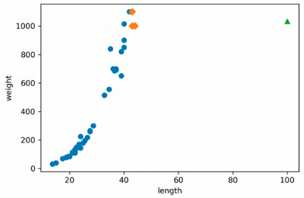
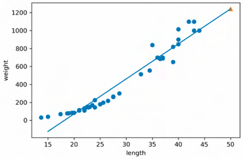

# 머신러닝+딥러닝 CH 03

## MLDL_1st_TIL

### 3장 회귀 알고리즘과 모델 규제
#### 01. k-최근접 이웃 회귀
#### 02. 선형 회귀
#### 03. 특성 공학과 규제

## Study Schedule

| 주차  | 공부 범위     | 완료 여부 |
| ----- | ------------- | --------- |
| 1주차 | p.26~111    | ✅         |
| 2주차 | p.114~173   | ✅         |
| 3주차 | p.176~217  | 🍽️         |
| 4주차 | p.220~283 | 🍽️         |
| 5주차 | p.286~337 | 🍽️         |
| 6주차 | p.340~420 | 🍽️         |
| 7주차 | p.423~483 | 🍽️         |
| 8주차   | p.486~558 | 🍽️         |
 

<!-- 여기까진 그대로 둬 주세요-->

# 1️⃣ 개념 정리 

## 03-1. k-최근접 이웃 회귀 
> 지도 학습 알고리즘    
분류 vs **회귀**    
회귀 : 두 변수 사이의 상관관계를 분석하는 방법   

`k-최근접 이웃 회귀` : 새로운 샘플 x의 타깃을 예측하기 위해 예측하려는 샘플에 가장 가까운 샘플k개를 선택하여 이 수치들의 평균을 구함.

**1. 훈련 세트와 테스트 세트로 나눔**
~~~python
from sklearn.model_selection import train_test_split
train_input, test_input, train_target, test_target = train_test_split(
    perch_length, perch_weight, random_state=42)

# 사이킷런에 사용할 훈련 세트는 2차원 배열이어야 함.
# reshape() 메서드 : 바꾸려는 배열 크기 지정
train_input = train_input.reshape(-1,1)
test_input = test_input.reshape(-1,1)
print(train_input,shape, test_input.shape)
~~~

**2. 회귀 모델 훈련**
~~~python
from sklearn.neighbors import KNeighborsRegressor
knr=KNeighborsRegressor()
knr.fit(train_input, train_target)

print(knr.score(test_input, test_target))
## 0.992809
~~~

$$R^2 = 1 - \frac{(타깃-예측)^2 의 합}{(타깃-평균)^2 의 합}$$

*예측이 타깃에 아주 가까워 지면 $R^2$는 1에 가까운 값이 됨.*

> 정확하게 타깃과 예측한 값 사이의 차이를 구해보자.

~~~python
from sklearn.metrics import mean_absolute_error

test_prediction = knr.predict(test_input)
mae = mean_absolute_error(test_target, test_prediction)
print(mae)
## 19.157148 
## 19g 정도 예측이 타깃값과 다르다. 과적합?
~~~

**3. 과대적합 vs 과소적합**
~~~python
print(knr.score(test_input, test_target))
## 0.992809
print(knr.score(train_input, train_target))
## 0.969882
~~~
훈련세트에서 학습시킨 모델이므로 테스트 세트보다 훈련 세트 점수가 높아야 함.     
훈련 세트에 `과대적합`되었다 : 훈련 세트에서 점수가 좋은데, 테스트 세트에서 점수가 굉장히 나쁨.    
훈련 세트에 `과소적합`되었다 : 훈련 세트보다 테스트 세트의 점수가 높거나 두 점수가 모두 너무 낮음.    
즉 모델이 너무 단순해 훈련 세트에 적절히 훈련되지 않은 경우.    

> 현재 과소적합 상태 !    
**모델을 조금 더 복잡하게 만들자.**    
k-최근접 이웃 알고리즘 : 이웃의 개수 k를 줄이는 것.

 

## 03-2. 선형 회귀
### [k-최근접 이웃의 한계]
길이가 커질 수록 농어의 무게가 증가하는 경향     
→ 가까운 샘플을 평균하기 때문에 새로운 샘플이 훈련 세트의 범위를 벗어나면 엉뚱한 값을 예측함.    

### [선형 회귀]
`선형 회귀` : 특성이 하나인 경우 어떤 직선을 학습하는 알고리즘.    
*특성을 가장 잘 나타낼 수 있는 직선을 찾는 것이 중요함*
~~~python
from sklearn.linear_model import LinearRegression
lr=LinearRegression()

lr.fit(train_input, train_target)
print(lr.predict([[50]]))
## [1241.83860]

print(lr.coef_, lr.intercept_)
# LinearRegression 클래스가 찾은 직선의 방정식 a(기울기), b(y절편)은 lr 객체의 coef_와 intercept_ 속성에 저장되어 있음
~~~

 

### [다항 회귀]
> 최적의 선이 직선이 아니라 곡선이라면?    
2차 방정식의 그래프를 그리려면, **제곱한 항**이 훈련 세트에 추가되어야 함.    

~~~python
train_poly = np.column_stack((train_input ** 2, train_input))
test_poly = np.column_stack((test_input ** 2, test_input))

lr = LinearRegression()
lr.fit(train_poly, train_target)
print(lr.predict([[50**2, 50]]))
print(lr.coef_, lr.intercept_)
## [ 1.0143 -21.5579] 116.05021
~~~
따라서 해당 모델은 다음과 같은 그래프를 학습함.   
$$무게 = 1.01 * 길이^2 - 21.6 * + 116.05$$   

> 2차 방정식이면 비선형 아닌가요?
$길이^2$ = '왕길이'로 바꾸면 선형관계가 됨.   
이와 같은 방정식을 **다항식**, 다항식을 사용한 선형 회귀를 **다항 회귀** 라고 부름.     

 

## 03-3. 특성 공학과 규제
### [다중 회귀]
`다중 회귀` : 여러 개의 특성을 사용한 선형 회귀    
`특성 공학` : 기존의 특성을 사용해 새로운 특성을 뽑아내는 작업    

### [사이킷런의 변환기]
`변환기` : 특성을 만들거나 전처리 하기 위한 다양한 클래스    
예) `fit()`, `transform()`, `PolynomialFeatures()` 등     
`fit()` : 새롭게 만들 특성 조합을 찾음.     
`transform()` : 실제로 데이터를 변환함.
`PolynomialFeatures()` : 기본적으로 각 특성을 제곱한 항을 추가하고 특성끼리 서로 곱한 항을 추가함.   
     - `get_features_name()`: 추가된 특성이 각각 어떤 입력의 조합으로 만들어졌는지 알려줌.        

~~~python
from sklearn.preprocessing import PolynomialFeatures

poly = PolynomialFeatures(degree=5, include_bias=False)
poly.fit(train_input)
train.poly = poly.transform(train_input)
test_poly = poly.transform(test_input)
print(train_poly.shape) ## (42, 55) 만들어진 특성의 개수가 55개
~~~
하지만 훈련 세트 점수 0.99, 테스트 세트 점수 -144.4 출력     
→ 특성의 개수를 늘리면 선형 모델은 강력해지지만, 훈련 세트에 너무 과대적합되므로 테스트 세트에서는 형편없는 점수가 도출됨.     

### [규제]
**규제** : 머신러닝 모델이 훈련 세트를 너무 과도하게 학습자히 못하도록 훼방하는 것.     
*즉 모델이 훈련 세트에 과대적합하지 않도록 만드는 것*     
*선형 회귀 모델의 경우 특성에 곱해지는 계수(또는 기울기)의 크기를 작게 만드는 일*     

> 55개의 특성으로 훈련한 선형 회귀 모델의 계수를 규제하자!

> 그 전에 특성 스케일 정규화하기. StandaradScaler 클래스 사용.

~~~python
from sklearn.preprocessing import StandardScaler
ss=StandardScaler()
ss.fit(train_poly) 
train_scaled = ss.transform(train_poly)
test_scaled = ss.transform(test_poly)
~~~

### [릿지 회귀와 라쏘 회귀]
`릿지` : 계쑤를 제곱한 값을 기준으로 규제를 적용함    
`라쏘` : 계수의 절댓값을 기준으로 규제를 적용함.    
*일반적으로 릿지를 조금 더 선호함*    
*두 알고리즘 모두 계수의 크기를 줄이지만 라쏘는 아예 0으로 만듦*     

### [릿지 회귀]
~~~python
from sklearn.linear_model import Ridge
ridge = Ridge()
ridge = fit(train_scaled, train_target)
print(ridge.score(train_scaled, train_target)) ## 완벽에 가까웠던 점수가 조금 낮아짐.
print(ridge.score(test_scaled, test_target)) ## 테스트 세트 점수가 정상으로 돌아옴. 
~~~

> alpha 매개변수로 규제 강도 직접 조절해야함      
alpha 값이 작으면 계수를 줄이는 역할이 줄어들고 선형 회귀 모델과 유사해지므로 과대적합될 가능성이 큼.     
`하이퍼파라미터` : 사람이 알려줘야 하는 파라미터     

#### 적절한 alpha 값을 찾는 방법 
\- alpha 값에 대한 $R^2$ 값의 그래프를 그려 보는 것.    
\- 훈련 세트와 테스트 세트의 점수가 가장 가까운 지점이 최적의 alpha 값이 됨. 

### [라쏘 회귀]
~~~python
## alpha 값을 바꾸어 가며 훈련 세트와 테스트 세트에 대한 점수 계산 
train_score= []
test_score = []
alpha_list = [0.001, 0.01, 0.1, 1, 10, 100]
for alpha in alpha_list:
    lasso = Lasso(alpha=alpha, max_iter=10000)
    lasso.fit(train_scaled, train_target)
    train_score.append(lasso.score(train_scaled, train_target))
    test_score.append(lasso.score(test_scaled, test_target))
~~~

왼쪽은 과대 적합을 보여주고 있고, 오른쪽으로 갈수록 훈련 세트와 테스트 세트의 점수가 좁혀지고 있음.     
가장 오른쪽은 점수가 크게 떨어짐. (과소적합되는 모델일 것)     
따라서 최적의 alpha 값은 1, 즉 $10^1$=10 임.