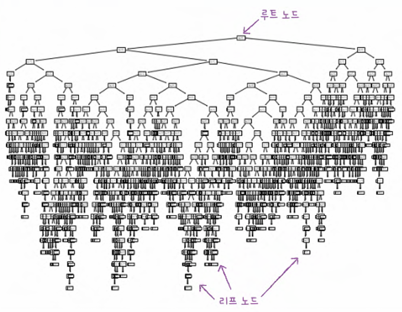
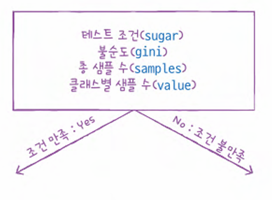
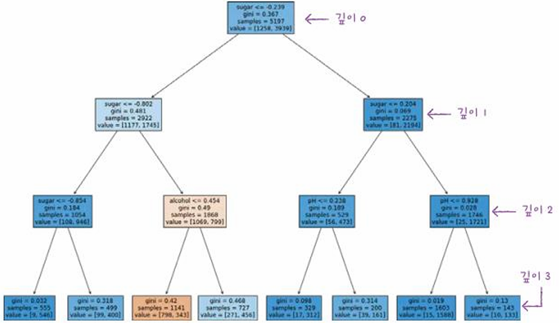
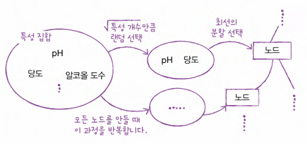

# 머신러닝+딥러닝 CH 05

## MLDL_4th_TIL

### 5장 트리 알고리즘
#### 01. 결정 트리
#### 02. 교차 검증과 그리드 서치
#### 03. 트리의 앙상블

## Study Schedule

| 주차  | 공부 범위     | 완료 여부 |
| ----- | ------------- | --------- |
| 1주차 | p.26~111    | ✅         |
| 2주차 | p.114~173   | ✅         |
| 3주차 | p.176~217  | ✅         |
| 4주차 | p.220~283 | ✅         |
| 5주차 | p.286~337 | 🍽️         |
| 6주차 | p.340~420 | 🍽️         |
| 7주차 | p.423~483 | 🍽️         |
| 8주차   | p.486~558 | 🍽️         |
 

<!-- 여기까진 그대로 둬 주세요-->

# 1️⃣ 개념 정리 

## 05-1. 결정 트리

**1. 로지스틱 회귀로 와인 분류하기**     
- 알코올 도수, 당도, pH 값에 로지스틱 회귀 모델 적용     

> **pandas 데이터프레임 매서드**     
> 샘플 데이터 확인 : head()    
> 각 컬럼 데이터 타입 및 결측치 확인 : info()    
> 각 컬럼에 대한 간단한 통계 확인 : describe()    
> → 컬럼 표준화 필요 : numpy 배열로 바꾸고 train/test set로 나눈 뒤 사이킷런의 StandaradScaler             

~~~python
from sklearn.linear_model import LogisticRegression
lr = LogisticRegression()
lr.fit(train_scaled, train_target)
print(lr.score(train_scaled, train_target)) # 0.7808
print(lr.score(test_scaled, test_target)) # 0.7777

print(lr.coef_, lr.intercept_) # [[0.5127 1.6734 -0.6877]] [1.8178]
# 로지스틱 회귀식
# y= 0.5127*도수 + 1.6734*당도 -0.6877*pH + 1.8178
# y 값이 0보다 크면 화이트와인, 작으면 레드와인 임.
# 즉 알코올도수와 당도가 높을수록 화이트와인일 가능성이 높고, pH가 높을수록 레드와인일 가능성이 높은 것 같음.
# 결과 해석이 어렵고, 다항 특성이 추가된다면 더욱 어려워짐.
~~~

**2. 결정트리**   
- 데이터를 잘 나눌 수 있는 질문을 한다면 분류 정확도가 올라갈 것. (스무고개 같은 거임)    
- 사이킷런의 DecisionTreeClassifier 클래스
~~~python
from sklearn.tree import DecisionTreeClassifier
dt = DecisionTreeClassifier(random_state=42)
dt.fit(train_scaled, train_target)
print(dt.score(train_scaled, train_target)) # 0.9969 과대적합?
print(dt.score(test_scaled, test_target)) # 0.8592
~~~
- plot_tree() 함수 사용해 시각화 가능

 

-max_depth로 트리 깊이 제한, filled 매개변수에서 클래스에 맞게 노드 색 정할 수 있음.   

 

- 결정트리에서 예측하는 방법: 리프 노드에서 대부분 예측 클래스가 됨.    

#### gini (지니 불순도)    
: 데이터를 분할하는 기준 ( 노드에 두 클래스 비율로 불순도 구할 수 있음 )      

: 결정 트리 모델은 부모 노드와 자식 노드의 불순도 차이가 가능한 크도록 트리를 성장시킴.   
> **부모 노드와 자식 노드의 불순도 차이 계산** : 자식 노드의 불순도를 샘플 개수에 비례하여 모두 더한 후, 부모 노드의 불순도에서 빼면 됨.     
> **정보 이득** : 부모와 자식 노드 사이의 불순도 차이.   

#### 엔트로피 불순도    
: 밑이 2인 로그를 사용하여 곱함.     

 

**3. 가지치기**     
- 자라날 수 있는 트리의 최대 깊이를 지정하는 것    
- DecisionTreeClassifier 클래스의 max_depth 매개변수를 3으로 지정해 모델 만들기 = 루트 노드 아래로 최대 3개의 노드까지만 성장함.     
~~~python
dt=DecisionTreeClassifier(max_depth=3)
dt.fit(train_scaled, train_target)
print(dt.score(train_scaled, train_target)) # 0.8455
print(dt.score(train_scaled, train_target)) # 0.8415
~~~

*결정 트리 알고리즘은 표준화 전처리를 할 필요가 없음!*    

- 특성 중요도
~~~python
print(dt.feature_importances_) # [0.12345626 0.86862934 0.0079144]
# 당도 > 알코올 도수 > pH 순서로 중요도 높음.  
# 특성 중요도는 각 노드의 정보 이득과 전체 샘플에 대한 비율을 곱한 후 특성별로 더하여 계산함.
~~~

 

## 05-2. 교차 검증과 그리드 서치
> 테스트 세트로 일반화 성능을 올바르게 예측하려면 가능한 한 테스트 세트를 마지막에만 사용하는 것이 좋음.    
> 그렇다면 max_depth 매개변수를 사용한 하이퍼파라미터 튜닝을 어떻게 할까?      

**1. 검증세트**    
- 훈련 세트를 또 나눈 것.    
- 훈련 세트에서 모델을 훈련하고 검증 세트로 모델을 평가함     
→ 테스트하고 싶은 매개변수 바꿔가며 가장 좋은 모델을 고름.    
→ 이 매개변수 사용해 훈련 세트와 검증 세트를 합쳐 전체 훈련 데이터에서 모델을 다시 훈련함. → 테스트 세트에서 최종 점수를 평가함.    

**2. 교차 검증**     
- 검증 세트를 떼어 내어 평가하는 과정을 여러 번 반복함, 이 점수들을 평균하여 최종 검증 점수를 얻음.    
> **k-폴드 교차검증**     
훈련 세트를 k 부분으로 나눠서 교차 검정을 수행하는 것. (보통 5, 10 폴드 교차 검증 많이 사용함)     
- 교차 검증을 수행함으로써 입력한 모델에서 얻을 수 있는 최상의 검증 점수를 가늠해 볼 수 있음.    
~~~python
splitter = StratifiedKFold(n_splts=10, shuffle=True)   
scores = cross_validate(dt, train_input, train_target, cv=splitter)
print(np.mean(scores['test_score'])) # 0.8574181117
~~~
- 여기서 'test_score'은 k-폴드 교차검증의 점수임. !혼동주의!     

**3. 하이퍼파라미터 튜닝**    
- 하이퍼파라미터 : 모델이 학습할 수 없어서 사용자가 지정해야만 하는 파라미터      
- 하이퍼파라미터 튜닝 방법     
1) 라이브러리가 제공하는 기본값을 그대로 사용해 모델 훈련     
2) 검증 세트의 점수나 교차 검증을 통해서 매개변수를 조금씩 바꿔봄.    
3) 모델마다 적게는 1~2개, 많게는 5~6개의 매개변수를 제공함.    
4) 이 매개변수를 바꿔가면서 모델을 훈련하고 교차검증을 수행함.     
*max_depth, min_samples_split 두 매개변수를 동시에 바꿔가며 최적의 값을 찾아야 함*     
- 매개변수가 많아질 경우, 그리드 서치 사용     
- **그리드 서치** : 테스트하고 싶은 매개변수 리스트 만들어 이 과정을 자동화함.
~~~python
from sklearn.model_selection import GridSearchCV
params = {'min_impurity_decrease' : [0.0001, 0.0002, 0.0003, 0.0004, 0.0005]} # 탐색할 매개변수와 탐색할 값의 리스트를 딕셔너리로 만들고 0.0001씩 증가하는 5개의 값을 시도함.
gs = GridSearchCV(DecisionTreeClassifier(random_state=42), params, n_jobs=-1)
gs.fit(train_input, train_target)
dt = gs.best_estimator_ # 검증 점수가 가장 높은 모델의 매개변수 조합으로 전체 훈련세트에서 자동으로 다시 모델을 훈련함.
print(dt.score(train_input, train_target)) # 0.96151625
print(gs.best_params_) # {'min_impurity_decrease': 0.0001}
# 0.0001이 가장 좋은 값으로 선택됨. 

# 즉, 각 매개 변수에서 수행한 교차 검증의 평균 점수가 자동으로 저장되기 때문에 최상의 검증 점수를 만든 매개변수 조합을 자동으로 알 수가 있음.
best_index =  np.argmax(gs.cv_results_['mean_test_score'])
print(gs.cv_results_['params'][best_index]) # {'min_impurity_decrease': 0.0001}
~~~

**4. 랜덤 서치**     
- 매개변수의 값이 수치일 때 범위나 간격을 미리 정하기 어려우니 랜덤 서치를 사용.
~~~python
params = {'min_impurity_decrease': uniform(0.0001, 0.001),
    'max_depth' : randint(20, 50),
    'min_samples_split' : randint(2, 25),
    'min_samples_leaf : randint(1, 25),
    }
~~~
랜덤 서치 후 교차검증, 최적의 매개변수 조합을 찾기    

 

## 05-3. 교차 검증과 그리드 서치
- 앙상블 학습 : 정형 데이터를 다루는 데 가장 뛰어난 성능을 냄.    
- 신경망 알고리즘 : 비정형 데이터의 알고리즘.

**1. 랜덤 포레스트**     
: 앙상블 학습의 대표     
: 각 트리를 훈련하기 위한 데이터를 랜덤하게 만드는데, 훈련 데이터에서 랜덤하게 샘플을 추출하여 훈련 데이터를 만듦. (복원추출)     
: 부트스트랩 샘플 = 훈련 세트의 크기와 갖게 만듦.    

~~~python
from skelarn.model_selection import cross_validate
from sklearn.ensemble import RandomForestClassifier
rf = RandomForestClassifier(n_jobs=-1, random_state=42)
scores = cross_validate(rf, train_input, train_target, return_train_score = True, n_jobs=-1)
print(np.mean(scores['train_score']), np.mean(socres['test_score'])) # 훈련세트, 검증세트 점수 비교하면 과대적합을 파악하는 데 용이함. 
~~~
: 자체적으로 모델을 평가하는 점수를 얻을 수 있음. print(rf.ppb_score_)    

**2. 엑스트라 트리**      
: 랜덤 포레스트와 유사하지만 부투스트랩 샘플을 사용하지 않음. 즉, 결정 트리를 만들 때 전체 훈련 세트를 사용함.     
: 엑스트라 트리가 무작위성이 더 커서 더 많은 결정 트리를 훈련해야함.    
: 랜덤하게 노드를 분할하기 때문에 빠른 계산 속도가 장점임.       

**3. 그레이디언트 부스팅**   
: 깊이가 얕은 결정 트리를 사용하여 이전 트리의 오차를 보완하는 방식. ( 기본적으로 깊이가 3인 결정 트리를 100개 사용함 )
: 결정 트리를 계속 추가하면서 가장 낮은 곳을 찾아 이동함.    
: `subsample` : 트리 훈련에 사용할 세트의 비율을 정함. (기본값 1.0으로 전체 훈련 세트를 사용하고, 1보다 작으면 훈련 세트의 일부를 사용함.)     
: 병렬로 훈련할 수 없기에 속도가 느림.     
: 학습률 매개변수를 조정하여 모델의 복잡도를 제어할 수 있음. 

**4. 히스토그램 기반 그레이디언트 부스팅**     
:그래이디언트 부스팅의 속도와 성능을 더욱 개선한 것.   
: 입력 특성을 256개의 구간으로 나눠 노드를 분할할 때 최적의 분할을 빠르게 찾을 수 있음. ( 이때 구간 하나는 누락된 값을 위해 사용하기에 전처리 필요가 없다 )
: 라이브러리 `XGBoost`. `LightGBM`