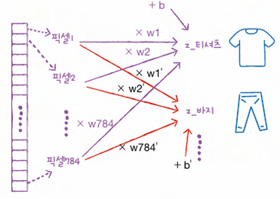
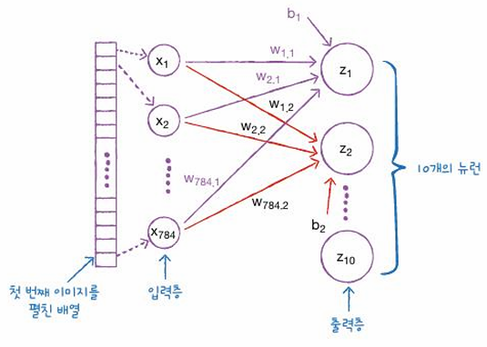
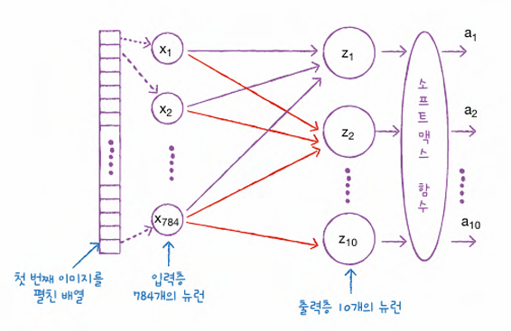
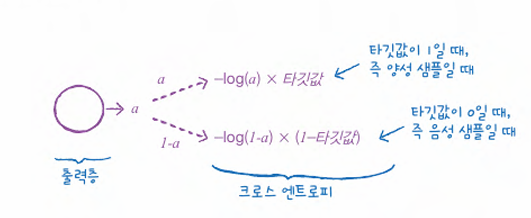
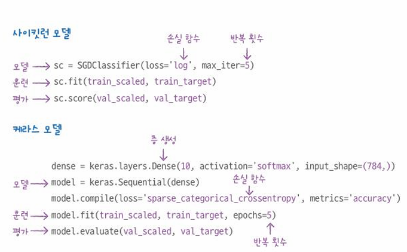
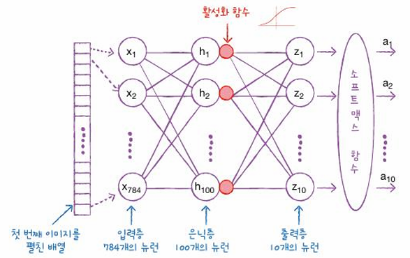
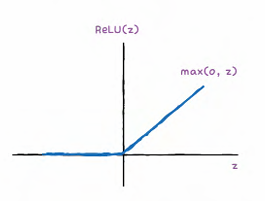
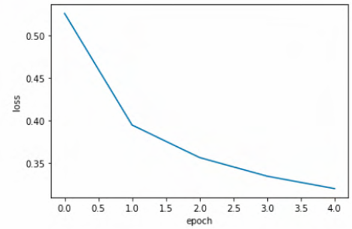
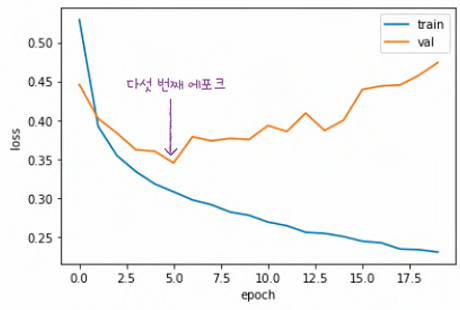
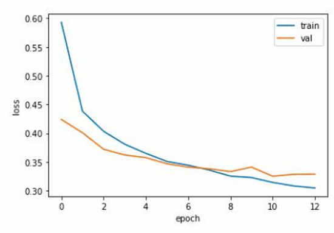

# 머신러닝+딥러닝 CH 07

## MLDL_6th_TIL

### 7장 딥러닝을 시작합니다
#### 01. 인공 신경망
#### 02. 심층 신경망
#### 03. 신경망 모델 훈련

## Study Schedule

| 주차  | 공부 범위     | 완료 여부 |
| ----- | ------------- | --------- |
| 1주차 | p.26~111    | ✅         |
| 2주차 | p.114~173   | ✅         |
| 3주차 | p.176~217  | ✅         |
| 4주차 | p.220~283 | ✅         |
| 5주차 | p.286~337 | ✅         |
| 6주차 | p.340~420 | ✅         |
| 7주차 | p.423~483 | 🍽️         |
| 8주차   | p.486~558 | 🍽️         |
 

<!-- 여기까진 그대로 둬 주세요-->

# 1️⃣ 개념 정리 

## 07-1. 인공 신경망
### [패션 MNIST]
훈련 데이터 : 60,000개의 이미지, 각 이미지는 28x28 크기     
테스트 세트 : 10,000개의 이미지    
타깃 : 0~9까지의 숫자 레이블로 구성됨, 각 레이블 당 샘플 개수는 6,000개.     
### [로지스틱 회귀로 패션 아이템 분류하기]
*훈련 샘플이 60,000개나 되기 때문에 전체 데이터 한꺼번에 사용하는 것보다 샘플을 하나씩 꺼내서 모델을 훈련하는 방법이 더 효율적임. => `경사 하강법`    
- reshape() 매서드 사용해 2차원 배열인 각 샘플을 1차원 배열로 펼침.
- 784개의 픽셀로 이루어진 60,000개 샘플 준비됨.
- SGDClassifier클래스, cross_validate 함수 사용해 교차검증으로 성능 확인해본 결과 약 0.84.     
=> `로지스틱 회귀 공식`
- 784개의 픽셀, 즉 특성이 있으므로 아주 긴 공식이 만들어짐.   
- 각 레이블에 대한 방정식을 따로 작성함.
- w는 가중치, b는 절편임.

- z_티셔츠, z_바지와 같이 10개의 클래스에 대한 선형 방정식을 모두 계산한 다음 `소프트맥스 함수`를 통과해 각 클래스에 대한 확률을 얻을 수 있음.   

### [인공 신경망]
*가장 기본적인 인공 신경망은 확률적 경사 하강법을 사용하는 로지스틱 회귀와 같음*     

`출력` : z1 ~ z10 을 계산하고 이를 바탕으로 클래스를 예측함.        
`유닛` : z 값을 계산하는 단위, 뉴런이라고도 불렀음. 누런에서 일어나는 일은 선형 계산뿐임.                
`입력층` : 784개의 픽셀 자체를 의미하고 특별한 계산을 수행하지 않음, x1 ~ x784

 

`텐서플로` : 구글이 공개한 딥러닝 라이브러리    

`케라스` : 텐서플로의 고수준 API      
머신러닝 라이브러리와 다른 딥러닝 라이브러리 차이점 : 그래픽 처리 장치인 GPU를 사용해 인공 신경망을 훈련함.

~~~python
import tensorflow as tf

from tensorflow import keras
~~~

### [인공 신경망으로 모델 만들기]
`밀집층` = `완전 연결층` : 784개의 픽셀과 10개의 뉴런이 뺵빽하게 연결되어 있는 선들이 이루고 있는 층을 의미함.    
~~~python
dense = keras.layer.Dense(10, activation='softmax', input_shape(784,))
# 뉴런 개수 10, 뉴런의 출력에 적용할 함수 softmax, 입력의 크기 784

model = keras.Sequential(dense) # model 객체가 신경망 모델
~~~
- 소프트맥스와 같이 뉴런의 선형 방정식 계산 결과에 적용되는 함수를 `활성화 함수` 라고 부름, 계산 결과 값을 a로 표시함.     

### [인공 신경망으로 패션 아이템 분류하기]
~~~python
# 훈련 하기 전에 설정 단계
# model 객체의 compile() 메서드에서 수행
# 손실 함수의 종류를 지정하고 훈련 과정에서 계산하고 싶은 측정값을 지정함.
model.compile(loss='sparse_categorical_crossentropy', metrics='accuracy') 
~~~
👉 loss = sparse_categorical_crossentropy      
- 케라스에서는 크로스 엔트로피 손실 함수를 이진 분류: loss =`binary_crossentropy`, 다중분류: loss = `categorical_crossentropy`로 나누어 부름.
- -log(예측 확률)에 타깃값(정답)을 곱함.
- 이진 분류의 출력 뉴런 : 오직 양성 클래스에 대한 확률(a)만 출력함, 음성 클래스에 대한 확률은 1-a -> 이진 분류의 타깃값은 양성 샘플일 경우 1, 음성 샘플일 경우 0 -> 하나의 뉴런만으로 양성과 음성 클래스에 대한 크로스 엔트로피 손실을 모두 계산할 수 있음.     

- `원-핫 인코딩` : 타깃값을 해당 클래스만 1이고 나머지는 모두 0인 배열로 만드는 것.      
- 따라서 다중 분류에서 크로스 엔트로피 손실 함수를 사용하려면 정수로 된 타깃값을 원-핫 인코딩으로 변환해야함.      

- **텐서플로에서는 원-핫 인코딩으로 바꾸지 않고 정수로 된 타깃값을 그대로 사용할 수 있음 = `sparse_categorical_crossentropy`**

👉 metrics = 'accuracy'      
- 케라스는 모델이 훈련할 때 기본으로 에포크마다 손실 값을 출력해줌.  
- 정확도 지표를 의미하는 'accuracy'를 지정하여 정확도를 함께 출력함.
 

~~~python
## 모델 훈련
model.fit(train_scaled, train_target, epochs=5)
# 반복할 에포크 횟수를 epochs 매개변수로 지정, 5번 반복함.
# accuracy : 0.8549
## 모델 평가
model.evaluate(val_scaled, val_target)
# accuracy : 0.8359
~~~

#### [사이킷런 SGDClassifier와 케라스의 Sequential 클래스 사용법 차이]

## 07-2. 심층 신경망

### [2개의 층]

`은닉층` : 입력층과 출력층 사이에 있는 모든 층을 의미함.     
`활성화 함수` : 신경망 층의 선형 방정식의 계산 값에 적용하는 함수. 
- 출력층에 적용했던 소프트맥스 함수
- 이진 분류일 경우 시그모이드 함수 / 다중 분류일 경우 소프트맥스 함수 사용
- 은닉층의 활성화 함수는 비교적 자유로움! 시그모이드 함수, 볼 렐루 함수 사용함.

~~~python
dense1 = keras.layers.Dense(100, activation='sigmoid', input_shape=(784,))
# dense1 은닉층, 100개의 뉴런을 가진 밀집층
# 활성화 함수를 'sigmoid'로 지정, 입력의 크기를 784로 지정
dense2 = keras.layers.Dense(10, activation='softmax'())
# dense2 출력층, 10개의 클래스를 분류하므로 10개의 뉴런을 둠,
# 활성화 함수는 소프트맥수 함수로 지정
~~~
- 클래스10개에 대한 확률을 예측한다면 은닉층의 뉴런은 10개보다 많을 것.

### [심층 신경망 만들기]
~~~python
model = keras.Sequential([dense1, dense2]) # 출력층을 가장 마지막에 두기

model.summary()
# 층마다 층 이름, 클래스, 출력 크기, 모델 파라미터 개수가 출력됨.
~~~
👉 출력 크기 (None, 100)
- `배치 차원` : 신경망 층에 입력되거나 출력되는 배열의 첫번째 차원을 의미함. (샘플 개수를 고정하지 않고 어떤 배치 크기에도 유연하게 대응할 수 있도록 None으로 설정함.)    
- 100개의 출력이 나옴 = 784개 픽셀값이 은닉층을 통과하면서 100개의 특성으로 압축됨.    
👉 모델 파라미터 개수
- 입력 픽셀 * 출력 뉴런 개수 (가중치) + 출력 뉴런 개수(절편)
- 784*100 + 100 = 78,500     

### [층을 추가하는 다른 방법]
- Sequential 클래스의 name 매개변수로 모델의 이름을 지정하고, 층의 이름을 지정함. 
~~~python
model = keras.Sequential([
    keras.layer.Dense(100, activation='sigmoid', input_shpae=(784,), name = 'hidden'),
    keras.layers.Dense(10, activation= 'softmax', name='output')], name = '패션 MNIST 모델')
~~~
- add() 매서드로 전달해 동적으로 층을 선택하여 추가할 수 있음.
~~~python
model= keras.Sequential()
model.add(keras.layers.Dense(100, activation='sigmoid', input_shape=(784,)))
model.add(keras.layers.Dense(10, activation = 'softmax'))
~~~

### [렐루 함수]
- 입력이 양수일 경우 마치 활성화 함수가 없는 것처럼 그냥 입력을 통과시키고, 음수일 경우에는 0으로 만듦.

~~~python
model=keras.Sequential()
model.add(keras.laer.Flatten(input_shape=(28,28)))
model.add(keras.layer.Dense(100, activation='relu'))
model.add(keras.layer.Dense(10, activation='softmax'))
# Flatten클래스는 배치 차원을 제외하고 나머지 입력 차원을 모두 일렬로 펼치는 역할만 함.
# 활성화 함수 relu
~~~
- 1절의 은닉층을 추가하지 않은 경우보다 몇 퍼센트 성능이 향상됨. 

### [옵티마이저]
- 하이퍼파라미터 : 모델이 학습하지 않아 사람이 지정해주어야 하는 파라미터
- 지금까지 다룬 하이퍼파라미터 : 추가할 은닉층의 개수, 뉴런 개수, 활성화 함수, 층의 종류, 배치 사이즈 매개변수, 에포크 매개변수 등 + RMSprop의 학습률    

`옵티마이저` : compile() 메서드에서 다양한 종류의 경사 하강법 알고리즘을 제공하고 이를 지정함.    
- 가장 기본적인 옵티마이저는 확률적 경사 하강법인 SGD임.

~~~python
sgd = keras.optimizers.SGD() # 있어도 되고 없어도 됨. 기본이니까.
sgd = keras.optimizers.SGD(learning_rate=0.1) # 학습률을 0.1로 조정함. 하이퍼파라미터!
model.compile(optimizer='sgd', loss='sparse_categorical_crossentropy', metrics='accuracy')
~~~

- 모멘텀 최적화 : SGD 클래스의 momentum 매개변수 기본값은 0임, 0보다 큰 값으로 지정하는 것. 보통 0.9 이상을 지정함.
- 네스테로프 모멘텀 최적화 : SGD 클래스의 nesterov 매개변수를 기본값 False에서 True로 바꾸는 것.
    - 모멘텀 최적화를 2번 반복하여 구현함. 
    - 네스테로프 모멘텀 최적화가 기본 확률적 경사 하강법보다 더 나은 성능을 제공함.
- 적응적 학습률 : 모델이 최적점에 가까이 갈수록 학습률을 낮출 수 있음.
    - 대표적인 옵티마이저 : Adagrad, RMSprop 
    - 모멘텀 최적화와 RMSprop 장점을 접목한 것 : Adam

 

## 07-3. 신경망 모델 훈련
### [손실 곡선]
- 케라스는 기본적으로 에포크마다 손실을 계산함.
~~~python
import matplotlib.pyplot as plt
plt.plot(history.history['loss'])
plt.xlabel('epoch')
plt.ylabel('loss')
plt.show()
~~~

- 에포크 횟수를 20으로 늘려서 모델을 훈련하고 손실 그래프를 그려봤더니, 손실이 감소함. 

### [검증 손실]
*에포크에 따른 과대적합과 과소적합을 파악하려면 훈련 세트에 대한 점수뿐만 아니라 검증 세트에 대한 점수도 필요함*    
~~~python
## fit() 메서드에 검증 데이터를 전달
# validation_data 매개변수에 검증에 사용할 입력과 타깃값을 튜플로 만들어 전달
model = model_fn()
model.compile(loss='sparse_categorical_crossentropy', metrics='accuracy')
history=model.fit(train_scaled, train_target, epochs=20, verbose=0, validation_data=(val_scaled, val_target))

plt.plot(history.histroy['loss'])
plt.plot(history.histroy['val_loss'])
plt.xlabel('epoch')
plt.ylabel('loss')
plt.legent(['train', 'val'])
plt.show()
~~~

👉 검증 손실이 상승하는 시점을 가능한 뒤로 늦춰야함.

👉 옵티마이저 결정하기 : 기본 옵티마이저 대신 다른 옵티마이저를 테스트.       
    - Adam이 좋은 선택임을 알아냄. 

### [드롭아웃] 
`드롭아웃` : 훈련 과정에서 층에 있는 일부 뉴런을 랜덤하게 꺼서 (즉 뉴런의 출력을 0으로 만들어) 과대적합을 막음.       
👉 드롭아웃이 왜 과대적합을 막을까?       
    - 일부 뉴런이 랜덤하게 꺼지면 특정 뉴런에 과대하게 의존하는 것을 줄일 수 있고, 이를 감안하면 이 신경망은 더 안정적인 예측을 만들 수 있음.          
    - 2개의 신경망을 앙상블 하는 것으로 해석할 수 있음. (앙상블은 과대적합을 막아주는 기법임)

### [모델 저장과 복원]
- `save_weights()` 메서드 : 훈련된 모델의 파라미터를 저장함.     
- `save()` 메서드 : 모델 구조와 모델 파라미터를 함께 저장함.
- `load_weights()` 메서드 : 이전에 저장했던 모델 파라미터를 적재함. 
    - *이때 save_weights()로 저장했던 모델과 정확히 같은 구조를 가져야함.     

### [콜백]
`콜백` : 훈련 과정 중간에 어떤 작업을 수행할 수 있게 하는 객체.          
    - keras.callbacks 패키지 아래에 있는 클래스들          
    - fit() 메서드의 callbacks 매개변수에 리스트로 전달하여 사용함.       

~~~python
checkpoint_cb = keras.callbacks.ModelCheckpoint('best-model.h5')
model.fit(train_scaled, train_target, epochs=20, verbose=0, validation_data=(val_scaled, val_target), callbacks=[checkpoint_cb])
~~~
- ModelCheckpoint 콜백이 가장 낮은 검증 점수의 모델을 자동으로 저장해줌.

 

- `조기 종료` : 과대적합이 시작되기 전 (검증 점수가 상승하기 시작하기 전)에 훈련을 미리 중지하는 것.
- EarlyStopping 콜백을 제공함
- practice =2로 지정하면 2번 연속 검증점수가 향상되지 않으면 훈련을 중지함.
- restore_best_weights  = True 는 가장 낮은 검증 손실을 낸 모델 파라미터로 되돌림. 
~~~python
early_stopping_cb = keras.callbacks.EarlyStopping(patience =2, restore_best_weights=True)
~~~

👉 ModelCheckpoint 콜백과 조기 종료 기법 함께 사용하면,  안심하고 에포크 횟수를 크게 지정해도 상관없으며 최상의 모델을 자동으로 저장해 주므로 편리함.

