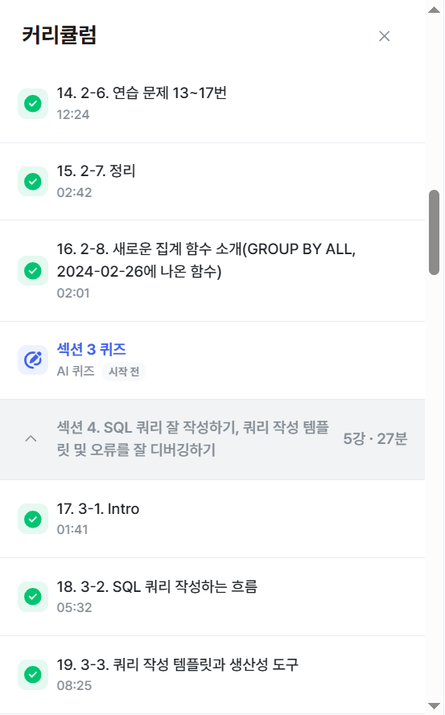

# SQL_BASIC 3주차 정규 과제 

📌SQL_BASIC 정규과제는 매주 정해진 분량의 `초보자를 위한 BigQuery(SQL) 입문` 강의를 듣고 간단한 문제를 풀면서 학습하는 것입니다. 이번주는 아래의 **SQL_Basic_3rd_TIL**에 나열된 분량을 수강하고 `학습 목표`에 맞게 공부하시면 됩니다.

**3주차 과제는 문제 풀이를 중심으로**, 강의에서 제시된 예제 문제 중 **7 문제 이상을 선택하여 직접 풀어본 뒤**, 강의 영상의 풀이와 비교해 **틀린 부분, 맞은 부분, 새롭게 배운 개념**을 구체적으로 정리해주세요. (적어도 3문제는 정리해야 합니다.) 완성된 과제는 Gihub에 업로드하고, 링크를 스프레드시트 'SQL' 시트에 입력해 제출해주세요.

**(수행 인증샷은 필수입니다.)** 

## SQL_BASIC_3rd

### 섹션 3. 데이터 탐색 - 조건, 추출, 요약

### 2-6. 연습문제 1~3번

### 2-6. 연습문제 7~9번

### 2-6. 연습문제 10~12번

### 2-6. 연습문제 13~17번

### 2-7. 정리 

### 2-8. 새로운 집계함수

## 섹션 4. 쿼리 잘 작성하기, 쿼리 작성 템플릿 및 오류를 잘 디버깅하기

### 3-1. INTRO

### 3-2. SQL 쿼리 작성하는 흐름

### 3-3. 쿼리 작성 템플릿과 생산성 도구 

## 🏁 강의 수강 (Study Schedule)

| 주차  | 공부 범위              | 완료 여부 |
| ----- | ---------------------- | --------- |
| 1주차 | 섹션 **1-1** ~ **2-2** | ✅         |
| 2주차 | 섹션 **2-3** ~ **2-5** | ✅         |
| 3주차 | 섹션 **2-6** ~ **3-3** | ✅         |
| 4주차 | 섹션 **3-4** ~ **4-4** | 🍽️         |
| 5주차 | 섹션 **4-4** ~ **4-9** | 🍽️         |
| 6주차 | 섹션 **5-1** ~ **5-7** | 🍽️         |
| 7주차 | 섹션 **6-1** ~ **6-6** | 🍽️         |

 

<!-- 여기까진 그대로 둬 주세요-->

---

# 1️⃣ 개념정리

## 2-6. 연습문제

~~~
✅ 학습 목표 :
* 연습문제(7문제 이상) 푼 것들 정리하기
~~~

<!-- 새롭게 배운 내용을 자유롭게 정리해주세요.-->

#1   
NULL : 아무것도 없는 값.    
0이랑 다르며 값이 존재하지 않을 때 사용.   
연산자는 '= NULL' 이 아니라 'IS NULL'로 사용.   

#2   
집계 함수는 GROUP BY와 같이 다님.   
집계 기준(컬럼)이 없으면 COUNT만 쓸 수 있으나, 집계하는 기준이 있다면 그 기준 컬럼을 GROUP BY에 써줘야 한다.    
~~~
SELECT    
 type2,    
 COUNT(id) AS cnt    
...    
GROUP BY type1   
~~~
#3   
type2 상관없이? =>조건이 아니다   
DISTINCT 고유한 값만 보고 싶을 때 사용한다. unique한 값만 알고 싶은 경우 사용함. COUNT(id)=COUNT(DISTINCT id)   

#4    
GROUP BY 또는 ORDER BY에서 컬럼명이 아니라 SELECT 문에 쓰여진 컬럼명을 그대로 받아 올 때 1번째 컬럼에 해당하면 1, 2번째에 해당하면 2 사용해서 표현할 수도 있다.   

#7    
OR조건으로 쓰는 거 너무 길니까 컬럼 IN( , , ) 사용가능!   

#10   
가장 많은 type1은 무엇인가?    
COUNT 집계함수 -> ORDER BY DESC -> LIMIT 1    

#13   
컬럼 LIKE '특정단어%' : %는 앞에도 붙을 수 있고, 뒤에도 붙을 수 있음.   
'%파' : 파로 끝나는 단어, '파%': 파로 시작하는 단어, '%파%' : 파가 들어간 단어 => 문자열 컬럼에서 특정 단어가 포함되어 있는지 알고싶은 경우엔 LIKE를 사용하면 편함   

#14(오답정리)   
SELECT 문에서 *로 확인한 다음 집계함수 써보자!   
name, budget_count, COUNT(id) AS trainer_cnt 를 다 쓰는 게 아니라 COUNT 집계함수만 보여주면 됐던 문제임.   

#17   
COUNTIF(조건) AS 컬럼명   
조건 안에 두가지 연산을 섞어서 쓸 수 있는 유용한 함수   

## 2-8. 새로운 집계함수

~~~
✅ 학습 목표 :
* SQL 쿼리 구조를 이해할 수 있다. 
* SELECT, FROM, WHERE을 활용하는 방법을 설명할 수 있다. 
~~~

<!-- 새롭게 배운 내용을 자유롭게 정리해주세요.-->

GROUP BY ALL    
GROUP BY 컬럼명 대신 사용할 수 있는 새로운 함수

## 3-2. 쿼리를 작성하는 흐름

~~~
✅ 학습 목표 :
* 쿼리를 작성하는 흐름을 설명할 수 있다.
~~~

<!-- 새롭게 배운 내용을 자유롭게 정리해주세요.-->

1. 지표 고민: 문제 해결 위해 어떤 지표가 필요한가?   
2. 지표 구체화: 분자, 분모 표시하고 #정의(이름) 구체적으로 설정하기   
3. 지표 탐색: 유사한 문제 해결한 케이스가 있는지 확인    
4. 쿼리 작성: 데이터가 있는 테이블 찾기(1개/2개이상; JOIN)    
5. 데이터 정합성 확인   
6. 쿼리 가독성   
7. 쿼리 저장: 문서로 저장   

## 3-3. 쿼리 작성 템플릿과 생산성 도구

~~~
✅ 학습 목표 :
* 생산성 도구를 만들 수 있다.
~~~

<!-- 이어질 주차에서 생산성 도구를 활용한 실습이 있습니다.강의에 맞게 제작하여 화면을 캡쳐하여 이 주석을 지우고 올려주세요. -->

#쿼리 작성 목표, 확인지표(정의)   
#쿼리 계산 방법   
#데이터의 기간   
#사용할 테이블   
#Join KEY   
#데이터 특징   

SELECT   
FROM   
WHERE 자동생성   

생산성 도구:Espanso -> 터미널. 명령 프롬포트 등에서 espanso path 확인해서 정확한 주소 알기 -> espanso edit 입력하면 수정 파일(base.yml)로 접근 후 파일 수정-> reload fig

 
 

---

# 2️⃣ 학습 인증란

<!-- 이 글을 지우고, 여기에 학습한 것을 인증해주세요.-->

  

---

# 3️⃣ 확인문제

## 문제 1

> **🧚Q. 포켓몬 게임에 재미를 느낀 동혁은 포켓몬 도감에서 강력한 포켓몬 타입을 미리 선점하기 위해, 먼저 어떤 포켓몬들이 있는지 포켓몬 수를 기준으로 내림차순 정렬하여  확인하고자 했습니다.**
>
> 그래서 다음과 같은 필요한 정보를 미리 정리해보았습니다. 

~~~
조건 : type2는 상관없이
보고 싶은 컬럼 : type1
집계 내용 : 각 type1 별 포켓몬 수
정렬 기준 : 포켓몬 수를 기준으로 내림차순 정렬
~~~

> **이 목표를 바탕으로 동혁이 아래와 같은 쿼리를 잘 작성했지만, 일부 SQL 문법 요소를 빼먹었습니다. 비어 있는 부분인 ㄱ,ㄴ,ㄷ 에 들어갈 알맞은 SQL 구문을 채워보세요:**

~~~sql
SELECT type1, (ㄱ)
FROM pokemon
(ㄴ) type1
ORDER BY (ㄱ) (ㄷ);
~~~

~~~
(ㄱ) COUNT(id) as cnt
(ㄴ) GROUP BY
(ㄷ) cnt DESC
~~~

### 🎉 수고하셨습니다.