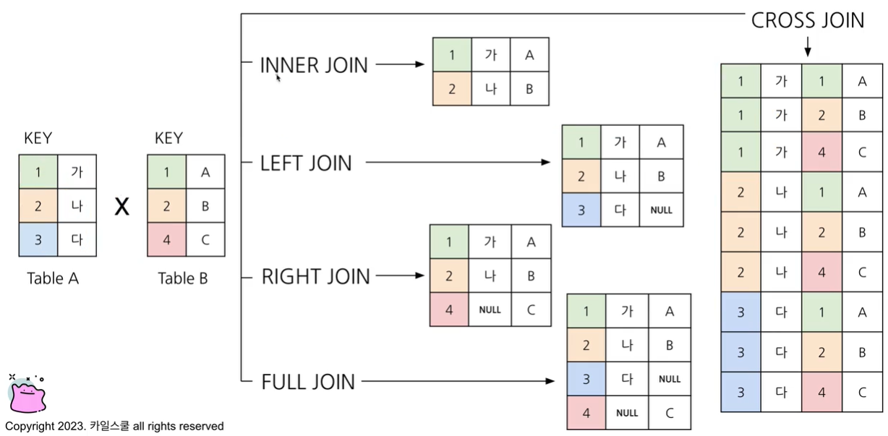

# SQL_BASIC 6주차 정규 과제 

📌SQL_BASIC 정규과제는 매주 정해진 분량의 `초보자를 위한 BigQuery(SQL) 입문` 강의를 듣고 간단한 문제를 풀면서 학습하는 것입니다. 이번주는 아래의 **SQL_Basic_6th_TIL**에 나열된 분량을 수강하고 `학습 목표`에 맞게 공부하시면 됩니다.

**6주차 과제는 강의 내용을 정리하는 것과 함께, 프로그래머스에서 제공하는 SQL 문제를 직접 풀어보는 실습도 병행합니다.** 강의에서는 **배운 내용을 정리하고 주요 쿼리 예제를 정리**하며, 프로그래머스 문제는 **직접 풀어본 뒤 풀이 과정과 결과, 배운 점을 함께 기록**해주세요. 완성된 과제는 Github에 업로드하고, 링크를 스프레드시트 'SQL' 시트에 입력해 제출해주세요.

**(수행 인증샷은 필수입니다.)** 

## SQL_BASIC_6th

### 섹션 6. 다량의 자료를 연결 : JOIN 

### 5-1. Intro

### 5-2. JOIN 이해하기

### 5-3. 다양한 JOIN 방법

### 5-4. JOIN 쿼리 작성하기 

### 5-5. JOIN을 처음 공부할 때 헷갈렸던 부분

### 5-6. JOIN 연습문제 1~2번

### 5-6. JOIN 연습문제 3~5번

### 5-7. 정리

## 🏁 강의 수강 (Study Schedule)

| 주차  | 공부 범위              | 완료 여부 |
| ----- | ---------------------- | --------- |
| 1주차 | 섹션 **1-1** ~ **2-2** | ✅         |
| 2주차 | 섹션 **2-3** ~ **2-5** | ✅         |
| 3주차 | 섹션 **2-6** ~ **3-3** | ✅         |
| 4주차 | 섹션 **3-4** ~ **4-4** | ✅         |
| 5주차 | 섹션 **4-4** ~ **4-9** | ✅         |
| 6주차 | 섹션 **5-1** ~ **5-7** | ✅         |
| 7주차 | 섹션 **6-1** ~ **6-6** | 🍽️         |

<!-- 여기까진 그대로 둬 주세요-->

 

---

# 1️⃣ 개념정리

## 5-2. JOIN 이해하기

~~~
✅ 학습 목표 :
* JOIN에 대한 정의와 필요성에 대해 설명할 수 있다.
~~~

### 정의 
: 서로 다른 데이터 테이블을 연결하는 것             

__두 데이터를 연결할 수 있는 공통값(key)이 필요함__        
trainer_pokemon, trainer 데이터의 trainer_id, id          
trainer_pokemon, pokemon 데이터의 pokemon_id, id          

JOIN -> 컬럼이 많아짐       
큰 table은 작은 table들을 합친 것.         

보통 id 값을 key로 많이 사용하고, 특정 범위(예. Date)로도 JOIN이 가능함       

### 필요성
: 관계형 데이터베이스 설계시 정규화 과정을 거침            
**__정규화__ : 중복을 최소화 하게 데이터를 구조화            
** User table은 유저 데이터만,  Order table은 주문 데이터만               
ex. 트레이너가 포켓몬을 포획할때마다 하나의 테이블에 저장하게 되면 row수가 너무 많아져서 데이터가 무거워짐.          
=> 데이터 웨어하우스에서 JOIN + 필요한 연산을 해서 __"데이터 마트"__ (일자별, 주요 타입별, 지역별, 주문건수, 매출 등으로 가공)를 만들어서 활용

## 5-3. 다양한 JOIN 방법

~~~
✅ 학습 목표 :
* JOIN 방법들의 종류를 설명할 수 있다. 
* 각 JOIN 방법들의 차이점에 대해서 설명할 수 있다. 
~~~

__1. INNER JOIN *교집합__       
두 테이블key에 공통적으로 가지고 있는 열만 붙임.       
__2. LEFT JOIN__         
왼쪽 테이블을 두고 다른 테이블을 붙임.       
__3. RIGHT JOIN__       
오른쪽 테이블을 두고 다른 테이블을 붙임.       
__4. FULL JOIN__         
모든 key를 다 적음.       
__5. CROSS JOIN *모두 다 조합__        
하나의 로우에 각 열을 다 붙이게 됨.         

#### JOIN 종류

#### 결합 관점 JOIN

## 5-4. JOIN 쿼리 작성하기 

~~~
✅ 학습 목표 :
* JOIN을 사용한 문법에 대해 이해하여 적용할 수 있다.
* JOIN 을 활용한 쿼리를 작성할 수 있다. 
~~~

__1. 테이블 확인__      
__2. 기준 테이블 정의__  
: LEFT에 와야 하는 테이블 -> row수가 적으면서, 필요한 정보를 담고 있는     
__3. JOIN Key 찾기__      
: ON에 들어갈 내용 무엇일지 고민   
__4. 결과 예상하기__       
__5. 쿼리 작성/검증__

### 구조     
FROM 다음, 어떤JOIN, ON 사용 (CROSS JOIN은 ON 사용 x)
~~~sql
SELECT
  A.col1,
  A.col2,
  B.col1,
  B.col2
FROM table1 AS A
LEFT JOIN table2 AS B
ON A.key=B.key #Alias 사용할 수 있음
~~~

~~~sql
SELECT
  tp.*,
  t.* EXCEPT(id),  #trainer_id =>  tp에 있으니 그걸 활용
  p.* EXCEPT(id) #pokemon_id=> tp에 있으니 그걸 활용
FROM basic.trainer_pokemon AS tp
LEFT JOIN basic. trainer AS t
ON tp.trainer_id= t.id #ON : Join Key 기입
LEFT JOIN basic.pokemon AS p
ON tp.pokemon.id=p.id
~~~
*cf_ JOIN의 개수에 한계는 없으나 너무 많은 JOIN은 힘듦 (중간 테이블을 활용하는 방법도 있음)*

## 5-6. JOIN 연습문제 1~5번 

~~~
✅ 학습 목표 :
* 연습문제(3문제 이상) 푼 것들 정리하기
~~~

#### #1 트레이너가 보유한 포켓몬을 얼마나 있는지 알 수 있는 쿼리     
*: 결과) 포켓몬 이름 명시 후 cnt 도출*
~~~sql
--1) trainer_pokemon에서 status에서 Active, Training 경우만 필터링(WHERE)
--** 1)로 JOIN할 테이블 row 수를 줄인다음 JOIN을 해야함
--2) 필터링한 결과를 pokemon Table과 JOIN
--3) 2)의 결과에서 pokemon_name, COUNT(pokemon_id) AS pokemon_cnt
~~~
~~~sql
SELECT
  kor_name, #p.kor_name으로 해도 됨
  COUNT(tp.id) AS pokemon_cnt  #JOIN에서 사용하는 테이블에 중복된 컬럼의 이름이 있으면 꼭 어떤 테이블의 컬럼인지 명시해야 함 id=> tp.id
FROM (
  SELECT
    id,
    trainer_id,
    pokemon_id,
    status
  FROM basic.trainer_pokemon
  WHERE
    status IN ("Active", "Training")
)  AS tp
LEFT JOIN basic.pokemon AS p
ON tp.pokemon_id = p.id
GROUP BY
  kor_name
ORDER BY
  pokemon_cnt DESC
~~~
~~~sql
WHERE
  1=1
  AND status = "Training"
  AND status= "Active"
#쿼리를 작성할 때 값을 바꿔가면서 실행해야 함 => 빨리 주석처리하기 위해선 TRUE인 1=1을 넣고, AND 쓰고 빠르게 주석 처리
~~~

#### #2 각 트레이너가 가진 포켓몬 중에서 type1= 'Grass' 타입의 포켓몬 수를 계산해주세요
*왼쪽 테이블 결정 : 기준이 되는 테이블은 내가 구하고자 하는 데이터가 어디에 잘 저장되어 있는가? (NULL이 얼만큼 생기는지)*    
~~~sql
SELECT
  p.type1,
  COUNT(tp.id) AS pokemon_cnt
FROM(
  SELECT
    id,
    trainer_id,
    pokemon_id,
    status
  FROM basic.trainer_pokemon
  WHERE
    status IN ("Active", "Training")
)  AS tp    #Alias 어떻게 했는지 잘 기억해
LEFT JOIN basic.pokemon AS p
ON tp.pokemon_id=p.id
WHERE
  type="Grass"
GROUP BY
  type1
ORDER BY
  pokemon_cnt DESC
~~~

#### #5 Incheon 출신 트레이너들은 1세대, 2세대 포켓몬을 각각 얼마나 보유하고 있나요?
~~~sql
SELECT
  generation,
  COUNT(tp.id) AS pokemon_cnt
FROM(
SELECT
  id,
  trainer_id,
  pokemon_id,
  status
FROM basic.trainer_pokemon
WHERE
  status IN ("Active", "Training")
) AS tp
LEFT JOIN basic. trainer AS t
ON tp.trainer_id = t.id
LEFT JOIN basic.pokemon AS p
ON tp.pokemon_id = p.id
WHERE
  t.hometown = "Incheon"
GROUP BY
  generation
~~~
*cf_3세대가 생겨도 1,2세대만 나오게 해달라고 한다면*
__WHERE 조건에 generation IN (1,2) 조건도 포함__

## 학습인증

 

 

---

# 2️⃣ 확인문제 & 문제 인증

## 프로그래머스 문제 

https://school.programmers.co.kr/learn/courses/30/lessons/164673

> 조건에 부합하는 중고거래 댓글 조회하기 (JOIN)
~~~sql
SELECT
 B.TITLE,
 B.BOARD_ID,
 R.REPLY_ID,
 R.WRITER_ID,
 R.CONTENTS,
 DATE_FORMAT(R.CREATED_DATE, '%Y-%m-%d') AS CREATED_DATE
FROM USED_GOODS_BOARD AS B
INNER JOIN USED_GOODS_REPLY AS R
ON B.BOARD_ID = R.BOARD_ID
WHERE
 B.CREATED_DATE >= '2022-10-01' AND B.CREATED_DATE < '2022-11-01'
ORDER BY
 R.CREATED_DATE ASC,
 B.TITLE ASC;
 ~~~

https://school.programmers.co.kr/learn/courses/30/lessons/144854

> 조건에 맞는 도서와 저자 리스트 출력하기 (JOIN)
~~~sql
SELECT
 B.BOOK_ID,
 A.AUTHOR_NAME,
 DATE_FORMAT(B.PUBLISHED_DATE, '%Y-%m-%d') AS PUBLISHED_DATE
FROM BOOK AS B
INNER JOIN AUTHOR AS A
ON B.AUTHOR_ID = A.AUTHOR_ID
WHERE
 B.CATEGORY = '경제'
ORDER BY
 B.PUBLISHED_DATE ASC;
~~~

---

# 3️⃣ 참고자료

JOIN 에 대해서 그림으로 쉽게 이해할 수 있는 자료들도 있어서 첨부합니다. 아래의 블로그도 학습할 때 같이 참고해주세요.

1. https://data-marketing-bk.tistory.com/entry/SQL-JOIN-%ED%95%9C-%EB%B0%A9%EC%97%90-%EC%A0%95%EB%A6%AC-%EA%B0%9C%EB%85%90%EB%B6%80%ED%84%B0-%EC%BD%94%EB%93%9C%EA%B9%8C%EC%A7%80-%EC%9D%B4%EA%B2%83%EB%A7%8C-%EB%B3%B4%EC%9E%90

2. https://velog.io/@wijoonwu/JOIN

 

### 🎉 수고하셨습니다.