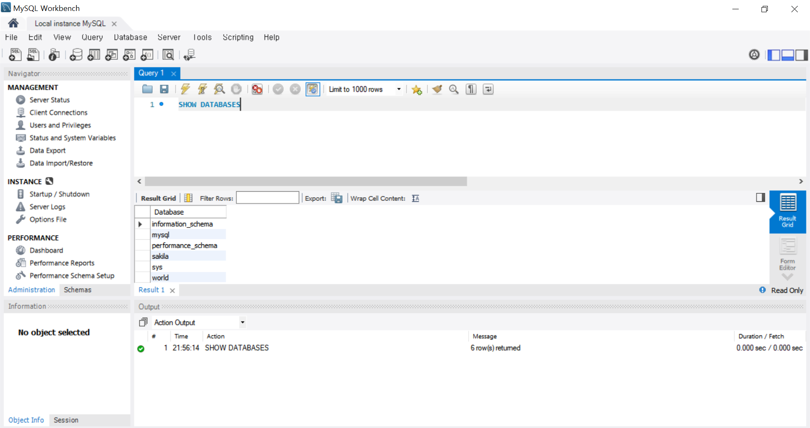
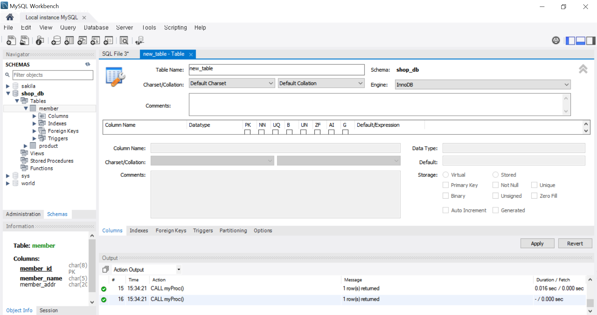
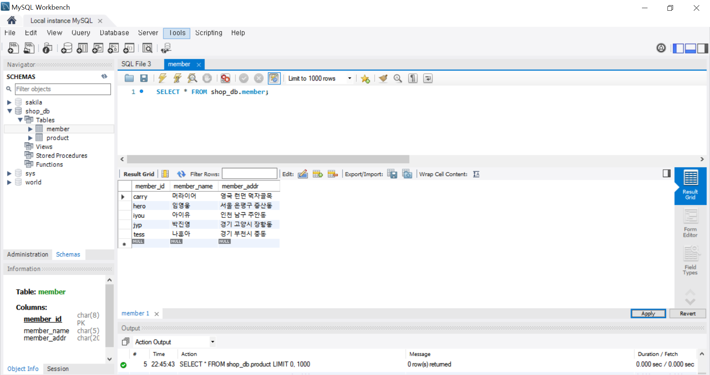
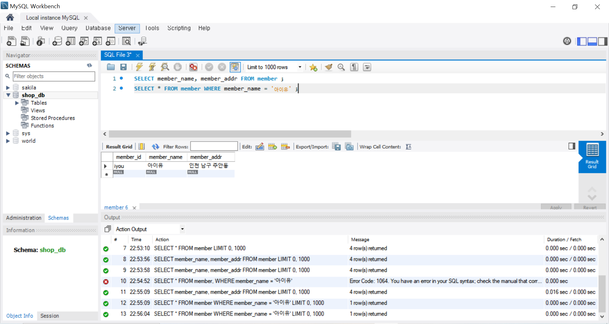
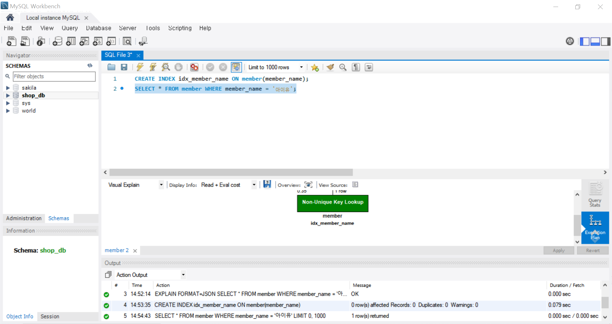
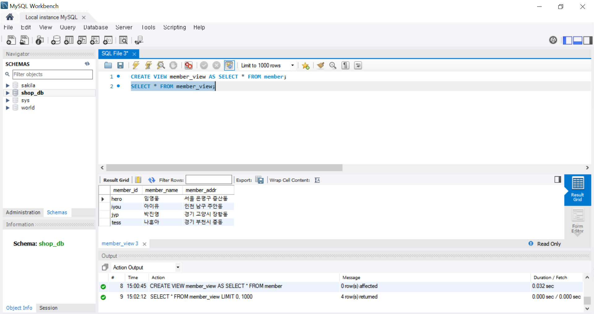
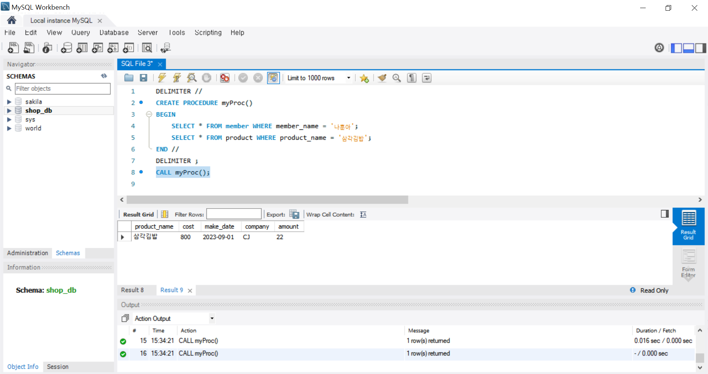

# SQL_ADVANCED 1주차 정규 과제 

📌SQL_ADVANCED 정규과제는 매주 정해진 분량의 『*혼자 공부하는 SQL*』 을 읽고 학습하는 것입니다. 이번주는 아래의 **SQL_ADVANCED_1st_TIL**에 나열된 분량을 읽고 공부하시면 됩니다.

아래의 문제를 풀어보며 학습 내용을 점검하세요. 문제를 해결하는 과정에서 개념을 스스로 정리하고, 필요한 경우 제시된 강의를 참고하여 보완하는 것이 좋습니다.

<!-- 강의 링크는 아래와 같습니다.
https://www.youtube.com/watch?v=0cRhit1EJM0&list=PLVsNizTWUw7GCfy5RH27cQL5MeKYnl8Pm&index=1
https://www.youtube.com/watch?v=6JFEJWLcKUc&list=PLVsNizTWUw7GCfy5RH27cQL5MeKYnl8Pm&index=2
https://www.youtube.com/watch?v=8r1W_7nuo2U&list=PLVsNizTWUw7GCfy5RH27cQL5MeKYnl8Pm&index=3
https://www.youtube.com/watch?v=j2DAiY-OXGs&list=PLVsNizTWUw7GCfy5RH27cQL5MeKYnl8Pm&index=4
https://www.youtube.com/watch?v=EftIRlr6rPI&list=PLVsNizTWUw7GCfy5RH27cQL5MeKYnl8Pm&index=5
https://www.youtube.com/watch?v=lBk5YhLZevs&list=PLVsNizTWUw7GCfy5RH27cQL5MeKYnl8Pm&index=6
-->

**교재 실습 예제 파일은 07_SQL_ADVANCED_Template 레포지토리의 src 폴더에 업로드되어 있습니다. market_db 파일도 해당 폴더에 함께 포함되어 있으니 참고하시기 바랍니다.**

**👀(수행 인증샷은 필수입니다.)** 

## SQL_ADVANCED_1st_TIL

### 1장 데이터베이스와 SQL
#### 01. 데이터베이스 알아보기
#### 02. MySQL 설치하기
### 2장 실전용 SQL 미리 맛보기
#### 01. 건물을 짓기 위한 설계도: 데이터베이스 모델링
#### 02. 데이터베이스 시작부터 끝까지
#### 03. 데이터베이스 개체 


## Study Schedule

| 주차  | 공부 범위     | 완료 여부 |
| ----- | ------------- | --------- |
| 1주차 | p.24~99    | ✅         |
| 2주차 | p.102~155   | 🍽️         |
| 3주차 | p.158~213  | 🍽️         |
| 4주차 | p.216~271 | 🍽️         |
| 5주차 | p.274~327 | 🍽️         |
| 6주차 | p.330~369 | 🍽️         |
| 7주차 | p.372~407 | 🍽️         |


<br>

<!-- 여기까진 그대로 둬 주세요-->

---

# 1️⃣ 학습 내용 정리

## 1. 데이터베이스 알아보기

<!-- 데이터베이스와 DBMS에 관해 배우게 된 점을 적어주세요. -->
- 데이터베이스를 '데이터의 집합'이라고 정의함.   
- 데이터베이스를 관리하고 운영하는 소프트웨어를 DBMS라고 함.   
_*엑셀은 DBMS가 아님. (대용량 데이터를 관리하거나 여러 사용자와 공유하는 개념과 거리가 있기 때문.)_


#### <DBMS 발전 과정>  

- 종이 → 컴퓨터 메모장 → 스프레드시트 사용해 표 형태, 파일 형태로 저장 → DBMS (대량의 데이터를 효율적으로 관리, 운영하기 위함)

#### <DBMS 분류>   
**1. 계층형** : 트리형태, 구성 완료 후 변경 어려움.   
**2. 망형** : 계층형 + 하위구성원도 연결되어 있음. 거의 사용하지 않음.   
**3. 관계형** : **RDBMS**, 테이블(열, 행) 2차원 구조    
**기타. 객체지향형, 객체관계형 등**

#### <DBMS 언어: SQL>
**표준 SQL** : 국제표준화기구에서 SQL에 대한 표준 정해서 발표함.


> **확인문제: 다음 소프트웨어 중에서 DBMS가 아닌 것을 모두 고르세요.**

> MySQL / Excel / Oracle / SQL Server / MariaDB

```
Excel
```


## 2. MySQL 설치하기

<!-- 이번 챕터는 개념정리 없이 MySQL 설치 후 인증사진으로 대체합니다. -->




## 3. 건물을 짓기 위한 설계도: 데이터베이스 모델링

<!-- 데이터베이스 모델링에 관해 배우게 된 점을 적어주세요. -->

**- 데이터베이스 모델링** : 테이블의 구조를 미리 설계함,   
대표적으로 폭포수 모델 사용 → 테이블 구조 결정

**- 프로젝트**: 현실 세계에서 일어나는 업무를 컴퓨터 시스템으로 옮겨놓는 과정,   
대규모 소프트웨어를 작성하기 위한 전체 과정,   
폭포수 모델에서 업무 분석과 시스템 설계 

> **확인문제: 다음은 폭포수 모델의 절차입니다. 차례대로 나열해보세요.**

> 시스템 설계 / 테스트 / 프로그램 구현 / 프로젝트 계획 / 업무 분석 / 유지보수

```
프로젝트 계획 → 업무 분석 → 시스템 설계 → 프로그램 구현 → 테스트 → 유지보수
```


## 4. 데이터베이스 시작부터 끝까지 

<!-- 이번 챕터는 개념정리 없이 실습 인증사진으로 대체합니다. 강의를 수강하고, 실습 과정이 보이도록 인증사진 3-4장을 아래에 제출해주세요. -->





<!-- 이 부분을 지우고 인증사진을 제출해주세요.-->


## 5. 데이터베이스 개체

<!-- 데이터베이스 개체에 관해 배우게 된 점을 적어주세요. -->
#### 데이터베이스 개체
**1. 테이블**   

**2. 인덱스** : 데이터를 조회할 때 결과 나오는 속도가 획기적으로 빠르게 해줌. 

**3. 뷰** : 테이블의 일부를 제한적으로 표현할 때 사용.    
'가상의 테이블' 이라고 정의.    
실제 데이터를 가지고 있지 않으며, 진짜 테이블에 링크된 개념.   
SELECT문   

**4. 스토어드 프로시저** : SQL에서 프로그래밍이 가능하도록 해줌.   
- 두 SQL을 하나의 스토어드 프로시저로 만드는 구문.
~~~sql
DELIMITER //
CREATE PROCEDURE myProc() #스토어드 프로시저 이름 지정
BEGIN
	SELECT * FROM member WHERE member_name = '나훈아';
	SELECT * FROM product WHERE product_name = '삼각김밥'; #지금은 두 줄이지만, 몇 백줄이 넘어도 상관없음.
END //
DELIMITER ;
~~~

**5. 트리거** : 잘못된 데이터가 들어가는 것을 미연에 방지하는 기능.   
**기타. 함수, 커서 등**


#### 참고
- 데이터베이스 개체 만들기
~~~sql
CREATE 개체_종류 개체_이름 ~~
~~~

- 데이터베이스 개체 삭제하기
~~~sql
DROP 개체_종류 개체_이름
DROP PROCEDURE myProc
~~~

<!-- 인덱스, 뷰, 스토어드 프로시저 실습을 각각 진행한 후, 각 실습에 대한 인증 사진을 1장씩 제출해 주세요. -->






---

# 2️⃣ 실습과제

> SQL ADVANCED 과정은 별도의 확인문제가 없습니다. 다음 주부터는 확인문제 대신 제공되는 실습용 테이블을 활용하여, 배운 내용을 직접 적용하는 실습형 과제로 진행됩니다.

> 이번주는 개강과 함께 새로운 학기가 시작된 만큼, 학기 초 일정에 천천히 적응하시며 부담 없는 한 주 보내시길 바랍니다. 😊

### 🎉 수고하셨습니다.