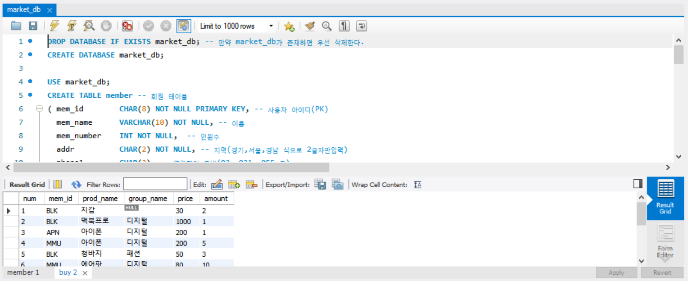
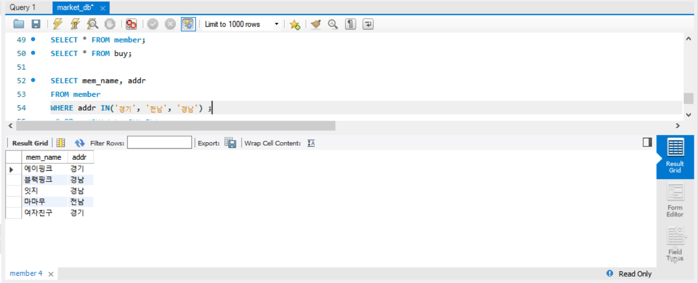
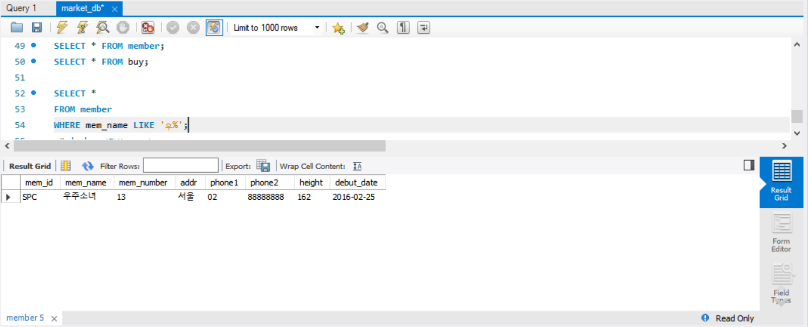
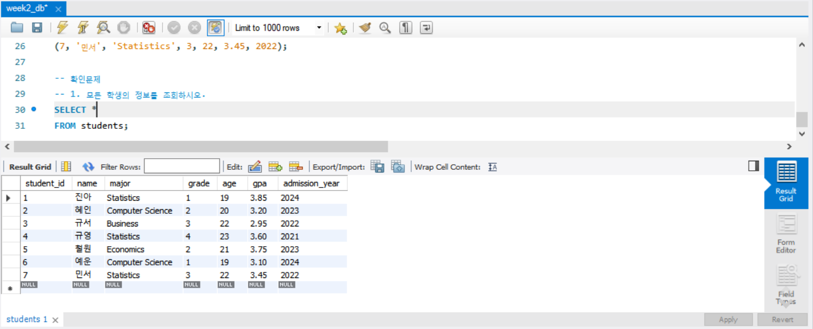
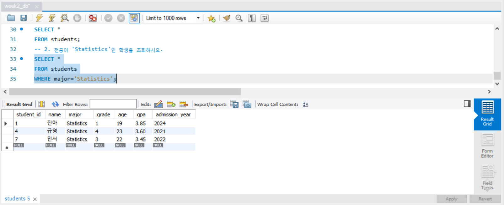
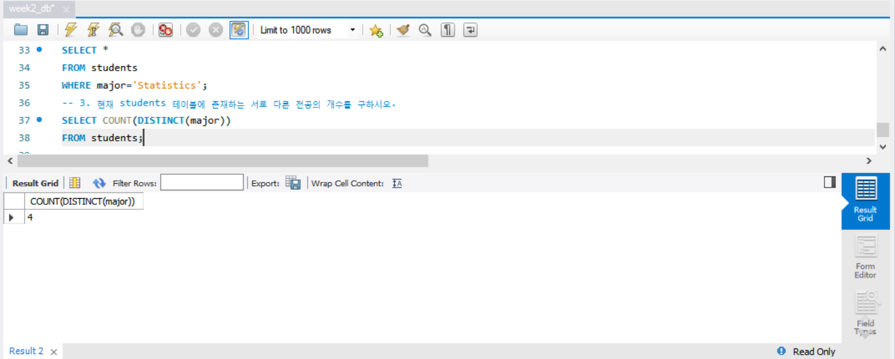
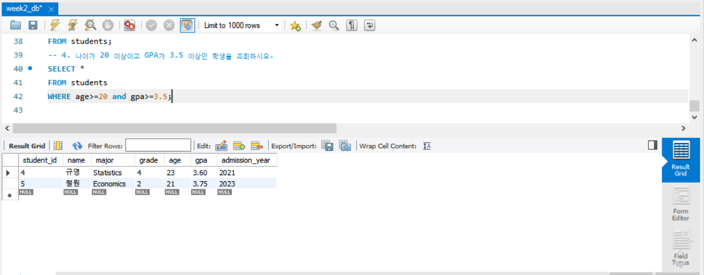
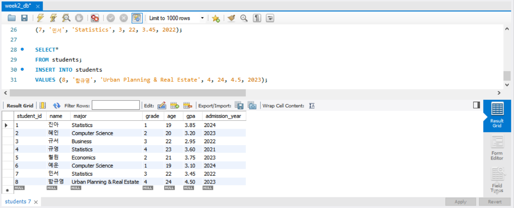

# SQL_ADVANCED 2주차 정규 과제 

📌SQL_ADVANCED 정규과제는 매주 정해진 분량의 『*혼자 공부하는 SQL*』 을 읽고 학습하는 것입니다. 이번주는 아래의 **SQL_ADVANCED_2nd_TIL**에 나열된 분량을 읽고 공부하시면 됩니다.

아래의 문제를 풀어보며 학습 내용을 점검하세요. 문제를 해결하는 과정에서 개념을 스스로 정리하고, 필요한 경우 제시된 강의를 참고하여 보완하는 것이 좋습니다.

<!-- 강의 링크는 아래와 같습니다.
https://www.youtube.com/watch?v=_JURyg_KzHE&list=PLVsNizTWUw7GCfy5RH27cQL5MeKYnl8Pm&index=7
https://www.youtube.com/watch?v=6qkPy7RfLqQ&list=PLVsNizTWUw7GCfy5RH27cQL5MeKYnl8Pm&index=8
https://www.youtube.com/watch?v=WWAFAm9op2U&list=PLVsNizTWUw7GCfy5RH27cQL5MeKYnl8Pm&index=9
-->

**교재 실습 예제 파일은 07_SQL_ADVANCED_Template 레포지토리의 src 폴더에 업로드되어 있습니다. market_db 파일도 해당 폴더에 함께 포함되어 있으니 참고하시기 바랍니다.**

**👀(수행 인증샷은 필수입니다.)** 

## SQL_ADVANCED_2nd_TIL

### 3장 SQL 기본 문법
#### 01. 기본 중에 기본 SELECT ~ FROM ~ WHERE
#### 02. 좀 더 깊게 알아보는 SELECT문
#### 03. 데이터 변경을 위한 SQL문


## Study Schedule

| 주차  | 공부 범위     | 완료 여부 |
| ----- | ------------- | --------- |
| 1주차 | p.24~99    | ✅         |
| 2주차 | p.102~155   | ✅         |
| 3주차 | p.158~213  | 🍽️         |
| 4주차 | p.216~271 | 🍽️         |
| 5주차 | p.274~327 | 🍽️         |
| 6주차 | p.330~369 | 🍽️         |
| 7주차 | p.372~407 | 🍽️         |


<br>

<!-- 여기까진 그대로 둬 주세요-->

---

# 1️⃣ 학습 내용 정리

## 1. 기본 중에 기본 SELECT ~ FROM ~ WHERE

<!-- 기본적인 SQL 문법에 관해 배우게 된 점을 적어주세요. -->
~~~sql
SELECT 열 이름 # 데이터베이스의 테이블을 조회한 후 결과를 보여줌
FROM 테이블 이름
WHERE 조건식
~~~

### USE문
~~~sql
USE market_db; # 사용할 데이터베이스를 설정
~~~

### 기본적인 sql문
~~~sql
SELECT 열_이름
 FROM 테이블_이름
 WHERE 조건식
 GROUP BY 열_이름
 HAVING 조건식
 ORDER BY 열_이름
 LIMIT 숫자
~~~

#### 열 이름의 별칭
~~~sql
SELECT addr 주소, debut_date "데뷔 일자", mem_name
FROM member;

-- 열 이름에 별칭(allias) 지정할 수 있음.
-- 단, 별칭에 공백이 있으면 큰따옴표로 묶어줘야함. "데뷔 일자"
~~~
### WHERE문
~~~sql
SELECT *
FROM member
WHERE mem_name='블랙핑크' ;
-- 이름 열은 문자형이므로 작은따옴표로 묶어줘야함. 
WHERE mem_number =4 ;
-- 숫자형 열을 조회할 때는 작음따옴표가 필요 없음.
WHERE height <= 162 ;
-- 관계 연산자 >=
WHERE height >= 165 AND mem_number >6 ;
-- 논리 연산자 AND
WHERE height BETWEEN 163 AND 165 ;
-- BETWEEN ~ AND
WHERE addr='경기' OR addr='전남' OR addr='경남' ;
WHERE addr IN('경기', '전남', '경남') ;
-- OR 논리연산자와 동일한 결과
WHERE mem_name LIKE '우%';
-- '우'로 시작하는 글자
WHERE mem_name LIKE '__핑크';
-- '핑크'로 끝나면서 앞 두글자가 있는 글자
~~~

### 서브쿼리
: SELECT 안에 또 **다른 SELECT (서브쿼리, 하위쿼리)** 가 들어갈 수 있음. 
~~~sql
SELECT mem_name, height FROM member
 WHERE height > (SELECT height FROM membr WHERE mem_name = '에이핑크') ;
~~~

<!-- 이번 챕터에서 제시된 실습을 흐름에 맞게 진행한 후, 실습 과정이 보일 수 있도록 인증 사진을 3~4장 제출해 주세요. -->

<!-- 이 부분을 지우고 인증사진을 제출해주세요.-->





> **확인문제: 다음 SQL문의 빈칸에 들어갈 WHERE절의 문법으로 틀린 것을 고르세요.**

```sql
SELECT *
FROM table_name
WHERE ________;
```

보기는 아래와 같습니다.
```
1. mem_number == 4
2. mem_number >= 4
3. mem_number <= 4
4. mem_number = 4
```

```
1. mem_number == 4
숫자형 열을 조외할 때에는 작은따옴표 없이 mem_number = 4 로 표기하는 것이 옳으며,
= 대신 관계연산자인 >=, <= 등을 사용할 수 있다.
```


## 2. 좀 더 깊게 알아보는 SELECT문

<!-- ORDER BY절과 GROUP BY절에 관해 배우게 된 점을 적어주세요. -->
### ORDER BY절
: 결과가 출력되는 순서를 조절함.

~~~sql
SELECT mem_id, mem_name, debut_date
FROM member
ORDER BY debut_date ; -- 데뷔 일자가 빠른 순서대로 출력 (기본값은 ASC)
ORDER BY debut_date DESC ; -- 데뷔 일자 내림차순
~~~
-WHERE 절 뒤에 ORDER BY절이 오게끔 함께 사용.
~~~sql
SELECT mem_id, mem_name, debut_date, height
FROM member
WHERE height >= 164
ORDER BY height DESC, debut_date ASC ; -- 키 기준 우선 정렬, 다음으로 데뷔일자 기준 정렬 
~~~
-정렬 기준은 여러 개 열로 지정할 수 있음.    
-첫 번째 열에서 정렬이 동일한 경우, 다음 지정 열로 정렬.

### LMIT
: 출력하는 개수를 제한함.
~~~sql
SELECT *
FROM member
ORDER BY height DESC
LIMIT 3, 2 ; -- 3번째부터 2건만 조회.
~~~
-가장 마지막에 LIMIT을 위치 시키며, ORDER BY와 함께 사용 가능.

### DISTINCT
: 중복된 데이터를 1개만 남김.
~~~sql
SELECT DISTINCT addr FROM member ;
~~~

### GROUP BY 절
: 그룹을 묶어주는 역할

-집계함수를 함께 사용함으로써 그룹별 통계를 쉽게 나타냄.   
예) SUM(), AVG(), MIN(), MAX(), COUNT(), COUNT(DISTINCT)

~~~sql
SELECT mem_id, SUM(price * amount) "총 구매 금액" -- 그룹별 총 구매 금액을 계산함.
FROM buy
GROUP BY mem_id ; -- 회원별로 그룹을 만들어준 다음,
~~~
~~~sql
SELECT COUNT(phone1) "연락처가 있는 회원"
FROM member ;
-- phone1 열에서 NULL 값인 항목을 제외한 셀 개수
~~~

### Having 절
-WHERE과 비슷한 개념이지만, **집계 함수에 대해서** 조건을 제한함.   
-HAVING 절은 꼭 GROUP BY 절 다음에 나와야 함.
~~~sql
SELECT mem_id "회원 아이디", SUM(price*amount) "총 구매 금액"
FROM buy
GROUP BY mem_id
HAVING SUM(price*amount) > 1000 ;
~~~

> **확인문제: 다음 표는 주요 집계함수를 정리한 것입니다. 각 설명에 해당하는 올바른 함수명을 기호에 맞게 작성하세요.**

| 함수명 | 설명 |
|--------|------|
| SUM() | 합계를 구합니다. |
| (ㄱ) | 평균을 구합니다. |
| (ㄴ) | 최소값을 구합니다. |
| MAX() | 최대값을 구합니다. |
| (ㄷ) | 행의 개수를 셉니다. |
| (ㄹ) | 행의 개수를 셉니다 (중복은 1개만 인정). |

```
여기에 답을 적어주세요!
(ㄱ) AVG()
(ㄴ) MIN()
(ㄷ) COUNT()
(ㄹ) COUNT(DISTINCT)
```


## 3. 데이터 변경을 위한 SQL문

<!-- INSERT문, UPDATE문, DELETE문에 관해 배우게 된 점을 적어주세요. -->
### INSERT
: 테이블에 행 데이터를 입력함
~~~sql
USE market_db;
CREATE TABLE hongong1 (toy_id INT, toy_name CHAR(4), age INT) ;
INSERT INTO hongong1 VALUES (1, '우디', 25); 
-- VALUES 뒤 열 순서 및 개수가 동일해야 함.

INSERT INTO hongong1 (toy_id, toy_name) VALUES (2, '버즈') ;
-- 나이 열에는 아무것도 없다는 의미의 NULL 값이 들어감.
~~~

### AUTO_INCREMENT
: 열을 정의할 때 1부터 증가하는 값 입력.   
-INSERT에서는 해당 열이 없다고 생각하고 입력   
-AUTO_INCREMENT 열은 꼭 PK지정
~~~sql
CREATE TABLE hongong2 (
 toy_id INT AUTO_INCREMENT PRIMARY KEY,
 toy_name CHAR(4),
 age INT) ;
INSERT INTO hongong2 VALUES (NULL, '보핍', 25) ; -- 자동 증가하는 부분은 NULL 값으로 채우면 됨.
~~~
~~~sql
SELECT LAST_INSER_ID() ; -- 현재 어느 숫자까지 증가되었는지 확인
~~~
~~~
ALTER TABLE hongong2 AUTO_INCREMENT=100 ; -- 자동증가 100부터 시작
SET @@auto_increment_increment=3; -- 증가값 3으로 지정
~~~
#### 시스템변수
: MYSQL에서 자체적으로 가지고 있는 설정값이 저장된 변수    
: SHOW GLOBAL VARIABLES 실행으로 종류 확인 가능
~~~sql
SELECT @@시스템변수
~~~ 

### INSERT INTO ~ SELECT
: 다른 테이블의 데이터를 한 번에 입력함
~~~sql
INSERT INTO 테이블_이름 (열_이름1, 열_이름2, ...)
    SELECT문 ; 
-- SELECT 문의 열 개수는 INSERT할 테이블의 열 개수와 같아야 함.
~~~
~~~sql
CREATE TABLE city_popul (city_name CHAR(35), population INT);
INSERT INTO city_popul
    SELECT Name, Population From world.city;
~~~
### UPDATE
: 데이터 수정
~~~sql
UPDATE city_popul
    SET city_name = '서울', population = 0
    WHERE city_name = 'Seoul'; 
-- city_popul 테이블의 도시이름 중에서 'Seoul'을 '서울'로 변경, 동시에 인구는 0으로 설정
~~~
-WHERE 가 없는 UPDATE문은 모든 행의 값이 변경되니 주의
~~~sql
UPDATE city_popul
 SET population=population / 10000;
-- 모든 인구 열을 한꺼번에 10,000으로 나눠 단위 변경
~~~
### DELETE
: 테이블의 행 데이터 삭제
~~~sql
DELETE FROM city_popul
    WHERE city_name LIKE 'New%' 
    LIMIT 5;
-- 'NEW'로 시작하는 도시를 상위 5건만 삭제
~~~
### 대용량 테이블의 삭제
~~~sql
DROP TABLE big_table2; --테이블 자체 삭제
TRUNCATE TABLE big_table3; -- 전체 내용 삭제, 빈 테이블 구조 남김
~~~
> **확인문제: 다음이 설명하는 SQL이 무엇인지 쓰세요.**

```
* 데이터를 삭제합니다.
* DELETE와 동일한 효과를 내지만 속도가 무척 빠릅니다.
* 삭제 후에 빈 테이블이 남아 있습니다.
```

```
TRUNCATE
```


---

# 2️⃣ 실습과제

## 1. 데이터베이스 구축

아래 코드를 MySQL Workbench에 붙여넣은 후,  
**전체 드래그 → 실행 (Ctrl + shift + Enter)** 하여 데이터베이스를 구축하세요.

```sql
-- 1. 데이터베이스 생성
CREATE DATABASE IF NOT EXISTS week2_db;

-- 2. 사용할 데이터베이스 선택
USE week2_db;

-- 4. 테이블 생성
CREATE TABLE students (
    student_id INT PRIMARY KEY,
    name VARCHAR(20),
    major VARCHAR(30),
    grade INT,
    age INT,
    gpa DECIMAL(3,2),
    admission_year INT
);

-- 5. 데이터 삽입
INSERT INTO students VALUES
(1, '진아', 'Statistics', 1, 19, 3.85, 2024),
(2, '혜인', 'Computer Science', 2, 20, 3.20, 2023),
(3, '규서', 'Business', 3, 22, 2.95, 2022),
(4, '규영', 'Statistics', 4, 23, 3.60, 2021),
(5, '철원', 'Economics', 2, 21, 3.75, 2023),
(6, '예운', 'Computer Science', 1, 19, 3.10, 2024),
(7, '민서', 'Statistics', 3, 22, 3.45, 2022);
```
## 2. 실습 문제

다음 SQL 문을 작성하고 실행 결과를 확인 후 인증 사진을 아래에 업로드하세요.

1. 모든 학생의 정보를 조회하시오.

2. 전공이 'Statistics'인 학생을 조회하시오.

3. 현재 students 테이블에 존재하는 서로 다른 전공의 개수를 구하시오.

4. 나이가 20 이상이고 GPA가 3.5 이상인 학생을 조회하시오.

5. students 테이블에 본인의 정보를 직접 INSERT 하시오. (INSERT 실행 후, 데이터가 정상적으로 추가되었는지 확인할 수 있도록 조회 결과까지 포함하여 캡처하시오.)



### 🎉 수고하셨습니다.