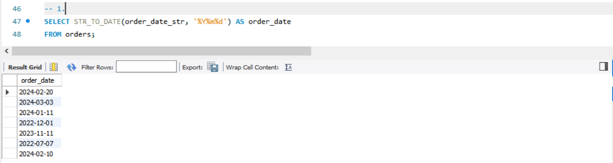
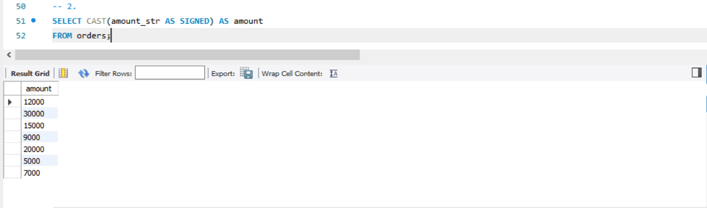
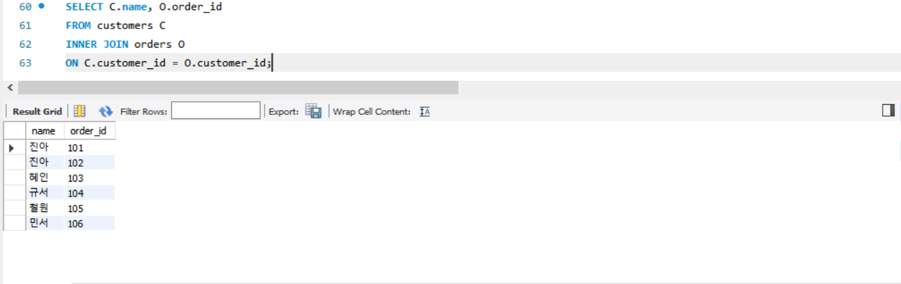
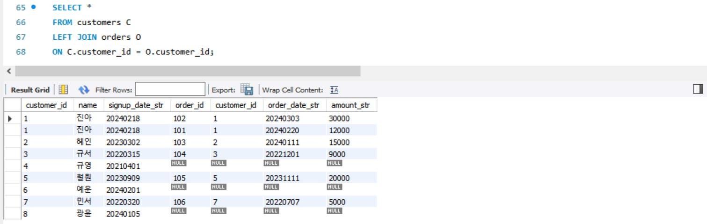
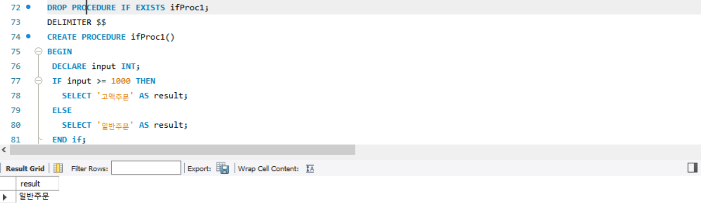

# SQL_ADVANCED 3주차 정규 과제 

📌SQL_ADVANCED 정규과제는 매주 정해진 분량의 『*혼자 공부하는 SQL*』 을 읽고 학습하는 것입니다. 이번주는 아래의 **SQL_ADVANCED_3rd_TIL**에 나열된 분량을 읽고 공부하시면 됩니다.

아래의 문제를 풀어보며 학습 내용을 점검하세요. 문제를 해결하는 과정에서 개념을 스스로 정리하고, 필요한 경우 제시된 강의를 참고하여 보완하는 것이 좋습니다.

<!-- 강의 링크는 아래와 같습니다.
https://www.youtube.com/watch?v=1YmWy-7-OhQ&list=PLVsNizTWUw7GCfy5RH27cQL5MeKYnl8Pm&index=10
https://www.youtube.com/watch?v=tuQFkzjqEGw&list=PLVsNizTWUw7GCfy5RH27cQL5MeKYnl8Pm&index=11
https://www.youtube.com/watch?v=IOCsreDYqFE&list=PLVsNizTWUw7GCfy5RH27cQL5MeKYnl8Pm&index=12
-->

**교재 실습 예제 파일은 07_SQL_ADVANCED_Template 레포지토리의 src 폴더에 업로드되어 있습니다. market_db 파일도 해당 폴더에 함께 포함되어 있으니 참고하시기 바랍니다.**

**👀(수행 인증샷은 필수입니다.)** 

## SQL_ADVANCED_3rd_TIL

### 4장 SQL 고급 문법
#### 01. MySQL의 데이터 형식
#### 02. 두 테이블을 묶는 조인
#### 03. SQL 프로그래밍 


## Study Schedule

| 주차  | 공부 범위     | 완료 여부 |
| ----- | ------------- | --------- |
| 1주차 | p.24~99    | ✅         |
| 2주차 | p.102~155   | ✅         |
| 3주차 | p.158~213  | ✅         |
| 4주차 | p.216~271 | 🍽️         |
| 5주차 | p.274~327 | 🍽️         |
| 6주차 | p.330~369 | 🍽️         |
| 7주차 | p.372~407 | 🍽️         |


<br>

<!-- 여기까진 그대로 둬 주세요-->

---

# 1️⃣ 학습 내용 정리

## 1. MySQL의 데이터 형식

<!-- MySQL의 데이터 형식에 관해 배우게 된 점을 적어주세요. -->
## [데이터 형식]
### 1. 정수형   


| 데이터형식  | 바이트 수     | 숫자 범위 |
| ----- | ------------- | --------- |
| TINYINT | 1 | -128 ~ 127 |
| SMALLINT | 2 | -32,768 ~ 32,767 |
| INT | 4 | 약 -21억 ~ +21억 |
| BIGINT | 8 | 약 -900경 ~ +900경|

`UNSIGNED` 붙이면 0부터 범위가 지정됨.     
TINYINT **UNSIGNED** 일 경우 0~255

### 2. 문자형
| 데이터형식  | 바이트 수     
| ----- | ------------- | 
| CHAR(개수) | 1~255 | 
| VARCHAR(개수) | 1~16383 | 


`CAHR(10)`에 3글자 저장하면 7자리 낭비.   
`VARCHAR(10)`에 3글자 저장할 경우 3자리만 사용 → 공간을 효율적으로 운영할 수 있지만 속도가 상대적으로 느림.   
=> 값들이 2글자로 일정하다면 CHAR(2), 그렇지 않다면 VARCHAR 사용이 유리함

> **참고**   
> **숫자인데 문자형으로 지정하는 경우!**   
\- 더하기/빼기 등 연산에 의미가 없음.   
\- 크다/작다 또는 순서에 의미가 없음.   
\- 02, 041, 055 등과 같이 제일 앞에 0이 붙어야 하는데 정수형으로 지정하면 0이 사라지므로 CHAR로 지정.

**대량의 데이터 형식**
- `TEXT` : 최대 65535자
- `LONGTEXT` : 최대 약 42억자
- `BLOB` : Binary Long Object(이진 데이터), 글자가 아닌 이미지, 동영상 등의 데이터 
- `LONGBLOB`

### 3. 실수형

| 데이터형식  | 바이트 수   | 설명 |
| ----- | ------- | --------- |
| FLOAT | 4 | 소수점 아래 7자리까지 표현|
| DOUBLE | 8 | 소수점 아래 15자리까지 표현 |


### 4. 날짜형

| 데이터형식  | 바이트 수     | 설명 |
| ----- | ------------- | --------- |
| DATE | 3 | 날짜만 저장, YYY-MM-DD 형식 |
| TIME | 3 | 시간만 저장, HH:MM:SS 형식 |
| DATETIME | 8 | 날짜 및 시간 저장, YYYY-MM-DD HH:MM:SS 형식 |

## [변수의 사용]
`SET`, `SELECT`
```sql
SET @변수이름 = 변수의 값 -- 변수의 선언 및 값 대입 ;
SELECT @변수이름 -- 변수의 값 출력; 
```
<br>

\- 예시 SQL문
```sql
SET @txt = '가수 이름 ==>' ;
SET @height = 166 ;
SELECT @txt, mem_name
FROM member
WHERE height > @height ;
-- 키가 166 초과인 mem_name을 추출함.
-- 이때 txt 변수 할당에 따라 가수 이름 ==> 소녀시대 형식으로 추출함.
```
<br>

> **참고**    
> **LIMIT @count 같이 LIMIT에는 변수 사용 불가.** 

대신, `PREPARE`, `EXECUTE` 사용.

```sql
SET @count = 3;
-- @count 변수에 3 대입
PREPARE mySQL FROM 'SELECT mem_name, height FROM member ORDER BY height LIMIT ?' ;
-- 'SELECT~ LIMIT?' 문을 mySQL 이름으로 준비만 해둠. ?는 현재는 모르지만 나중에 채워질 예정을 의미함.
EXECUTE mySQL USING @count;
-- mySQL에 저장된 SELECT문을 실행하며, ?에 @count 변수 값을 대입함.

```sql
SELECT mem_name, height
FROM member
ORDER BY height
LIMIT 3;
```

## [데이터 형 변환]

### 1. 함수를 이용한 **명시적인 변환**
`CAST()`,  `CONVERT()`
~~~sql
SELECT CAST(AVG(price) AS SIGNED) '평균 가격' FROM buy ;
SELECT CONVERT(AVG(price), SIGNED) '평균 가격' FROM buy ;
-- 구매 테이블(buy)에서 평균 가격을 구하는데, 결과 값이 부호가 있는 정수로 표현
~~~
> **참고**     
**CAST(), CONVERT() 함수 안에 올 수 있는 데이터 형식**    
CHAR, SIGNED, UNSIGNED(부호가 없는 정수), DATE, TIME, DATETIME

### 2. **암시적인 변환**
함수를 사용하지 않고도 자연스럽게 형이 변환 됨.
~~~sql
SELECT '100'+'200' ;
-- 문자 100, 200은 더할 수 없으나 자동으로 숫자 100, 200으로 변환해 덧셈 수행
~~~

> **참고**   
> **CONCAT() 함수는 문자를 이어주는 역할을 함.**

~~~sql
SELECT CONCAT('100', '200'); -- 100200
SELECT CONCAT(100, '200'); -- 100200
SELECT 100+'200'; --300
~~~


> **확인문제: 다음 보기에서 데이터 형식의 변환에 사용되는 함수를 2개 고르세요.**

보기는 아래와 같습니다.
```
CONVERT() / DATA() / CAST() / MOVE() / TYPE() / SUM() / AVG() / CURRENT_DATE()
```

```
CONVERT(), CAST()
```


## 2. 두 테이블을 묶는 조인

<!-- 두 테이블을 묶는 조인에 관해 배우게 된 점을 적어주세요. -->
>**참고**    
> **일대다 관계**    
한쪽 테이블에는 하나의 값만 존재해야 하지만, 연결된 다른 테이블에는 여러 개의 값이 존재할 수 있는 관계.    
= 기본키(PK)와 외래키(FK)의 관계

### 1. 내부 조인
`INNER JOIN ~ ON ~` : 조인하는 두 테이블에 모두 있는 내용만 조인되는 방식.    
_*만약 양쪽 중에 한 곳이라도 내용이 있을 때 조인하려면 외부 조인 사용._
<br>
 
\- 두 테이블에 동일한 열 이름이 존재한다면 **테이블_이름.열_이름** 형식으로 표기해야 함.
~~~sql
-- buy 테이블과 member 테이블을 조인함.  
USE market_db;
SELECT*
FROM buy
INNER JOIN member
ON buy.mem_id = member.mem_id
WHERE buy.mem_id = "GRL" ;
~~~
<br>

>**참고**   
**별칭 사용** : 각 열이 어느 테이블에 속한 곳인지 명확하게 하면서도 간결히 표현하기 위함.
~~~sql
SELECT B.mem_id, M.mem_name, B.prod_name, M.addr, CONCAT(M.phone1, M.phone2) '연락처'
FROM buy B -- buy테이블은 B
INNER JOIN member M -- member테이블은 M
ON B.mem_id = M.mem_id ;
~~~

<br>

### 2. 외부 조인
`(LEFT/RIGHT) OUTER JOIN ~ ON ~` : 두 테이블을 조인할 때 필요한 내용이 (왼쪽/오른쪽)에만 있어도 결과를 추출할 수 있음.

\- 왼쪽에 있는 회원 테이블을 기준으로 구매 테이블을 조인함.    
\- 구매 기록이 없는 회원의 구매 정보도 NULL 값으로 조인해 출력됨.
~~~ sql
SELECT M.mem_id, M.mem_name, B.prod_name, M.addr
FROM member M 
LEFT OUTER JOIN buy B
ON M.mem_id = B.mem_id 
ORDER BY M.mem_id ;
~~~
<br>

> **활용**   
회원 가입만 하고 한 번도 구매한 적 없는 회원의 목록 추출하기

~~~sql
SELECT DISTINCT M.mem_id, M.mem_name, B.prod_name, M.addr
FROM member M 
LEFT OUTER JOIN buy B
ON M.mem_id = B.mem_id 
WHERE B.prod_name IS NULL
ORDER BY M.mem_id ;
~~~

<br>

`FULL OUTER JOIN ~ ON` : 왼쪽이든, 오른쪽이든 한쪽에 들어있는 내용이면 출력.


## 3. 기타 조인
`CROSS JOIN` (상호조인)    
\- 한쪽 테이블의 모든 행과 다른 쪽 테이블의 모든 행을 조인시키는 기능.    
\- 상호 조인 결과의 전체 행 개수는 두 테이블의 각 행의 개수를 곱한 개수가 됨.   
\- ON 구문 사용할 수 없음.   
\- 결과 내용 의미 없음, 테스트용 대용량 데이터를 생성하기 위함임.    

~~~sql
SELECT *
FROM sakila.inventory
CROSS JOIN world.city;
~~~

<br>

`SELF JOIN` (자체 조인)    
\- 자신이 자신과 조인한다는 의미, 1개의 테이블을 사용함.    
\- 하나의 테이블에서 서로 다른 별칭을 붙여서 조인함.     
~~~sql
-- 경리부장 직속 상관의 연락처를 알고 싶다면,

SELECT A.emp "직원", B.emp "직속상관", B.phone "직속상관연락처"
FROM emp_table A
INNER JOIN emp_table B
ON A.manager = B.emp
WHERE A.emp = '경리부장';
~~~
<br>
<br>


> **확인문제: 다음 SQL은 회원으로 가입만 하고, 한 번도 구매한 적이 없는 회원의 목록을 조회하는 쿼리입니다. 빈칸에 들어갈 가장 적절한 구문을 고르세요..**

```sql
SELECT DISTINCT M.mem_id, B.prod_name, M.mem_name, M.addr
  FROM member M
    LEFT OUTER JOIN buy B
    ON M.mem_id = B.mem_id
  __________
  ORDER BY M.mem_id;
```
보기는 아래와 같습니다.
```
1. JOIN B.prod_name IS NULL
2. LIMIT B.prod_name IS NULL
3. HAVING B.prod_name IS NULL
4. WHERE B.prod_name IS NULL
```
```
WHERE B.prod_name IS NULL
상품을 구매한 적 없기 때문에 buy테이블의 별칭에 해당하는 B 열들은 NULL값을 가진다. 따라서 B.prod_name IS NULL 이어야 하며, SELECT에 조건을 거는 WHERE가 정답이다.
```

## 3. SQL 프로그래밍 

<!-- IF문, CASE문, WHILE문, 동적 SQL에 관해 배우게 된 점을 적어주세요. -->
## [스토어드 프로시저]
MySQL에서 프로그래밍 기능이 필요할 때 사용하는 데이터베이스 개체.

**구조** : 스토어드 프로시저는  `DELIMITER $$ ~ END $$` 안에 작성하고 `CALL`로 호출합니다.
~~~sql
DELIMITER $$
CREATE PROCUDRE 스토어드_프로시저_이름()
BEGIN
    [이 부분에 SQL 프로그래밍 코딩]
END $$ -- 스토어드 프로시저 종료
DELIMITER ;  -- 종료 문자를 다시 세미콜론으로 변경 
CALL 스토어드_프로시저 이름() -- 스토어드 프로시저 실행
~~~

### 1. IF문
`IF`문은 조건식이 참이라면 'SQL문장들'을 실행하고, 그렇지 않으면 그냥 넘어갑니다.
~~~sql
DELIMITER $$
CREATE PROCUDRE ifProc1()
BEGIN
    IF 100 = 100 THEN
        SELECT '100은 100과 같습니다.' ;
    END IF ;
END $$ -- 스토어드 프로시저 종료
DELIMITER ; 
CALL ifProc1() ;
~~~

### 2. IF ~ELSE 문
`IF~ELSE` 문은 조건식이 참이라면 'SQL문장들1'을 실행하고, 그렇지 않으면 'SQL문장들2'를 실행합니다.
~~~sql
IF myNum= 100 THEN
    SELECT '100입니다.' ;
ELSE
    SELECT '100이 아닙니다.' ;
~~~

<br>

>**참고**    
> **날짜 관련 함수**    
`CURRENT_DATE()` : 오늘 날짜    
`CURRENT_TIMESTAMP()` : 오늘 날짜 및 시간을 함께 알려줌.    
`DATEDIFF(날짜1, 날짜2)` : 날짜2부터 날짜1까지 일수가 몇일인지 알려줌.

### 3. CASE 문
`CASE`문은 2가지 이상의 여러 가지 경우일 때 처리 가능함.
~~~sql
CASE
    WHEN point >=90 THEN
        SET credit = 'A';
    WHEN point >=80 THEN
        SET credit = 'B';
    WHEN point >= 70 THEN
        SET credit = 'C';
    WHEN point >= 60 THEN
        SET credit = 'D';
    ELSE
        SET credit = 'F';
~~~
<br>

> **CASE 문의 활용**    
> '회원등급'열을 추가하여 총 구매액에 따라서 회원을 분류하시오.

~~~sql
SELECT M.mem_id. M.mem_name, SUM(price*amount) "총구매액",
    CASE
        WHEN (SUM(price*amount) <=1500) THEN '최우수고객'
        WHEN (SUM(price*amount) >= 1000) THEN '우수고객'
        WHEN(SUM(price*amount) >=1) THEN '일반고객'
        ELSE '유령고객'
    END '회원등급'
FROM buy B
    RIGHT OUTER JOIN member M
    On B.mem_id = M.mem_id
GROUP BY M.mem_id
ORDER BY SUM(price*amount) DESC ;
~~~

### 4. WHILE 문
`WHILE`문은 조건식이 참인 동안에 'SQL문장들'을 계속 반복함.
~~~sql
BEGIN
    DECLARE i INT;
    DECLARE hap INT;
    SET i =1;
    SET hap=0;

    WHILE (i <= 100) DO
       SET hap = hap + i;
       SET i = i +1;
    END WHILE;
    SELECT '1부터 100까지의 합 ==>', hap;
END $$
~~~

> **WHILE문의 응용**   
\- `ITERATE [레이블]` : 지정한 레이블로 가서 계속 진행합니다.    
\- `LEAVE [레이블]` : 지정한 레이블을 빠쪄나갑니다. 즉 WHILE 문이 종료됩니다. 

### 5. 동적 SQL
#### [PREPARE와 EXECUTE]
\- `PREPARE`는 SQL문 실행하지는 않고 미리 준비만 해놓고, `EXECUTE`는 준비한 SQL문을 실행함.     
\- 그리고 실행 후에는 `DEALLOCATE PREPARE`로 문장을 해제해주는 것이 바람직함.    
~~~sql
use market_db;
PREPARE myQuery FROM 'SELECT * FROM member WHERE mem_id = "BLK" ;
EXECTUE myQuery;
DEALLOCATE PREPARE myQuery;
~~~
<br>

> **동적 SQL의 활용**     
PREPARE 문에서 ?로 향후 입력될 값을 비워 놓고, EXECUTE에서 USING으로 ?에 값을 전달 할 수 있음.     
이로써 동적으로 SQL이 실행됨.

~~~sql
-- 출입증 태그하는 순간의 날짜와 시간이 입력되도록 함.

DROP TABLE IF EXISTS gate_table; -- 전에 만들었던 테이블이 있으면 삭제.
CREATE TABLE gate_table ( id INT AUTO_INCREMENT PRIMARY KEY, entry_time DATETIME); -- id, entry_time 열의 각 특징을 지정함.

SET @curDate = CURRENT_TIMESTAMP() ; --현재 날짜와 시간 

PREPARE myQuery FROM 'INSERT INTO gate_table VALUES(NULL, ?)' ; -- INSERT 문으로 계속 행들을 더해가도록 설정함.
EXECUTE myQuery USING @curDate;
DEALLOCATE PREPARE myQuery;

SELECT * FROM gate_table;
~~~

> **확인문제: 다음은 CASE 문의 형식입니다. 빈칸에 들어갈 가장 적절한 명령어를 보기에서 고르세요..**

```sql
CASE
    (1) 조건 THEN
        SQL문장들1
    ELSE
        SQL문장들4
END (2);
```

보기는 아래와 같습니다.
```
WHEN / THEN / CURRENT / DATE / TIME / IF / END IF / CASE
```

```
여기에 답을 적어주세요!
(1) WHEN
(2) CASE
```


---

# 2️⃣ 실습과제

## 1. 데이터베이스 구축

아래 코드를 MySQL Workbench에 붙여넣은 후,  
**전체 드래그 → 실행 (Ctrl + shift + Enter)** 하여 데이터베이스를 구축하세요.

```sql
-- 1. 데이터베이스 생성
CREATE DATABASE IF NOT EXISTS week3_db;

-- 2. 사용할 데이터베이스 선택
USE week3_db;

-- 3. 기존 테이블 삭제 (초기화용)
DROP TABLE IF EXISTS orders;
DROP TABLE IF EXISTS customers;

-- 4. 테이블 생성 (조인 실습용)
CREATE TABLE customers (
    customer_id INT PRIMARY KEY,
    name VARCHAR(20),
    signup_date_str VARCHAR(8) 
);

CREATE TABLE orders (
    order_id INT PRIMARY KEY,
    customer_id INT,           
    order_date_str VARCHAR(8), 
    amount_str VARCHAR(10)     
);

-- 5. 데이터 삽입
INSERT INTO customers VALUES
(1, '진아', '20240218'),
(2, '혜인', '20230302'),
(3, '규서', '20220315'),
(4, '규영', '20210401'),
(5, '철원', '20230909'),
(6, '예운', '20240201'),
(7, '민서', '20220320'),
(8, '광윤', '20240105'); -- 주문 없는 고객(외부 조인용)

INSERT INTO orders VALUES
(101, 1, '20240220', '12000'),
(102, 1, '20240303', '30000'),
(103, 2, '20240111', '15000'),
(104, 3, '20221201', '9000'),
(105, 5, '20231111', '20000'),
(106, 7, '20220707', '5000'),
(107, 99, '20240210', '7000'); -- 고객 테이블에 없는 customer_id (외부 조인용)
```

## 2. 실습 문제

다음 SQL 문을 작성하고 실행 결과를 확인 후 인증 사진을 아래에 업로드하세요.

1. **데이터 형식 변환**
   - orders 테이블의 `order_date_str`을 DATE 형식으로 변환하여 조회하시오.
   (힌트: STR_TO_DATE 사용)



2. **데이터 형식 변환**
   - orders 테이블의 `amount_str`을 숫자형으로 변환하여 조회하시오.



3. **내부 조인 (INNER JOIN)**
   - customers와 orders를 customer_id 기준으로 내부 조인하여
     고객 이름(name)과 주문 번호(order_id)를 함께 조회하시오.



4. **외부 조인 (LEFT JOIN)**
   - customers를 기준으로 LEFT JOIN을 수행하여,
     주문이 없는 고객도 함께 조회하시오.



5. **스토어드 프로시저 (IF문 사용)**
   - 입력받은 금액이 10000 이상이면 '고액 주문',
     그렇지 않으면 '일반 주문'을 출력하는
     프로시저를 생성하시오.
   - 생성 후 CALL로 실행 결과를 확인하시오.



<!-- 이 부분을 지우고 인증사진을 제출해주세요.-->


### 🎉 수고하셨습니다.