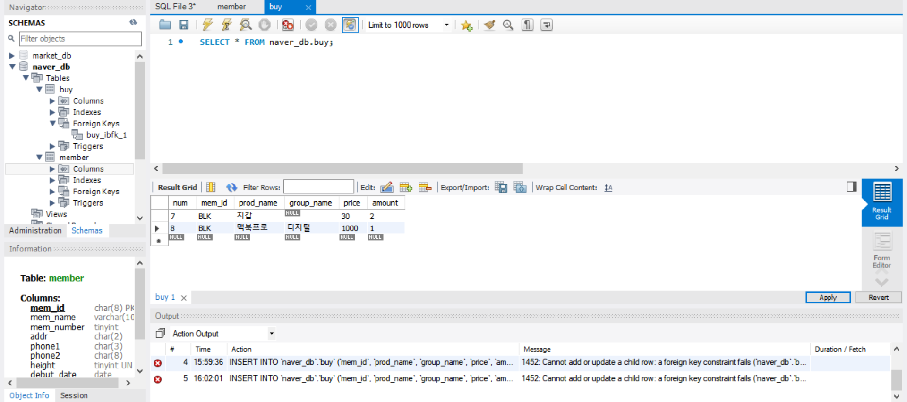
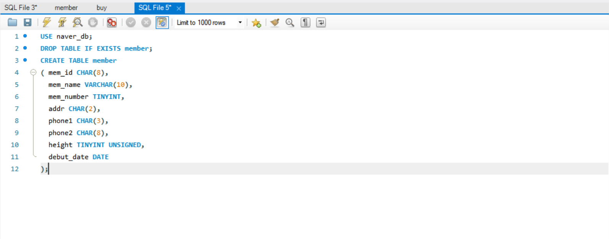
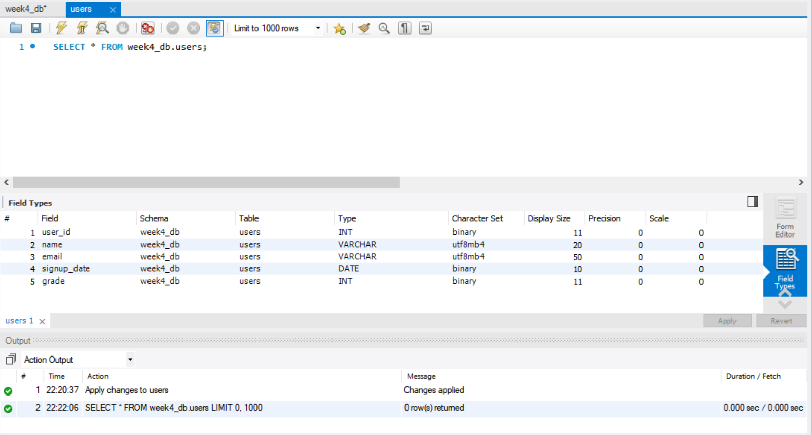
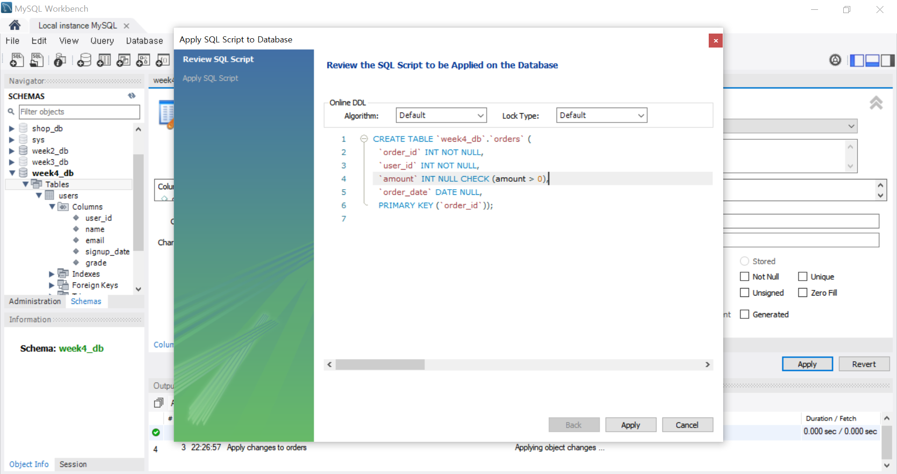
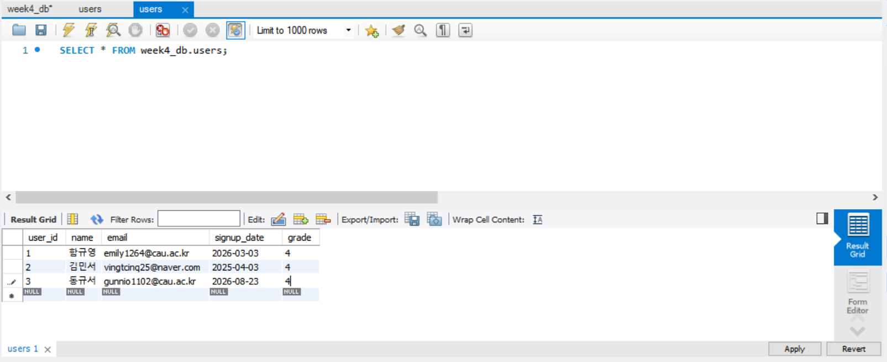
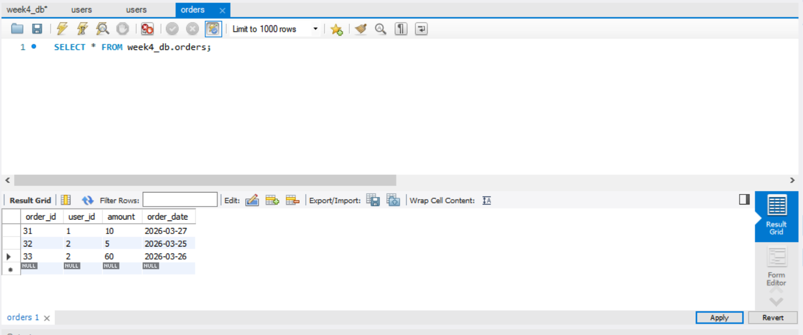
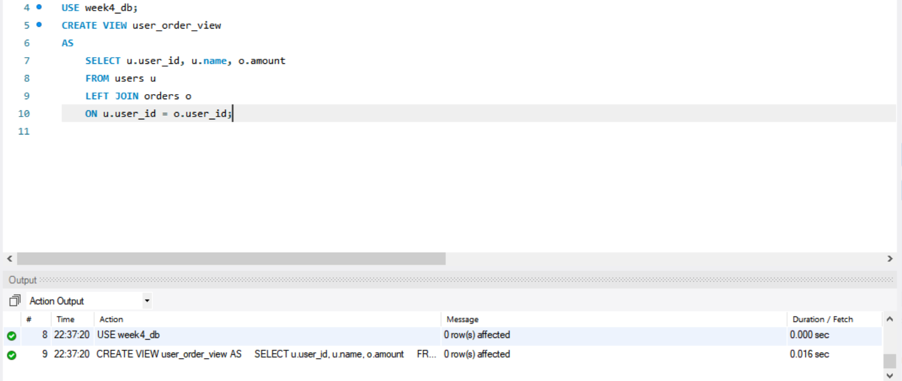
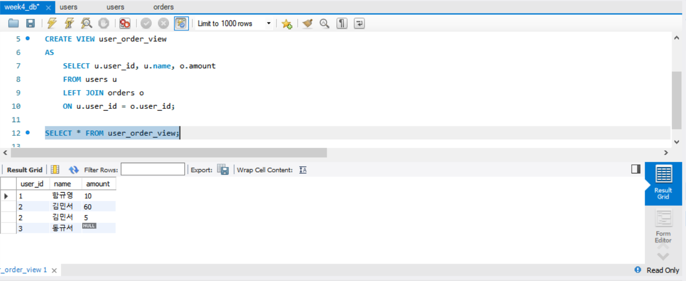

# SQL_ADVANCED 4주차 정규 과제 

📌SQL_ADVANCED 정규과제는 매주 정해진 분량의 『*혼자 공부하는 SQL*』 을 읽고 학습하는 것입니다. 이번주는 아래의 **SQL_ADVANCED_4th_TIL**에 나열된 분량을 읽고 공부하시면 됩니다.

아래의 문제를 풀어보며 학습 내용을 점검하세요. 문제를 해결하는 과정에서 개념을 스스로 정리하고, 필요한 경우 제시된 강의를 참고하여 보완하는 것이 좋습니다.

<!-- 강의 링크는 아래와 같습니다.
https://www.youtube.com/watch?v=DMNpkj_bZIs&list=PLVsNizTWUw7GCfy5RH27cQL5MeKYnl8Pm&index=13
https://www.youtube.com/watch?v=BUHj-behLyc&list=PLVsNizTWUw7GCfy5RH27cQL5MeKYnl8Pm&index=14
https://www.youtube.com/watch?v=JrXWxku7ZIM&list=PLVsNizTWUw7GCfy5RH27cQL5MeKYnl8Pm&index=15
-->

**교재 실습 예제 파일은 07_SQL_ADVANCED_Template 레포지토리의 src 폴더에 업로드되어 있습니다. market_db 파일도 해당 폴더에 함께 포함되어 있으니 참고하시기 바랍니다.**

**👀(수행 인증샷은 필수입니다.)** 

## SQL_ADVANCED_4th_TIL

### 5장 테이블과 뷰
#### 01. 테이블 만들기
#### 02. 제약조건으로 테이블을 견고하게
#### 03. SQL 가상의 테이블: 뷰 


## Study Schedule

| 주차  | 공부 범위     | 완료 여부 |
| ----- | ------------- | --------- |
| 1주차 | p.24~99    | ✅         |
| 2주차 | p.102~155   | ✅         |
| 3주차 | p.158~213  | ✅         |
| 4주차 | p.216~271 | ✅         |
| 5주차 | p.274~327 | 🍽️         |
| 6주차 | p.330~369 | 🍽️         |
| 7주차 | p.372~407 | 🍽️         |


<br>

<!-- 여기까진 그대로 둬 주세요-->

---

# 1️⃣ 학습 내용 정리

## 1. 테이블 만들기 

<!-- 이번 챕터에서 제시된 실습을 흐름에 맞게 진행한 후, 실습 과정이 보일 수 있도록 인증 사진을 2장 이상 제출해 주세요. -->


<br>



## 2. 제약조건으로 테이블을 견고하게 

<!-- 제약조건에 관해 배우게 된 점을 적어주세요. -->
### [제약조건의 기본 개념과 종류]

\- **제약조건**: 데이터의 무결성( 데이터에 결함이 없음) 을 지키기 위해 제한하는 조건   
<br>

#### 1. `기본키(PRIMARY KEY)` 
: 중복되지 않고, NULL 값이 입력될 수 없음.    
ex. 회원 테이블의 아이디, 학생 테이블의 학버느 직원 테이블의 사번 등       

\
\*_기본 키가 없어도 테이블 구성이 가능하지만 대부분의 테이블은 기본 키를 가져야 함_     
\* 기본 키로 생성한 것은 자동으로 클러스터형 인덱스가 생성됨.      
\* 테이블은 기본 키를 1개만 가질 수 있음.    

~~~sql
-- 열 이름 뒤에 PRIMARY KEY 붙여주기
mem_id CHAR(8) NOT NULL PRIMARY KEY

--  테이블의 제일 마지막에 PRIMARY KEY(열_이름) 붙여주기
PRIMARY KEY (mem_id)

-- ALTER TABLE 문으로 기본키 설정 가능
ALTER TABLE member
    ADD CONSTRAINT
    PRIMARY KEY (mem_id);
~~~

#### 2. `외래키(FOREIGN KEY)` 
: 두 테이블 사이의 관계를 연결해주고, 그 결과 데이터의 무결성을 보장해줌.       
\* _기본 키가 있는 회원 테이블을 **기준 테이블**, 외래 키가 있는 구매 테이블을 **참조 테이블**이라고 함_     
\* **참조 테이블이 참조하는 기준 테이블의 열은 반드시 기본키나 고유키로 설정되어 있어야 함.**     

~~~sql
-- CREATE TABLE 끝에 FOREIGN KEY 붙여주기
FOREIGN KEY(mem_id) REFERENCES member(mem_id)

-- ALTER TABLE 문으로 외래 키 설정 가능
ALTER TABLE buy
    ADD CONSTRAINT
    FOREIGN KEY (mem_id)
    REFERENCES member(mem_id) ;
~~~

> **참고**    
> **기준 테이블의 열이 변경될 경우**

기본 키-외래 키로 맺어진 후에는 기준 테이블의 열 이름이 변경되지 않음!       
열 이름이 변경되면 참조 테이블의 데이터에 문제가 발생하기 떄문.    

>**기준 테이블의 값 BLK가 PING로 변경되면 자동으로 참조 테이블도 바뀌면 좋겠다**  

`ON UPDATE CASCADE`, `ON DELETE CASCADE`     
~~~sql
ALTER TABLE buy
    ADD CONSTRAINT
    FOREIGN KEY(mem_id) REFERENCES member(mem_id)
    ON UPDATE CASCADE
    ON DELETE CASCADE;
~~~

#### 3. `고유키(UNIQUE)` 
: 중복되지 않는 유일한 값, NULL값 허용    
~~~sql
email CHAR(30) NULL UNIQUE
~~~

#### 4. `체크(Check)`
: 입력되는 데이터를 점검함.    
~~~sql
-- 평균 키는 반드시 100 이상의 값만 입력되도록 설정
height TINYINT UNSIGNED NULL CHECK (height >= 100)

--ALTER TABLE 문으로 제약조건 추가
ALTER TABLE member
    ADD CONSTRAINT
    CHECK (phone1 IN ( '02', '031', '032', '054', '055', '051')) ;
~~~

#### 5. `기본값 정의 (Default)`
: 입력하지 않았을 때 자동으로 입력될 값을 미리 지정해 놓는 방법     
~~~sql
height TINYINT UNSIGNED NULL DEFAULT 160

ALTER TABLE member
    ALTER COLUMN phone1 SET DEFAULT '02';

-- 기본값이 설정된 열에 기본값을 입력하려면 default 라고 써줌.
INSERT INTO member VALUES('SPC', '우주소녀', default, default)
~~~

#### 6. `널 값 허용(NULL)`
: NULL 허용하려면 생략하거나 NULL을 사용하고, 허용하지 않으려면 NOT NULL을 사용함.    
*NULL은 공백(' ')이나 0과는 다르다*    

 <br>

> **확인문제: 다음 보기 중에서 각 문항이 설명하는 것을 고르세요.**

보기는 아래와 같습니다.
```
CHECK / DEFAULT / PRIMAY KEY / UNIQUE / NOT NULL / FOREIGN KEY
```

```
여기에 답과 그 이유를 적어주세요!
1. 입력되는 데이터가 조건에 맞는지 검사하는 기능: CHECK
2. 값을 입력하지 않으면 자동으로 들어갈 값: DEFAULT
3. 빈 값을 입력하는 것을 허용하지 않음: NULL
```


## 3. 가상의 테이블: 뷰 


### [뷰의 개념]

\- **뷰**의 실체 : `SELECT`문    
\* *뷰의 이름만 보고도 뷰인지 알아볼 수 있도록 이름 앞에 v_를 붙이는 것이 일반적임*

~~~sql
-- 회원 테이블의 아이디, 이름, 주소에 접근하는 뷰 생성

USE market_db;
CREATE VIEW v_member
AS
    SELECT mem_id, mem_name, addr
    FROM member 
    WHERE addr IN ('서울', '경기'); -- 조건식도 가능함
~~~


### [뷰의 작동]
\- 뷰는 기본적으로 '읽기 전용'으로 사용    
\- 뷰를 통해 원본 테이블의 데이터를 수정할 수 있음. 단 조건 만족.

### [뷰를 사용하는 이유]
**1. 보안(security)에 도움이 된다.**    
\- 사용자마다 테이블에 접근하는 권한에 차별을 둬서 처리할 수 있음.   
**2. 복잡한 SQL을 단순하게 만들 수 있다.**    

### [뷰의 실제 작동]
\- 뷰를 생성할 떄 뷰의 열 이름을 테이블과 다르게 지정할 수 있으며 띄어쓰기나 한글도 가능함.   
\* *단, 뷰를 조회할 때 열 이름에 공백이 있으면 백틱(`)으로 묶어줘야 함.*
~~~sql
USE market_db;
CREATE VIEW v_viewtest1
AS
    SELECT B.mem_id '회원 아이디', M.mem_name AS 'Member Name', B.prod_name "Product Name", CONCAT(M.phone1, M.phone2) AS "Office Phone"
    FROM buy B
    INNER JOIN member M
    ON B.mem_id = M.mem_id;
SELECT DISTINCT `Member ID`, `Member Name`
FROM v_viewtest1; -- 백틱 사용
~~~
\- 뷰의 수정은 `ALTER VIEW` 구문    
\- 뷰의 삭제는 `DROP VIEW`    
\- 기존 뷰 정보 확인은 `DESCRIBE`문   
\- 뷰의 소스 코드 확인은 `SHOW CREATE VIEW`문

### [뷰를 통한 **데이터**의 수정/삭제]
: 뷰를 통해서 테이블의 데이터를 수정할 수도 있다.
~~~sql
UPDATE v_member SET addr = '부산' WHERE mem_id = 'BLK' ; -- 수정

INSERT INTO v_member(mem_id, mem_name, addr) VALUES( 'BTS', '방탄소년단', '경기') ; 
--member 테이블에서 mem_number은 NOT NULL 이기 때문에 해당 값을 입력하려면 NOT NULL 조건을 없애거나 뷰를 재정의 해야함.

DELETE FROM v_height167 WHERE height <167 ; -- 삭제
~~~
<br>

`WITH CHECK OPTION` : 뷰에 설정된 값의 범위가 벗어나는 값은 입력되지 않도록 함.
~~~sql
INSERT INTO v_height167 VALUES('TRA', '티아라', 6, '서울', NULL, NULL, 159, '2005-01-01') ; -- 하지만 v_height167에는 키가 167미만인 데이터 입력이 불가능함.

SELECT * FROM member WHERE height >=167
    WITH CHECK OPTION ; -- 이렇게 설정해둔 뒤 INSERT 하면 167 이상의 데이터만 입력됨
~~~
<br>

>**뷰가 조회되지 않을 때**

`CHECK TABLE` : 뷰의 상태를 확인해 볼 수 있음.

<br>

<br>


> **확인문제: 다음은 뷰의 특징입니다. 거리가 먼 것을 하나 고르세요.**

보기는 아래와 같습니다.
```
1️⃣ 뷰에는 테이블의 모든 열을 포함시켜야 합니다.
2️⃣ 뷰는 복잡한 SQL을 단순하게 만드는 효과가 있습니다.
3️⃣ 뷰는 보안에 도움이 됩니다.
4️⃣ 일부 사용자가 테이블에는 접근하지 못하게 하고, 뷰에만 접근하도록 설정할 수 있습니다.
```

```
1) 뷰에는 테이블의 모든 열을 포함시켜야 합니다.
뷰에는 테이블의 일부 열만 포함시켜 정의할 수 있음. 다만, NOT NULL의 특징을 가지는 열이 포함되지 않은 뷰의 경우 데이터 입력에 문제가 생길 수 있으므로 주의해야함. 
```


---

# 2️⃣ 실습과제

## 1. 데이터베이스 구축

아래 코드를 MySQL Workbench에 붙여넣은 후,  
**전체 드래그 → 실행 (Ctrl + Shift + Enter)** 하여 데이터베이스를 생성하세요.

```sql
CREATE DATABASE IF NOT EXISTS week4_db;
USE week4_db;
```

## 2. 실습문제

1. 다음 조건을 만족하는 `users` 테이블을 생성하시오.
```
- user_id는 INT이며 **기본키(Primary Key)**로 설정합니다.
- name은 VARCHAR(20)이며 NULL을 허용하지 않습니다.
- email은 VARCHAR(50)이며 중복을 허용하지 않습니다.
- signup_date는 DATE 타입으로 설정합니다.
- grade는 INT이며 기본값(Default)을 1로 설정합니다.
```


2. 다음 조건을 만족하는 orders 테이블을 생성하시오.
```
- order_id는 INT이며 기본키(Primary Key)로 설정합니다.
- user_id는 INT이며 NULL을 허용하지 않습니다.
- amount는 INT이며 0보다 커야 합니다.
- order_date는 DATE 타입으로 설정합니다.
```



3. 다음 조건을 만족하여 데이터를 삽입하시오.
```
- users 테이블에 3명 이상의 데이터를 직접 INSERT 하시오.
- orders 테이블에 3건 이상의 데이터를 직접 INSERT 하시오.
```



4. users와 orders 테이블을 활용하여 다음 컬럼을 보여주는 뷰 user_order_view를 생성하시오.
```
- user_id
- name
- amount
```


5. 생성한 user_order_view를 조회하시오.


## 3. 제출 방법

1. 각 문제의 실행 결과가 보이도록 화면을 캡처합니다.
2. 테이블 생성 결과, 데이터 삽입 결과, 뷰 생성 및 조회 결과가 모두 보이도록 제출합니다.

### 🎉 수고하셨습니다.