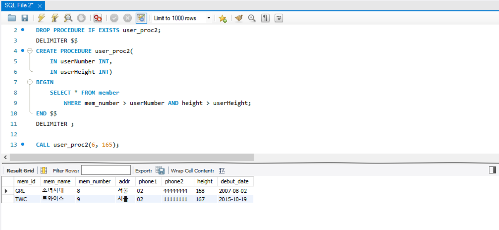
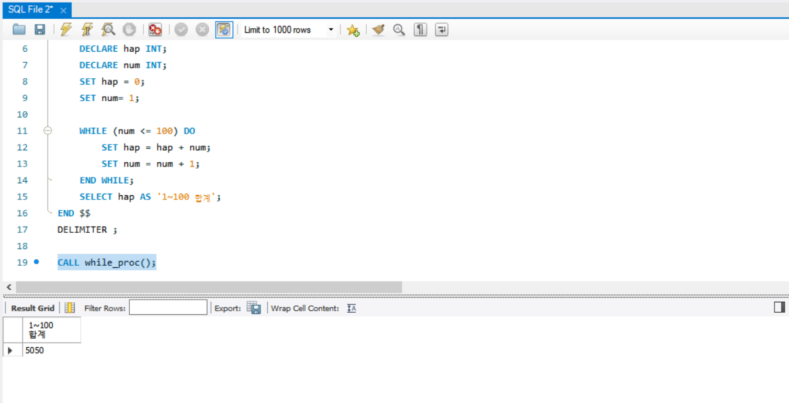
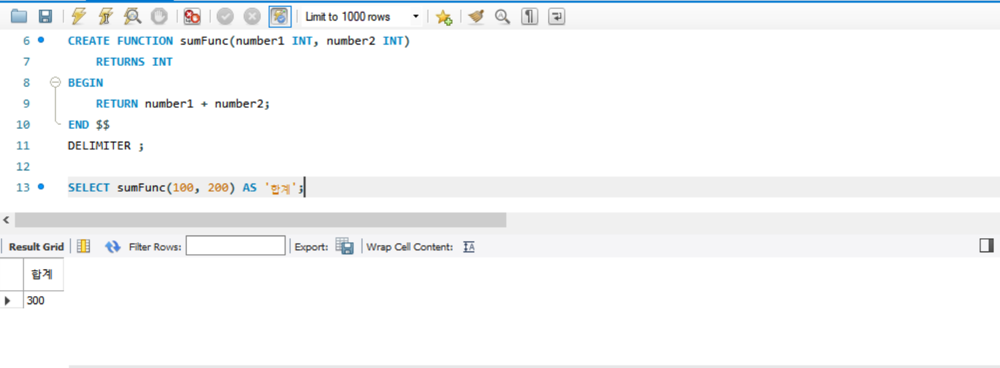
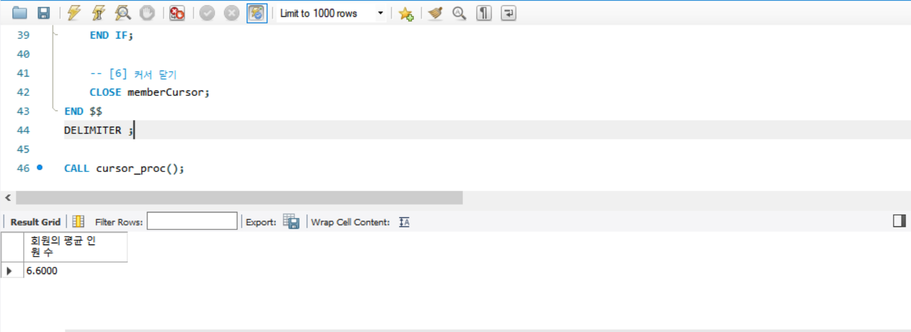
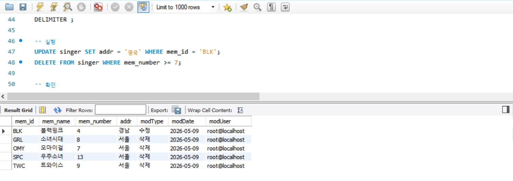
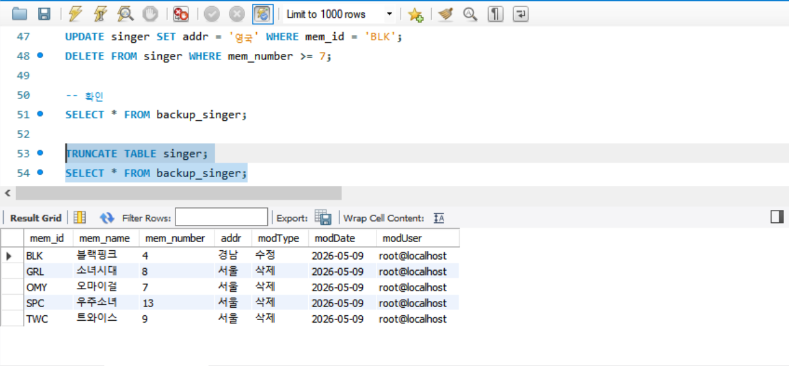
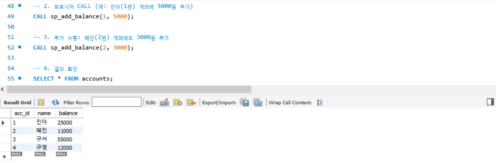
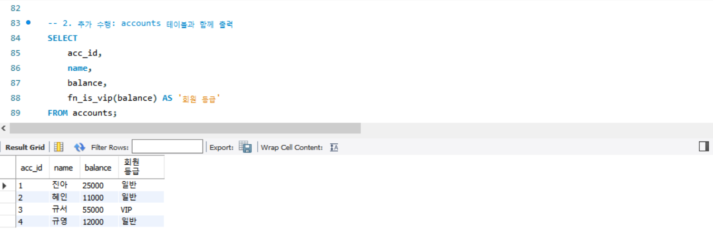
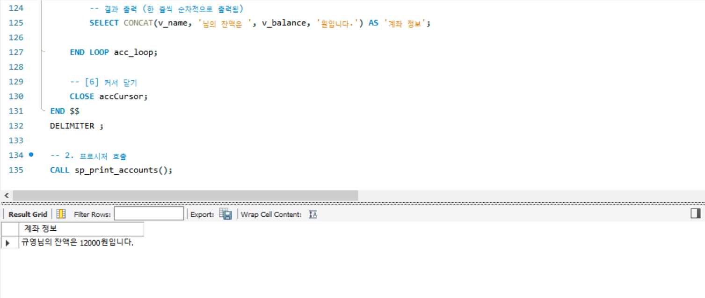
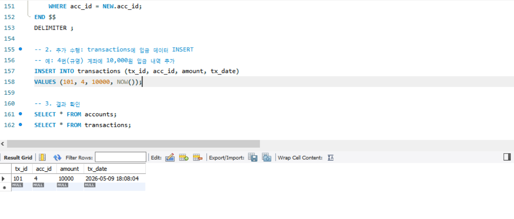

# SQL_ADVANCED 6주차 정규 과제 

📌SQL_ADVANCED 정규과제는 매주 정해진 분량의 『*혼자 공부하는 SQL*』 을 읽고 학습하는 것입니다. 이번주는 아래의 **SQL_ADVANCED_6th_TIL**에 나열된 분량을 읽고 공부하시면 됩니다.

아래의 문제를 풀어보며 학습 내용을 점검하세요. 문제를 해결하는 과정에서 개념을 스스로 정리하고, 필요한 경우 제시된 강의를 참고하여 보완하는 것이 좋습니다.

<!-- 강의 링크는 아래와 같습니다.
https://www.youtube.com/watch?v=cw1wGN0ZdFA&list=PLVsNizTWUw7GCfy5RH27cQL5MeKYnl8Pm&index=19
https://www.youtube.com/watch?v=bMQ_dAoaMzA&list=PLVsNizTWUw7GCfy5RH27cQL5MeKYnl8Pm&index=20
https://www.youtube.com/watch?v=bggWVsBmKag&list=PLVsNizTWUw7GCfy5RH27cQL5MeKYnl8Pm&index=21
-->

**교재 실습 예제 파일은 07_SQL_ADVANCED_Template 레포지토리의 src 폴더에 업로드되어 있습니다. market_db 파일도 해당 폴더에 함께 포함되어 있으니 참고하시기 바랍니다.**

**👀(수행 인증샷은 필수입니다.)** 

## SQL_ADVANCED_6th_TIL

### 7장 스토어드 프로시저
#### 01. 스토어드 프로시저 사용 방법
#### 02. 스토어드 함수와 커서
#### 03. 자동 실행되는 트리거 


## Study Schedule

| 주차  | 공부 범위     | 완료 여부 |
| ----- | ------------- | --------- |
| 1주차 | p.24~99    | ✅         |
| 2주차 | p.102~155   | ✅         |
| 3주차 | p.158~213  | ✅         |
| 4주차 | p.216~271 | ✅         |
| 5주차 | p.274~327 | ✅         |
| 6주차 | p.330~369 | ✅         |
| 7주차 | p.372~407 | 🍽️         |


<br>

<!-- 여기까진 그대로 둬 주세요-->

---

# 1️⃣ 학습 내용 정리

## 1. 스토어드 프로시저 사용 방법 

<!-- 스토어드 프로시저에 관해 배우게 된 점을 적어주세요. -->
### 스토어드 프로시저의 개념과 형식
: 스토어드 프로시저 : MySQL에서 제공하는 프로그래밍 기능     
~~~sql
DELIMITER $$
CREATE PROCEDURE 스토어드_프로시저_이름 ( IN 또는 OUT 매개변수 )
BEGIN
 -- 이 부분에 SQL 프로그래밍 코드 작성
END $$
DELIMITER;

CALL 스토어드_프로시저_이름();
~~~

### 스토어드 프로시저 생성
~~~sql
USE market_db;
DROP PROCEDURE IF EXISTS user_proc;
DELIMITER $$
CREATE PROCUDURE user_proc()
BEGIN
    SELECT * FROM member;
END $$
DELIMITER;

CALL user_proc();
~~~
### 스토어드 프로시저 삭제
~~~sql
DROP PROCEDURE user_proc();
~~~

<br>

*noTable 이라는 이름이 테이블에 넘겨 받은 값을 입력하고, id 열의 최대 값을 알아낼 때*     
*: 스토어드 프로시저를 만드는 시점에는 아직 존재하지 않는 테이블을 사용해도 됨. 단, CALL로 실행하는 시점에는 사용한 테이블이 있어야 함.*     

<br>

>**날짜 관련된 함수**        
SELECT YEAR(CURDATE()), MONTH(CURDATE()), DAY(CURDATE());   
*여기서 CURDATE()는 현재 날짜를 알려줌*     

### 동적 SQL
: 다이나믹하게 SQL이 변경됨.     
: 테이블 이름을 매개변수로 전달받아서 해당 테이블을 조회함.

<!-- 이번 챕터에서는 확인문제를 실습 인증으로 대체하여 진행합니다. 제시된 실습을 흐름에 맞게 진행한 후, 실습 과정이 보일 수 있도록 인증 사진을 2장 이상 제출해 주세요. -->





## 2. 스토어드 함수와 커서 

### 스토어드 함수의 개념과 형식
~~~sql
DELIMITER $$
CREATE FUNCTION 스토어드_함수_이름(매개변수)
    RETURNS 반환형식
BEGIN
    --이 부분에 프로그래밍 코딩
    RETURN 반환값;
END $$
DELIMITER ;
SELECT 스토어드_함수_이름() ;
~~~

### 커서로 한 행씩 처리하기
커서가 행의 시작을 가리킨 후에 한 행씩 차례대로 접근함.     
함수의 반환값을 `SELECT~INTO~`로 저장했다가 사용할 수도 있음.     
~~~sql
SELECT calcYearFunc(2007) INTO @debut2007;
SELECT calcYearFunc(2013) INTO @debut2013;
SELECT @debut2007-@debut2013 AS '2007과 2013 차이';
~~~

*스토어드 함수의 사용*
: 스토어드 생성 권한을 허용한 후 스토어드 함수를 사용할 수 있음.      
`SET GLOBAL log_bin_trust_function_creators = 1;`     

커서 선언하기 -> 반복 조건 선언하기 -> 커서 열기 -> 데이터 가져오기 -> 데이터 처리하기     
~~~sql
-- 1. 사용할 변수 준비하기 
DECLARE memNumber INT;
DECLARE cnt INT DEFAULT 0;
DECLARE totNumber INT DEFAULT 0;
DECLARE endOfRow BOOLEAN DEFAULT FALSE;

-- 2. 커서 선언하기
DECLARE memberCursor CURSOR FOR
    SELECT mem_number FROM member;

-- 3. 반복 조건 선언하기
DECLARE CONTINUE HANDLER
    FOR NOT FOUND SET endOfRow = TRUE;

-- 4. 커서 열기
OPEN memberCursor;

-- 5. 행 반복하기
cursor_loop: LOOP
    --이 부분을 반복
END LOOP cursor_loop

IF endOfRow THEN
    LEAVE cursor_loop;
END IF;

-- 6. 커서 닫기
CLOSE memberCursor;
~~~


<!-- 이번 챕터에서는 확인문제를 실습 인증으로 대체하여 진행합니다. 제시된 실습을 흐름에 맞게 진행한 후, 실습 과정이 보일 수 있도록 인증 사진을 2장 이상 제출해 주세요. -->





## 3. 자동 실행되는 트리거 

<!-- 트리거에 관해 배우게 된 점을 적어주세요. -->

### 트리거 기본
**트리거** : DML문 (`INSERT`, `UPDATE`, `DELETE`) 등 이벤트가  발생하면 실행되는 코드.     
**사용 목적** : 특정 행을 삭제하기 전에 그 내용을 다른 곳에 복사해 놓고 싶을 때 매번 수작업으로 할 경우, 실수가 생길 수 있다.      
*따라서 DELETE 작업이 일어날 경우 해당 데이터가 삭제되기 전에 다른 곳에 자동으로 저장해주는 기능을 하는 것이 트리거의 대표적인 용도!*

~~~sql
DROP TRIGGER IF EXISTS myTrigger;
DELIMITER $$
CREATE TRIGGER myTrigger
    AFTER DELETE
    ON trigger_table
    FOR EACH ROW
BEGIN
    SET @msg = '가수 그룹이 삭제됨' ; -- 트리거 실행 시 작동되는 코드들
END $$
DELIMITER ;
~~~

### 트리거 활용 
: 데이터에 입력/수정/삭제가 발생할 때 트리거를 자동으로 작동시켜 데이터를 변경한 사용자와 시간을 기록함.
~~~sql
USE market_db;
CREATE TABLE singer (SELECT mem_id, mem_name, mem_number, addr FROM member);
CREATE TABLE backup_singer
(mem_id CHAR(8) NOT NULL,
 mem_name VARCHAR(10) NOT NULL,
 mem_number INT NOT NULL,
 addr CHAR(2) NOT NULL,
 modType CHAR(2),
 modDate DATE,
 modUser VARCHAR(3)
);

DROP TRIGGER IF EXISTS singer_updateTrg;
DELIMITER $$
CREATE TRIGGER singer_updateTrg
    AFTER UPDATE
    ON singer
    FOR EACH ROW
BEGIN
    INSERT INTO backup_singer VALUES (OLD.mem_id, OLD.mem_name, OLD.mem_number, OLD.addr, '수정', CURDATE(), CURRENT_USER() );
END $$
DELIMITER ;

DROP TRIGGER IF EXISTS singer_deleteTrg;
DELIMITE $$
CREATE TRIGGER singer_deleteTrg
    AFTER DELETE
    ON singer
    FOR EACH ROW
BEGIN
    INSERT INTO backup_singer VALUES( OLD.mem_id, OLD.mem_name, OLD.mem_number, OLD.addr, '삭제', CURDATE(), CURRENT_USER() );
END $$
DELIMITER ;

UPDATE singer SET addr = '영국' WHERE mem_id = 'BLK';
DELETE FROM singer WHERE mem_number >=7 ;
~~~


<!-- 이번 챕터에서는 확인문제를 실습 인증으로 대체하여 진행합니다. 제시된 실습을 흐름에 맞게 진행한 후, 실습 과정이 보일 수 있도록 인증 사진을 2장 이상 제출해 주세요. -->






---

# 2️⃣ 실습과제

## 1. 데이터베이스 구축

아래 코드를 MySQL Workbench에 붙여넣은 후,  
**전체 드래그 → 실행 (Ctrl + Shift + Enter)** 하여 데이터베이스를 구축하세요.

```sql
CREATE DATABASE IF NOT EXISTS week6_db;
USE week6_db;

-- 초기화
DROP TABLE IF EXISTS transactions;
DROP TABLE IF EXISTS accounts;

-- 계좌 테이블
CREATE TABLE accounts (
    acc_id INT PRIMARY KEY,
    name VARCHAR(20) NOT NULL,
    balance INT NOT NULL DEFAULT 0 CHECK (balance >= 0)
);

-- 거래 테이블
CREATE TABLE transactions (
    tx_id INT PRIMARY KEY,
    acc_id INT NOT NULL,
    amount INT NOT NULL,
    tx_date DATETIME NOT NULL DEFAULT CURRENT_TIMESTAMP
);

-- 샘플 데이터
INSERT INTO accounts VALUES
(1, '진아', 20000),
(2, '혜인', 8000),
(3, '규서', 55000),
(4, '규영', 12000);
```

## 2. 실습 문제

다음 문제를 수행하고 실행 결과를 확인 후 인증 사진을 아래에 업로드하세요.
(추가 수행도 필수입니다.)


### 1. 스토어드 프로시저

**다음 요구사항을 만족하는 프로시저 `sp_add_balance`를 생성하시오.**
- 입력값: `p_acc_id INT`, `p_amount INT`
- 기능:
  - 해당 계좌의 `balance`에 `p_amount`를 더합니다.

**추가 수행**
- 프로시저를 1회 이상 CALL 하시오.
- 실행 후 `accounts` 테이블을 조회하여 잔액이 변경되었는지 확인하시오.



---

### 2. 스토어드 함수

**다음 요구사항을 만족하는 함수 `fn_is_vip`를 생성하시오.**
- 입력값: `p_balance INT`
- 반환값:
  - `p_balance >= 50000` 이면 `'VIP'`
  - 그렇지 않으면 `'일반'`

**추가 수행**
- `accounts` 테이블을 조회하면서 `fn_is_vip(balance)` 결과를 함께 출력하시오.



---

### 3. 커서(Cursor)

**accounts 테이블의 모든 계좌를 커서로 순회하면서 각 계좌의 `name`과 `balance`를 출력하는 프로시저를 작성하시오.**

**추가 수행**
- 프로시저를 CALL 하여 결과를 확인하시오.



---

### 4. 트리거(Trigger)

**transactions 테이블에 새로운 데이터가 INSERT 될 때 해당 `acc_id`의 `accounts.balance`가 자동으로 증가하도록 트리거를 생성하시오.**

**추가 수행**
- transactions에 직접 INSERT 하시오.
- accounts 잔액이 자동으로 증가하는지 확인하시오.




### 🎉 수고하셨습니다.


