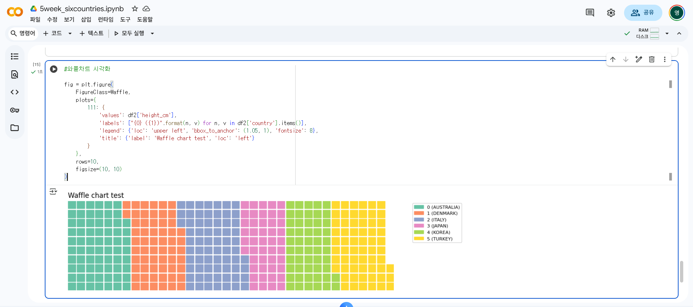
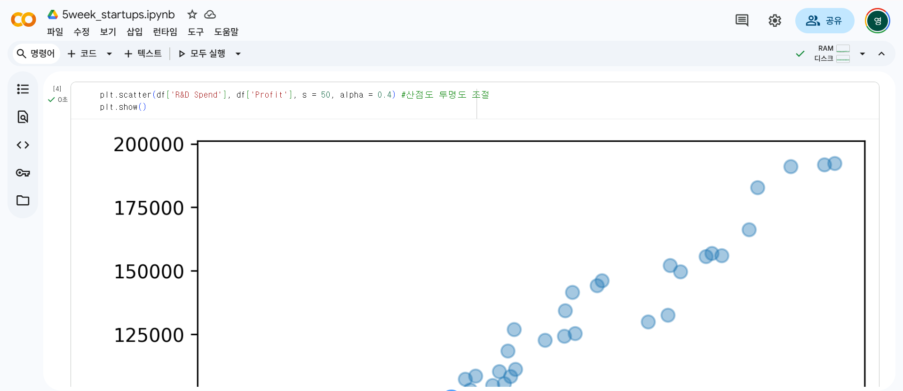
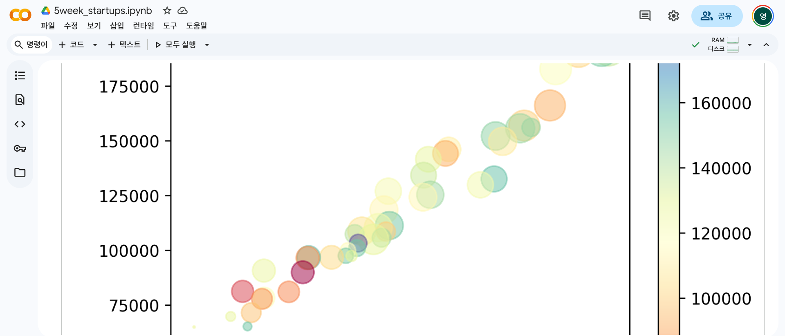
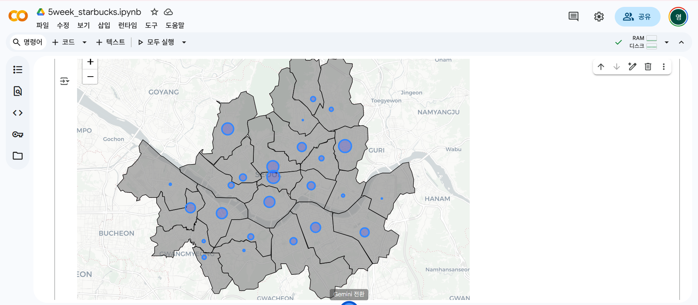
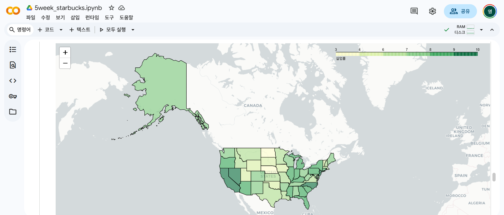
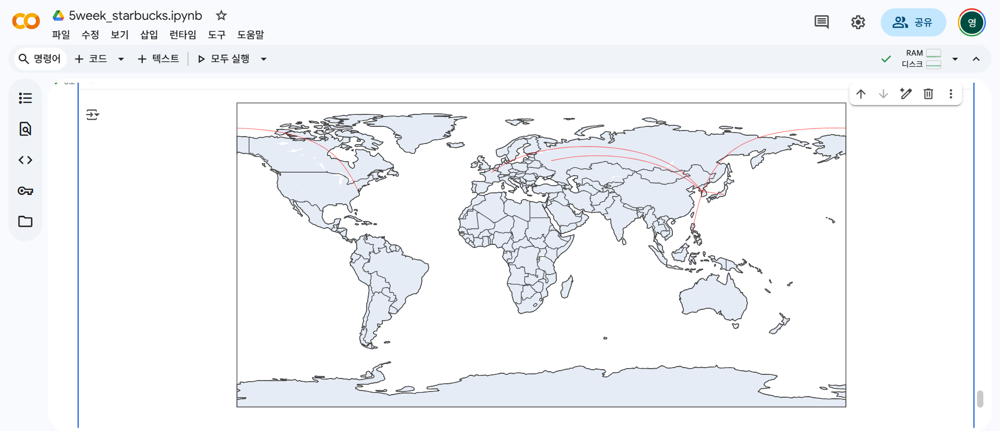
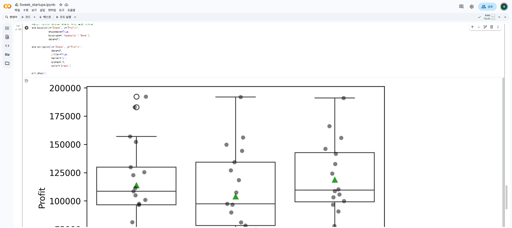

# 통계학 5주차 정규과제

📌통계학 정규과제는 매주 정해진 분량의 『*데이터 분석가가 반드시 알아야 할 모든 것*』 을 읽고 학습하는 것입니다. 이번 주는 아래의 **Statistics_5th_TIL**에 나열된 분량을 읽고 `학습 목표`에 맞게 공부하시면 됩니다.

아래의 문제를 풀어보며 학습 내용을 점검하세요. 문제를 해결하는 과정에서 개념을 스스로 정리하고, 필요한 경우 추가자료와 교재를 다시 참고하여 보완하는 것이 좋습니다.

5주차는 `2부-데이터 분석 준비하기`를 읽고 새롭게 배운 내용을 정리해주시면 됩니다


## Statistics_5th_TIL

### 2부. 데이터 분석 준비하기

### 10. 데이터 탐색과 시각화

- 10.5 분포 시각화부터 10장 마지막 10.8 박스 플롯까지 진행해주시면 됩니다.

**(수행 인증샷은 필수입니다.)** 

<!-- 이번주는 확인 문제가 없고, 교재의 실습에 있는 부분을 따라해주시면 됩니다. 데이터셋과 참고자료는 노션의 정규과제란에 있는 깃허브를 활용해주시면 됩니다. -->

## Study ScheduleStudy Schedule

| 주차  | 공부 범위     | 완료 여부 |
| ----- | ------------- | --------- |
| 1주차 | 1부 p.2~46    | ✅         |
| 2주차 | 1부 p.47~81   | ✅         |
| 3주차 | 2부 p.82~120  | ✅         |
| 4주차 | 2부 p.121~167 | ✅         |
| 5주차 | 2부 p.168~202 | ✅         |
| 6주차 | 3부 p.203~250 | 🍽️         |
| 7주차 | 3부 p.251~299 | 🍽️         |

<!-- 여기까진 그대로 둬 주세요-->

---

# 1️⃣ 개념 정리 

## 10. 데이터 탐색과 시각화

```
✅ 학습 목표 :
* EDA의 목적을 설명할 수 있다.
* 주어진 데이터셋에서 이상치, 누락값, 분포 등을 식별하고 EDA 결과를 바탕으로 데이터셋의 특징을 해석할 수 있다.
* 공분산과 상관계수를 활용하여 두 변수 간의 관계를 해석할 수 있다.
* 적절한 시각화 기법을 선택하여 데이터의 특성을 효과적으로 전달할 수 있다.
```

## 10.5 분포 시각화
### 양적 척도
- 막대그래프   
- 선그래프   
- 히스토그램 : 겹치지 않는 변수의 구간을 동일하게 단순화하여 구간별 도수를 막대그래프로 표현.    
각 구간을 bin, 구간의 높이는 밀도(density),즉 가로축의 단위 구간에 속한 값의 비율

### 질적 척도
- (단순한 경우) 파이차트, 도넛차트 : 전체를 100%로 하여 구성 요소들의 분포 정도를 면적(각도)으로 표현     
- (복잡한 경우) 트리맵 차트 : 사각형 안에 더 작은 사각형을 포함시켜서 위계구조를 표현할 수 있음.       
- 와플 차트 : 일정한 네모난 조각들로 분포 표현 (위계구조 표현 못함)
- 트리맵 차트 : path 옵션으로 위계꾸조 순서별 칼럼을 넣어준다.     
path=['sex', 'country'] 이 차트에서는 우선 성별로 구분하고 그 안에서 국가별 분포를 표현하고자 함.

## 10.6 관계 시각화
- 산점도 : 극단치를 제거하고서 그리는 것이 좋다. 극단치로 인해 주요 분포 구간이 압축되어 시각화의 효율이 떨어짐.           
투명도 조절하여 점들의 밀도 표현 가능!               
- 버블 차트 : 세 가지 요소의 상관관계 표현 가능             
(원의 면적을 함께 봐야하기 때문에 관측치가 너무 많게 되면 정보 전달이 어려움,          
원의 지름이 아닌 면적을 통해 크기를 비교하도록!)

## 10.7 공간 시각화
: 데이터가 지리적 위치와 관련되어 있으면 실제 지도 위에 데이터를 표현하는 것이 효과적         
=> 공간시각화는 위치 정보인 위도, 경도 데이터를 지도에 매핑하여 시각적으로 표현            

- 도트맵 : 동일한 크기의 작은 점을 찍어서 데이터 분포나 패턴 표현           
- 버블맵 : 데이터 값이 원의 크기로 표현되므로 비율을 비교하는 것이 효과적             
- 코로플레스맵(단계구분도) : 데이터 값의 크기에 따라 색상의 음영을 달리함             
- 커넥션맵(링크맵) : 지도에 찍힌 점들을 곡선 또는 직선으로 연결해 지리적 관계를 표현함,            
경로를 표현할 수도 있음 (지역 간의 무역 관계나 항공 경로, 통신 정보 흐름 표현)           
- 플로우맵 : 시작점과 도착점이 함께 표현됨            
- 카토그램 : 각 지역의 면적을 데이터 값에 비례하도록 변형시켜 시각화            

## 10.8 박스 플롯
하나의 그림으로 양적 척도 데이터의 분포 및 편향성, 평균과 중앙값 등 다양한 수치를 보기 쉽게 정리해 준다.


<br>
<br>

---

# 2️⃣ 확인 과제

> **교재에 있는 실습 파트를 직접 따라 해보세요. 실습을 완료한 뒤, 결과화면(캡처 또는 코드 결과)을 첨부하여 인증해 주세요.단순 이론 암기보다, 직접 손으로 따라해보면서 실습해 보는 것이 가장 확실한 학습 방법입니다.**
>
> > **인증 예시 : 통계 프로그램 결과, 시각화 이미지 캡처 등**









~~~
인증 이미지가 없으면 과제 수행으로 인정되지 않습니다.
~~~


### 🎉 수고하셨습니다.