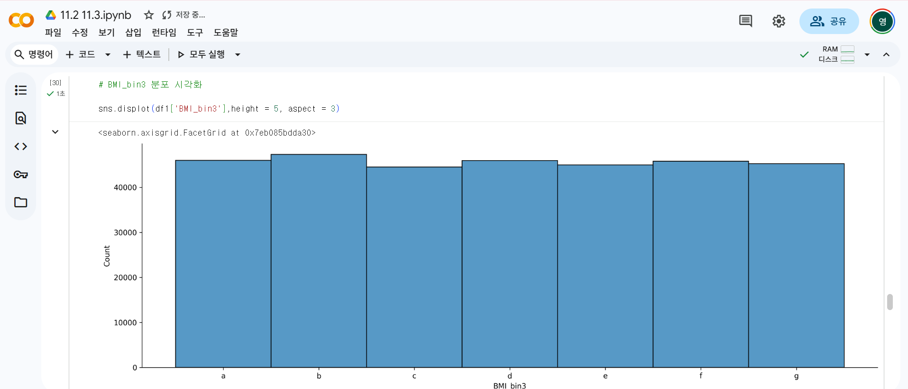
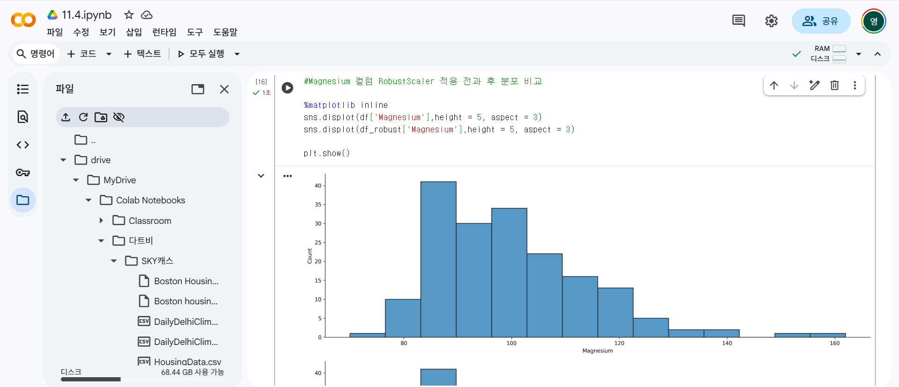

# 통계학 6주차 정규과제

📌통계학 정규과제는 매주 정해진 분량의 『*데이터 분석가가 반드시 알아야 할 모든 것*』 을 읽고 학습하는 것입니다. 이번 주는 아래의 **Statistics_6th_TIL**에 나열된 분량을 읽고 `학습 목표`에 맞게 공부하시면 됩니다.

아래의 문제를 풀어보며 학습 내용을 점검하세요. 문제를 해결하는 과정에서 개념을 스스로 정리하고, 필요한 경우 추가자료와 교재를 다시 참고하여 보완하는 것이 좋습니다.

6주차는 `2부-데이터 분석 준비하기`를 읽고 새롭게 배운 내용을 정리해주시면 됩니다


## Statistics_6th_TIL

### 2부. 데이터 분석 준비하기

### 11. 데이터 전처리와 파생변수 생성

<!-- 11. 데이터 전처리와 파생변수 생성에서 11.1 결측값 처리부터 11.4 데이터 표준화와 정규화 스케일링 파트까지 진행해주시면 됩니다. -->

## Study ScheduleStudy Schedule

| 주차  | 공부 범위     | 완료 여부 |
| ----- | ------------- | --------- |
| 1주차 | 1부 p.2~46    | ✅         |
| 2주차 | 1부 p.47~81   | ✅         |
| 3주차 | 2부 p.82~120  | ✅         |
| 4주차 | 2부 p.121~167 | ✅         |
| 5주차 | 2부 p.168~202 | ✅         |
| 6주차 | 2부 p.203~250 | ✅         |
| 7주차 | 2부 p.251~299 | 🍽️         |

> 과제가 많이 남지 않았습니다. 조금만 더 화이팅해주세요!

<!-- 여기까진 그대로 둬 주세요-->


---

# 1️⃣ 개념 정리 

## 11.데이터 전처리와 파생변수 생성

```
✅ 학습 목표 :
* 결측값과 이상치를 식별하고 적절한 방법으로 처리할 수 있다.
* 데이터 변환과 가공 기법을 학습하고 활용할 수 있다.
* 모델 성능 향상을 위한 파생 변수를 생성하고 활용할 수 있다.
```

### 11.1. 결측값 처리

결측값 처리 방법을 결정하기 전에 데이터 탐색을 통해 결측값의 비율이 어떻게 되는지, 한 변수에 결측값이 몰려 있지는 않은지 등 파악

#### 결측값 종류
- 완전 무작위 결측(MCAR) : 데이터 제거해도 편향이 거의 발생하지 않는다.
- 무작위 결측(MAR) : 다른 변수의 특성에 의해 해당 변수의 결측치가 체계적으로 발생한 경우                 
ex) 특정 체인점의 POS기기에 오류가 나서 해당 체인점에 해당하는 매출 정보에 결측값이 많이 나타난 경우
- 비무작위 결측(NMAR) : 결측값이 해당 변수 자체의 특성을 갖고 있는 경우

#### 결측값 처리 방법
##### 1. 표본 제거 방법 ( 결측값이 심하게 많은 변수 제거 / 결측값이 포함된 행 제거 )
- 결측값 비율이 10% 미만일 경우
##### 2. 평균 대치법 (최빈값, 중앙값, 최댓값, 최솟값 대치)
- 간단함
- 통계량의 표준오차가 왜곡되어 축소되어 나타나고 p-value가 부정확해짐. 
##### 3. 보간법 (데이터가 시계열적 특성을 가지고 있을 때)
- 전 시점, 다음 시적 값으로 대치 / 전 시점과 다음 시점의 평균 값으로 대치
- 시점 인덱스 간격이 불규칙할 경우 선형적인 수치 값을 계산해 보간. (데이터를 시간 순으로 정렬)
##### 4. 회귀대치법
- '연령' 변수의 결측값을 대치하기 위해 '연 수입' 변수를 사용
- 종속변수 : 추정하고자 하는 결측값을 가진 변수 / 독립변수 : 나머지
- 결측된 변수의 분산을 과소 추정하는 문제
##### 5. 확률적 회귀대치법
- 인위적으로 회귀식에 확률 오차항을 추가해 변동성 조정
- 여전히 어느 정도 표본오차를 과소 추정하는 문제를 가짐
##### 6. 다중 대치법
- 단순대치를 여러번 수행해 n 개의 가상적 데이터를 생성해 이들의 평균으로 결측값을 대치하는 방법
- 대치 단계 -> 분석 단계 -> 결합 단계


### 11.2. 이상치 처리
#### 이상치            
: 일부 관측치의 값이 전체 데이터의 범위에서 크게 벗어난 아주 작거나 큰 극단적인 값을 갖는 것 
- 전체 데이터의 양이 많을수록 튀는 값이 통곗값에 미치는 영향력이 줄어들어 이상치 제거의 필요성이 낮아짐                  
##### 1. 이상치 제거
 : 추정치 분산은 감소하지만 실젯값을 과장해 편향을 발생시킴
##### 2. 관측값 변경
 : 하한 값과 상한 값은 결정한 후 하한 값보다 작으면 하한값으로 대체, 상한 값보다 크면 상한 값으로 대체
##### 3. 가중치 조정
 : 이상치의 영향을 감소시키는 가중치를 줌

#### 이상치 탐색
1. 박스플롯 상에서 분류된 극단치
2. 임의로 허용범위를 설정                 
 - 평균(중위수)로부터 +-n 표준편차 이상 떨어져 있는 값을 이상치로 봄
- 평균은 이상치에 민감하게 변하기 때문에, 중위수, 중위수 절대편차(MAD) 사용하는 것이 더 효과적임.               

** 분석 도메인에 따라 이상치가 중요한 분석 요인일 수 있음                   
ex) 제품의 불량 원인을 찾아내기 위해 특정 공정의 센서 데이터 변화를 분석하는 경우


### 11.3. 변수 구간화

: 이산형 변수를 범주형 변수로 변환함으로써 데이터의 해석, 예측, 분류 모델을 의도에 맞도록 유도할 수 있음              
##### 이산값을 **평활화** 
: 단순한 이상값으로 변환시키는 기법          
ex) 구간별 중앙값으로 평활화           
구간1(4) : 5, 5, 5, 5 (2, 3, 7, 14의 중앙값)            
구간2(4) : 16.5 16.5 16.5 16.5 (16, 16, 17, 23의 중앙값)           
##### 머신러닝 기법                
-클러스터링 : 타깃 변수 설정이 필요 없이 구간화할 변수의 값들을 유사한 수준끼리 묶어줄 수 있음
- 의사결정나무 : 타깃 변수 설졍해, 구간화할 변수의 값을 타깃 변수 예측에 가장 적합한 구간으로 나누어 줌. 

##### 변숫값이 효과적으로 구간화됐는지 측정
- WOE(Weight of Evidence)값                 
- IV(Information Value)값 : 변수가 종속변수를 제대로 설명할 수 있도록 구간화가 잘 되면 IV 값이 높아짐 (0.3보다 큰 경우 예측력이 우수한 변수인 것으로 판단)

### 11.4. 데이터 표준화와 정규화 스케일링

#### 목적
1. 특정 머신러닝 모델의 학습 효율을 증가시킴             
2. (해석적 관점) 유용함.            
값이 평균보다 어느 정도 크거나 작은지 바로 알 수 있는 수치로 변환시킴으로써 분석 내용을 효율적으로 해석할 수 있음.                    
3. K-Nearest Neighbor, 서포트 벡터 머신과 같은 거리를 활용한 군집 분석에서 필수.            

#### 표준화
: 각 관측치의 값이 전체 평균을 기준으로 어느 정도 떨어져 있는지 나타낼 때 사용함.                       
Z = x-뮤 / 시그마
#### 정규화
: 데이터의 범위를 0부터 1까지로 변환하여 데이터 분포를 조정하는 방법           
(해당 값-최솟값)/(최댓값-최솟값)           

#### RobustScaler
: 이상치에 민감하다는 단점을 보완한 스케일링 기법          
: 데이터의 중앙값을 0으로 잡고 Q1과 Q3 사분위수와의 IQR 차이를 1이 되도록 하는 스케일링 기법 


<br>
<br>

---

# 2️⃣ 확인 과제

> **교재에 있는 실습 파트를 직접 따라 해보세요. 실습을 완료한 뒤, 결과화면(캡처 또는 코드 결과)을 첨부하여 인증해 주세요.**
>
> **단순 이론 암기보다, 직접 손으로 따라해보면서 실습해 보는 것이 가장 확실한 학습 방법입니다.**
>
> > **인증 예시 : 통계 프로그램 결과, 시각화 이미지 캡처 등**






~~~
인증 이미지가 없으면 과제 수행으로 인정되지 않습니다.
~~~


### 🎉 수고하셨습니다.