# Tableau 3주차 정규과제

📌Tableau 정규과제는 매주 정해진 **유튜브 강의를 통해 태블로 이론 및 기능을 학습한 후, 실습 문제를 풀어보며 이해도를 높이는 학습 방식**입니다. 

이번주는 아래의 **Tableau_3rd_TIL**에 명시된 유튜브 강의를 먼저 수강해주세요. 학습 중에는 주요 개념을 스스로 정리하고, 이해가 어려운 부분은 강의 자료나 추가 자료를 참고해 보완하세요. 과제 작성이 끝난 이후에는 **Github에 TIL과 실습 인증 결과를 업로드 후, 과제 시트에 제출해주세요.**


**(수행 인증샷은 필수입니다.)** 

> 태블로를 활용하는 과제인 경우, 따로 캡쳐도구를 사용하여 이미지를 첨가해주세요.


## Tableau_3rd_TIL

### 20. 파이와 도넛차트

### 21. 워드와 버블차트

### 22. 이중축과 결합축

### 23. 분산형 차트

### 24. 히스토그램

### 25. 박스 플롯

### 26. 영역차트

### 27. 간트차트

### 28. 필터

### 29. 그룹


<br>

## 주차별 학습 (Study Schedule)

| 주차  | 공부 범위          | 완료 여부 |
| ----- | ------------------ | --------- |
| 1주차 | **강의 1 ~ 9강**   | ✅         |
| 2주차 | **강의 10 ~ 19강** | ✅         |
| 3주차 | **강의 20 ~ 29강** | ✅         |
| 4주차 | **강의 30 ~ 39강** | 🍽️         |
| 5주차 | **강의 40 ~ 49강** | 🍽️         |
| 6주차 | **강의 50 ~ 59강** | 🍽️         |
| 7주차 | **강의 60 ~ 69강** | 🍽️         |

<!-- 여기까진 그대로 둬 주세요-->


---

# 학습 내용 정리

## 20강: 파이와 도넛차트
> **🧞‍♀️ 도넛차트를 생성하는 법을 포함해주세요.**

<!-- 파이와 도넛차트에 관해 배우게 된 점을 적어주세요 -->
### [파이차트]
\- 전체에 대한 비율 표시할 때 주로 사용

<br>

> 제품 세그먼트의 **파이차트 만들기**

`주문-세그먼트`, `제품-매출` 각각 더블클릭    
$\rightarrow$ 우측상단 `표현방식`을 **파이차트**로 바꾸기      
$\rightarrow$ 상단 툴바의 표준을 **전체보기**로 바꾸기       
$\rightarrow$ `제품-메출`을 `레이블`에 가져와 수치를 표현해줌      
$\rightarrow$ 가독성을 위해 내림차순 적용      
$\rightarrow$ 레이블 필드`합계(매출)` 오른쪽 클릭 `퀵 테이블계산▶` **구성비율** 설정 

<br>

### [도넛차트]

> 총합계 알 수 있게, **전체 매출 표현해주기**

`열` 선반 빈 칸 더블클릭해서 필드 직접 만들기    
$\rightarrow$ **0**을 입력하여 임의의 축 완성    
$\rightarrow$ ctrl키를 누르면서 완성된 필드`합계(0)`를 드래그 하면 두 개의 원 차트 생성됨    
$\rightarrow$ `합계(0)(2)` 두번째로 생성된 `마크`에서 값들을 빼냄    
$\rightarrow$ `레이블`에 `주문-매출`을 넣고    
$\rightarrow$ 사이즈를 조절하여 양쪽 파이 차트 크기를 잡아줌    
$\rightarrow$ 열 선반에서 두번째 필드 `합계(0)` 오른쪽클릭 `이중 축` 선택     
$\rightarrow$ 도넛 차트가 됨    

<br>

> 깔끔한 시각화를 위한 과정      

**시트** 빈 곳 오른쪽클릭 '서식'    
**격자 아이콘** 클릭,  `행`- 행 구분선 없음 , `열` - 열 구분선 없음.      
**삼선 아이콘** 클릭,  `영(0)기준선` 없음.      
**시트**에서 `축 선택` 오른쪽클릭 '머리글 표시' 해제     
색상- `테두리 선` 흰색 적용.
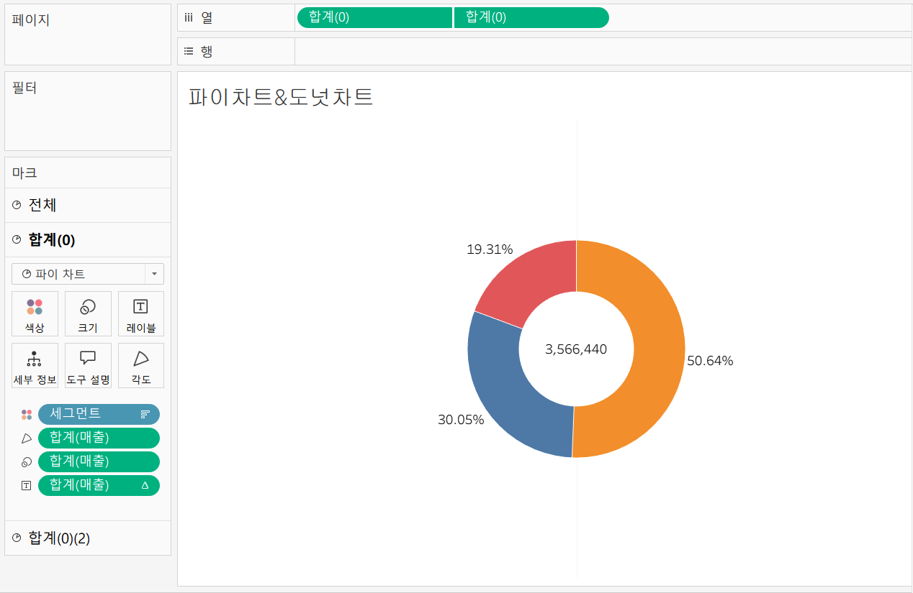

## 21강: 워드와 버블차트

<!-- 워드와 버블차트에 관해 배우게 된 점을 적어주세요 -->
### [버블 차트]
\- 수치적 데이터를 원의 크기로 표현하는 차트

> **지역과 매출에 따른 버블 차트 실습**

`위치- 국가/지역`,  `제품-매출` ctrl키를 함께 누른 채 선택      
$\rightarrow$ 우측상단 `표현 방식` **버블차트** 클릭     
$\rightarrow$ `매출`을 **색상**에 넣어서 색상으로 시각화     
$\rightarrow$ 상단 툴바 `표준` 전체보기      
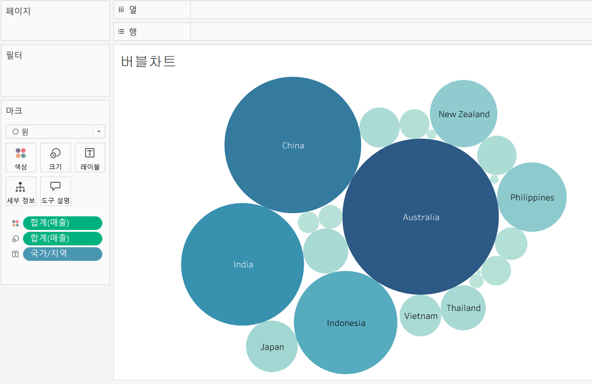

### [워드클라우드]
\- 문서 내에서 등장하는 키워드가 얼마나 자주 등장하는지를 텍스트 크기로 표현하여 직관적으로 시각화할 수 있는 차트

`국가/지역` 우클릭+드래그 `크기` 마크에 넣어줌        
$\rightarrow$ 카운트(국가/지역) 선택      
$\rightarrow$ `국가/지역` 우클릭+드래그 `레이블` 마크에 넣어줌      
$\rightarrow$ 마크 자동→ **텍스트 변경**        
$\rightarrow$ `매출`을 `색상` 마크에 넣어서 크기와 색상으로 등장 빈도와 매출 값의 크기를 표현
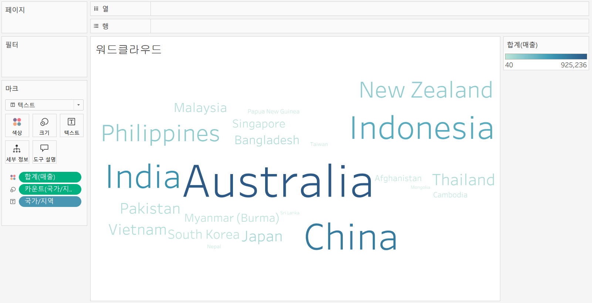

## 22강: 이중축과 결합축

<!-- 이중축과 결합축에 관해 배우게 된 점을 적어주세요 -->

### [이중축]
\- 하나의 뷰어 안에서 축을 이중으로 사용하는 차트       
\- `마크`를 각 축에 개별적으로 적용할 수 있음

> 주문 일자의 분기를 기준으로 매출과 수익 비교

`주문 일자 필드` 우클릭+드래그 열 선반      
$\rightarrow$ 필드 놓기 : `분기(주문 날짜)`    
$\rightarrow$ `매출`, `수익` 각각 더블클릭    
$\rightarrow$ 합치고자 하는(기준이 되는)필드 `합계(수익) ▽` **이중 축** 선택     
$\rightarrow$ 축 선택 오른쪽 클릭 `축 동기화` 
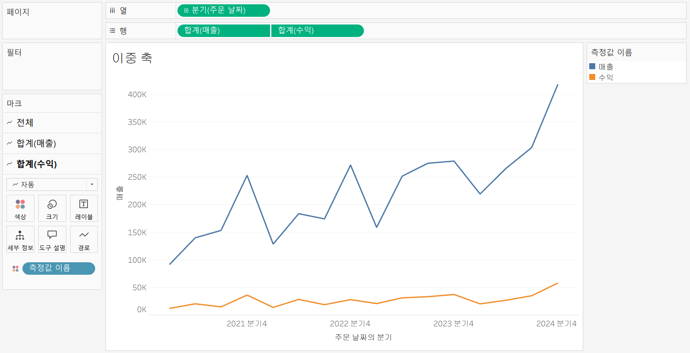

### [결합된 축]
\- 하나의 축을 공유하는 차트      
\- 축을 공유하는 측정값을 필요에 따라 추가할 수 있음

<br>

`주문 일자 필드` 우클릭+드래그 열 선반       
$\rightarrow$ 필드 놓기 : `분기(주문 날짜)`    
$\rightarrow$ `매출` 더블클릭,    
'수익' 매출 그래프의 왼쪽으로 드래그( 초록색 박스가 생길 때까지 ) 

<br>

_결합된 축은 측정값 중 하나, 가장 큰 범위의 축을 공유함._
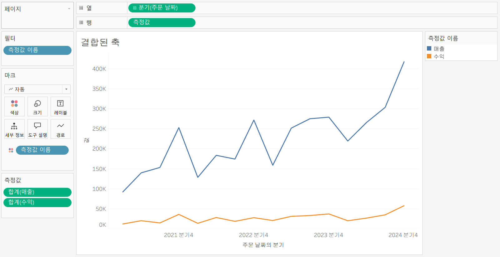

## 23강: 분산형 차트

<!-- 분산형 차트에 관해 배우게 된 점을 적어주세요 -->
### [분산차트]
\- 파라미터 간의 상관관계를 파악하는 데 유용한 그래프

> 매출과 수익 간의 상관관계

`매출` 열 선반 드래그, `수익` 행 선반 드래그    
$\rightarrow$ `제품-제조업체` **세부 정보** 드래그   
=> 제조업체별에 따른 매출과 수익 데이터 표시     

$\rightarrow$ `제품-범주` 필드를 **색상**마크에 드래그    
$\rightarrow$ `모양` 마크에서 다양한 모양으로 값 표시 가능    

<br>

> 범주별로 추세선 표시

분석 탭 - `추세선` 시트에 드래그 - `선형` 클릭

<br>

> 모든 값들에 대한 추세선 표시

추세선 하나 오른쪽 클릭 `모든 추세선 편집` 요소에서 `범주` 체크 해제

```js
강의 영상과 달리, 우리 파일에는 '제조 업체' 필드가 없습니다. 필요한 경우, 계산된 필드를 이용해 'SPLIT([제품 이름], ' ', 1)'를 '제조 업체'로 정의하시고 세부 정보에 놓아주세요.
```
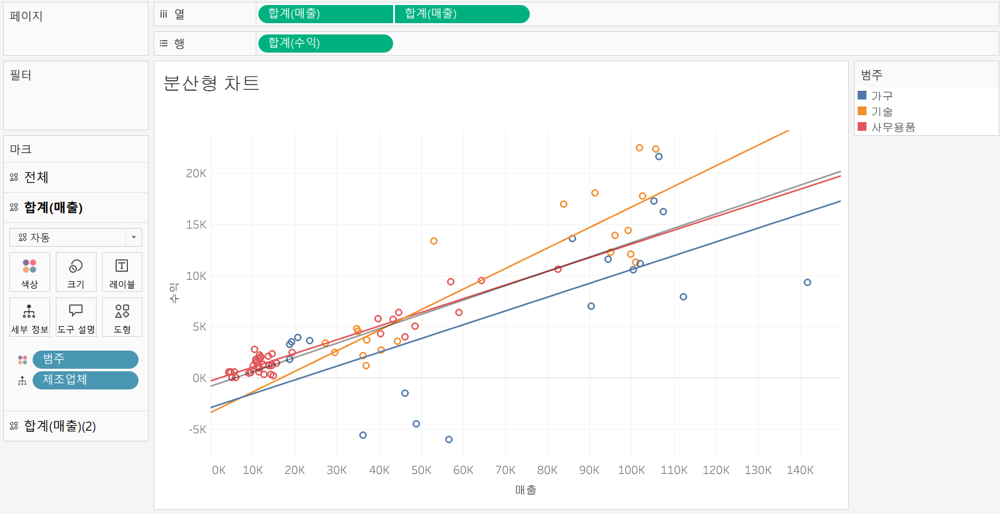


## 24강: 히스토그램

<!-- 히스토그램에 관해 배우게 된 점을 적어주세요 -->
### [히스토그램]
\- 분포 형태를 표시하는 차트   
\- 불연속형이 아닌 연속형 측정값을 범위 혹은 구간 차원으로 그룹화   
\- 차원 필드 없이 측정값만으로 그래프를 그릴 때 주로 사용

> **구간 차원이란?**    
지금까지는 행 또는 열 선반에 필드를 끌어와서 그 값으로 구간이 정해졌다면, 구간 차원은  일정한 크기의 포켓을 만들어 그 안에 값을 담아 표현시키기 위한 도구

> **구간 차원 생성**

`매출` 필드 우클릭 `만들기` **구간차원 편집**    
$\rightarrow$ 구간차원 크기: 100 (100단위로 끊어보기 위함)    
=> `매출(구간차원)` 필드 생성됨    
$\rightarrow$ `매출(구간차원)` 열선반 드래그 우클릭 `연속형`    
$\rightarrow$ `매출` 행선반 드래그 우클릭 **측정값(합계)**: 카운트

> 구간 차원 생성하지 않고 수익 히스토그램 생성

`수익`필드 열 선반에 드래그 
$\rightarrow$ 우상단 표현방식 **히스토그램**   
$\rightarrow$ `제품-범주` 필드를 **색상**마크로 드래그하면 범주별로 수익의 히스토그램을 살펴볼 수 있음.
$\rightarrow$ 축 선택 - 축 편집 - 로그 체크, 양수 체크

- 세가지 변화된 특징    
\- 뷰가 연속형 세로 막대를 표시하도록 표현     
\- 열 선반에 배치하여 합계로 집계되었던 수익의 측정값이 연속형의 `수익(구간차원)` 변동      
\- 수익 측정값이 행 선반으로 이동하고 집계가 합계에서 카운트로 변경됨       


> **히스토그램과 막대그래프 차이**    
`히스토그램` : 연속형 측정값을 통해 수치 데이터의 빈도를 표시하는 양적 데이터, 형태는 막대와 막대 사이가 붙어 있음.
`막대그래프` : 불연속형 여러 범주의 데이터를 비교하기 위해 사용되고 막대와 막대 사이에 공백 존재함

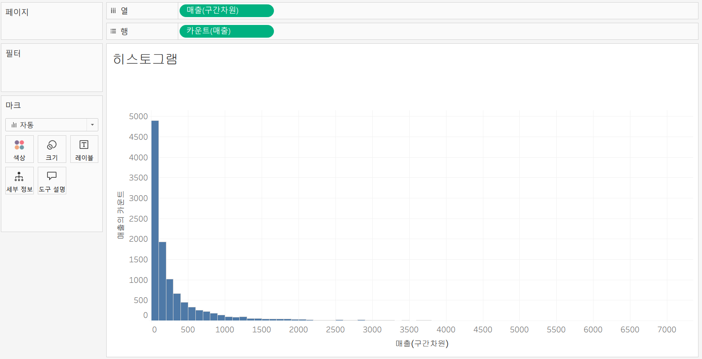
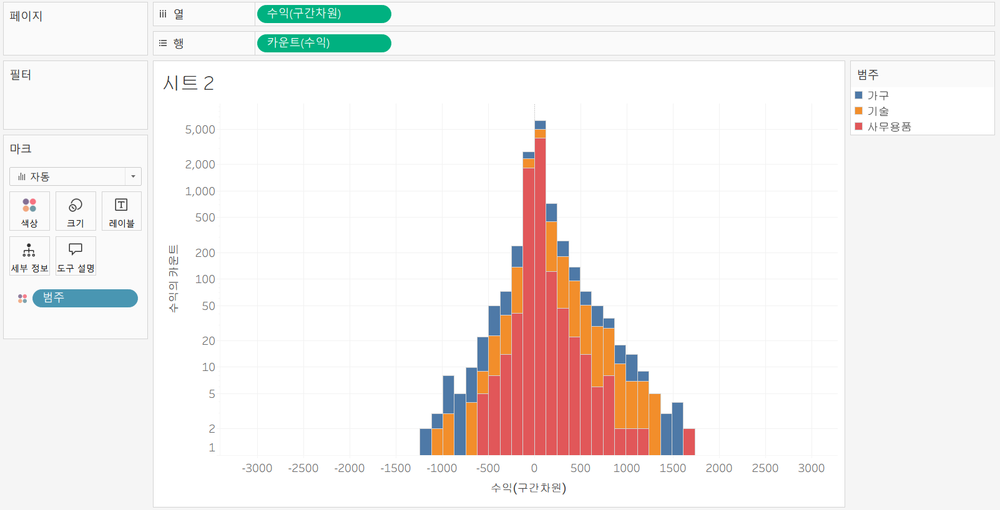

## 25강: 박스플롯

<!-- 박스플롯에 관해 배우게 된 점을 적어주세요 -->
### [박스플롯]
\- 데이터의 분포를 파악하는 데 사용하는 그래프

> 지역 및 고객 세그먼트별 매출을 표시하는 박스 플롯

`세그먼트` `위치-지역` 필드를 열 선반으로, `매출` 필드를 행 선반으로 드래그    
$\rightarrow$ 우측 상단 `표현방식` **박스플롯**    
$\rightarrow$ `고객 이름`을 **세부 정보** 마크로 드래그     
=> 고객별 매출로 시각화하기 위함.      
$\rightarrow$ `세그먼트`를 **색상** 마크로 드래그       
=> 세그먼트별로 시각화하기 위함.    
$\rightarrow$ 축 우클 `축 편집` `눈금` 로그 체크     
$\rightarrow$ 그래프 안쪽 박스에서 오른쪽 클릭 `편집 박스` 범위와 색상 변경 가능

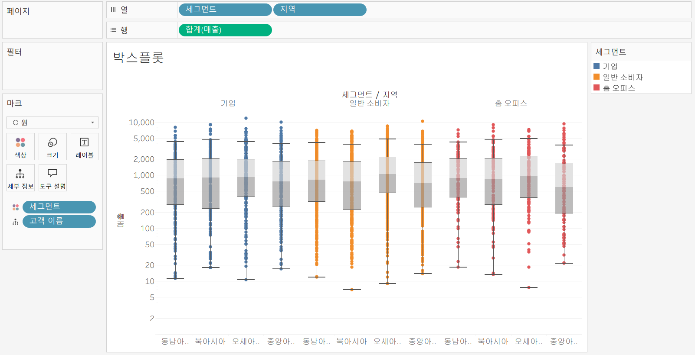

## 26강: 영역차트

<!-- 영역차트에 관해 배우게 된 점을 적어주세요 -->
### [영역차트] 
\- 라인과 축 사이의 공간이 색상으로 채워진 라인 차트      
\- 주로 연속형 데이터의 누계를 표현하는 데 사용    

> 주문 날짜에서 분기별 매출 **영역차트 그리기**

`주문 날짜` 우클릭+드래그 열 선반     
$\rightarrow$ 필드 놓기 : **분기(주문 날짜)** 선택     
$\rightarrow$ `매출` 우클릭+드래그 행 선반    
$\rightarrow$ `세그먼트` **색상** 마크 놓기     
=> 분리된 세개의 세그먼트별 라인차트 완성    
$\rightarrow$ 우측상단 `표현방식` **연속형** 선택    
$\rightarrow$ `매출` 을 **레이블** 마크에 놓기    
$\rightarrow$ `매출`을 **세부정보**마크 - 퀵 테이블 계산 - 구성비율    
$\rightarrow$ 다음을 사용하여 계산 - 테이블(아래로)    

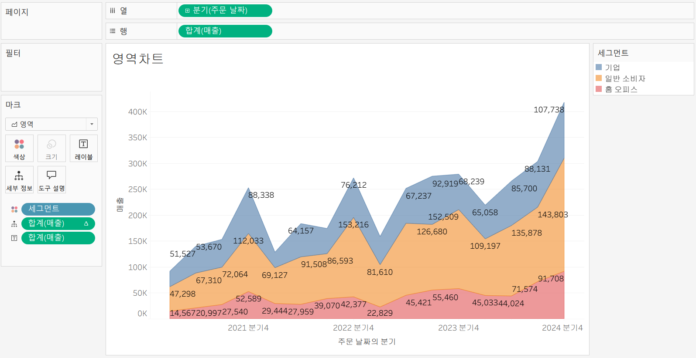

## 27강: 간트차트

<!-- 간트차트에 관해 배우게 된 점을 적어주세요 -->
### [간트차트]
\- 시간 경과에 따른 기간을 시각화하는데 사용

> 제품 범주별 배송기간을 배송 형태로 구분해 **간트 차트** 그리기

`배송 날짜` 우클릭+드래그 열 선반 - 불연속형 `월` 클릭    
$\rightarrow$  `제품-범주` 우클릭+드래그 행 선반    
$\rightarrow$  계산된 필드 만들기 : 상단 툴바 `분석` - **계산된 필드 만들기**    
$\rightarrow$  `배송기간` = 배송날짜 - 주문날짜 만들어 크기로 나타내기       
**DATEDIFF('day', '[주문 날짜]', '[배송 날짜]')**    
$\rightarrow$ 새로 생긴 `배송 기간`을 **크기** 마크에 두기    
$\rightarrow$ 행 선반에서 하위 범주 생성   
$\rightarrow$ `고객 이름` **필터**에 놓기,    
(아무 고객 한명 클릭한 후 확인을 누르면 한명에 대한 간트차트 확인 가능)    
$\rightarrow$ `배송형태`를 **색상** 마크에 놓기
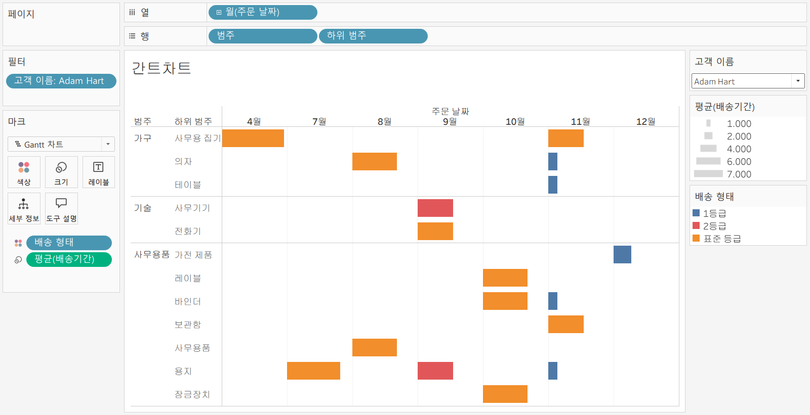

## 28강: 필터

<!-- 필터에 관해 배우게 된 점을 적어주세요 -->
### [필터]
#### 1. 데이터 추출 필터 
데이터 원본 - 연결 - 추출 클릭 - 편집 단추 - 추출 필터 추가 가능     
주문 날짜 - 2021년만 선택해 필터 생성 - 새로 저장 가능

#### 2. 데이터 원본 필터
\- 데이터 중 일부만 워크스페이스에 불러올 때 사용 
데이터 원본 - 연결 - 라이브 클릭 - 추가 단추 - 추출 필터 추가 가능 

#### 3. 컨텍스트 필터 

> 기술에서 매출 상위 10개 필터링 하고자 함

`범주`, `제품 이름`, `매출` 더블클릭
$\rightarrow$ `제품 이름` 필터에 놓기 - 상위 - 필드 기준 상위 10개 
$\rightarrow$ `범주` 필터에 놓기 - 일반 **없음** 클릭, 기술만 선택
$\rightarrow$ `제품 이름` 우클릭 컨텍스트에 추가
=> 범주 필터가 우선적으로 적용되고, 매출 상위 필터가 종속됨
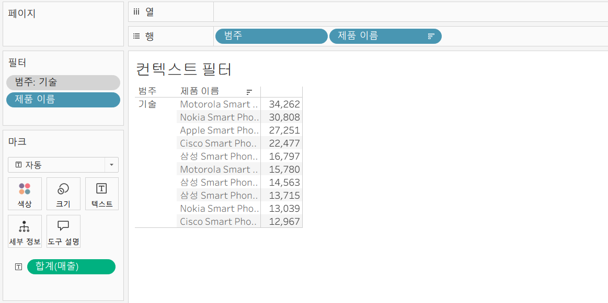

#### 4. 차원필터
`제품 이름` 필터 놓기 - 가져오고자 하는 필드를 선택할 수 있음(일반, 와일드카드, 조건)


## 29강: 그룹

<!-- 그룹에 관해 배우게 된 점을 적어주세요 -->
### [그룹]
\- 수동으로 필드에 있는 항목들을 묶을 수 있으며, 기존 데이터 원본에 없는 사용자 지정 그룹 필드를 만들 수 있음.

> 제품과 수익을 보여주는 **막대차트** 그리기

`제품 이름` 열 선반, `수익` 행 선반    
1. 뷰 ( 특정 회사들 드래그, 우클릭, 그룹)     
2. 항목별로 묶을 필드 선택     

`제품 이름` 우클릭 - 만들기 - 그룹  - 같은 회사들 제품을 shift 누른 채 모두 누르고 - 그룹 만들기      
$\rightarrow$ `제품 이름`을 열 선반에 놓음으로써 회사별로 막대그래프 생성 - 이때 '기타'는 제외해줌
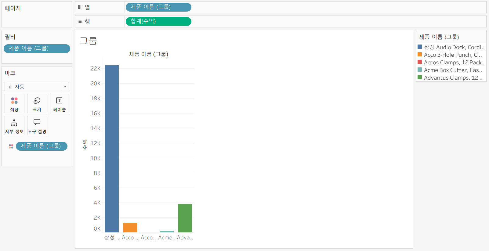

# 확인문제

## 문제 1.

```js
푸앙이는 superstore 데이터셋에서 '주문' 테이블을 보고 있습니다.
1) 국가/지역 - 시/도- 도시 의 계층을 생성했습니다. 계층 이름은 '위치'로 설정하겠습니다.
2) 날짜의 데이터 타입을 '날짜'로 바꾸었습니다.

코로나 시기의 도시별 매출 top10을 확인하고자
1) 배송 날짜가 코로나시기인 2021년, 2022년에 해당하는 데이터를 필터링했고
2) 위치 계층을 행으로 설정해 펼쳐두었습니다.
이때, 매출의 합계가 TOP 10인 도시들만을 보았습니다.
```


```
겉보기에는 전체 10개로, 잘 나온 결과처럼 보입니다. 그러나 푸앙이는 치명적인 실수를 저질렀습니다.
오늘 배운 '컨텍스트 필터'의 내용을 고려하여 올바른 풀이 및 결과를 구해주세요.
```

~~~
`배송날짜` 드를 `연도`로 변환하여 2021년, 2022년만 선택한다. `연도` 필터를 컨텍스트에 추가하고 `도시` 필드 -> 필터 -> 상위 -> 매출 합계 기준 상위10 선택
~~~

<!-- DArt-B superstore가 아닌 개인 superstore 파일을 사용했다면 값이 다르게 표시될 수 있습니다.-->


## 문제 2.

```js
규서는 관심이 있는 제품사들이 있습니다. '제품 이름' 필드에서 '삼성'으로 시작하는 제품들을 'Samsung group'으로, 'Apple'으로 시작하는 제품들을 'Apple group'으로, 'Canon'으로 시작하는 제품들을 'Canon group'으로, 'HP'로 시작하는 제품들을 'HP group', 'Logitech'으로 시작하는 제품들을 'Logitech group'으로 그룹화해서 보려고 합니다. 나머지는 기타로 설정해주세요. 이 그룹화를 명명하는 필드는 'Product Name Group'으로 설정해주세요.

(이때, 드래그보다는 멤버 찾기 > 시작 문자 설정하여 모두 찾아 한번에 그룹화해 확인해보세요.)
```


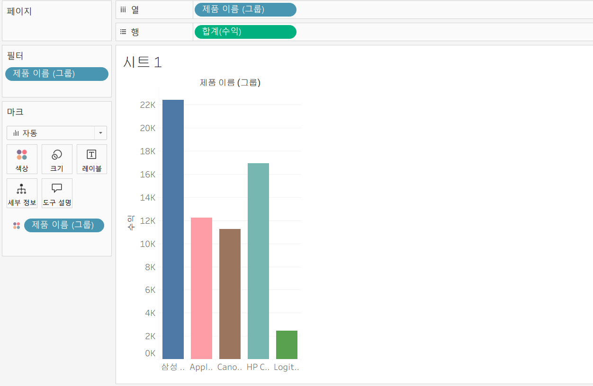

```js
해당 그룹별로 어떤 국가/지역이 주문을 많이 차지하는지를 보고자 합니다. 매출액보다는 주문량을 보고 싶으므로, 주문Id의 카운트로 계산하겠습니다.

기타를 제외하고 지정한 5개의 그룹 하위 목들만을 이용해 아래와 같이 지역별 누적 막대그래프를 그려봐주세요.
```


<br>

<br>

### 🎉 수고하셨습니다.