# Tableau 4주차 정규과제

📌Tableau 정규과제는 매주 정해진 **유튜브 강의를 통해 태블로 이론 및 기능을 학습한 후, 실습 문제를 풀어보며 이해도를 높이는 학습 방식**입니다. 

이번주는 아래의 **Tableau_4th_TIL**에 명시된 유튜브 강의를 먼저 수강해주세요. 학습 중에는 주요 개념을 스스로 정리하고, 이해가 어려운 부분은 강의 자료나 추가 자료를 참고해 보완하세요. 과제 작성이 끝난 이후에는 **Github에 TIL과 실습 인증 결과를 업로드 후, 과제 시트에 제출해주세요.**

**👀(수행 인증샷은 필수입니다.)** 

> 태블로를 활용하는 과제인 경우, 따로 캡쳐도구를 사용하여 이미지를 첨가해주세요.

## Tableau_4th_TIL

### 30. 계층

### 31. 집합

### 32. 결합집합

### 33. 계산된 필드

### 34. 행수준계산

### 35. 집계계산

### 36. 테이블 계산

### 37. 퀵테이블 계산(1)

### 38. 퀵테이블 계산(2)

 

## 주차별 학습 (Study Schedule)

| 주차  | 공부 범위          | 완료 여부 |
| ----- | ------------------ | --------- |
| 1주차 | **강의 1 ~ 9강**   | ✅         |
| 2주차 | **강의 10 ~ 19강** | ✅         |
| 3주차 | **강의 20 ~ 29강** | ✅         |
| 4주차 | **강의 30 ~ 38강** | ✅         |
| 5주차 | **강의 39 ~ 49강** | 🍽️         |
| 6주차 | **강의 50 ~ 59강** | 🍽️         |
| 7주차 | **강의 60 ~ 69강** | 🍽️         |

> **🧞‍♀️ 오늘의 스터디는 지니와 함께합니다.**

<!-- 여기까진 그대로 둬 주세요-->

---

# 학습 내용 정리

## 30. 계층

<!-- 계층 구조와 관련된 개념, 사용 방법 등을 적어주세요. -->
**계층** : 뷰에서 데이터를 "Drill Down"해 값으르 세부적으로 찾을 때 유용한 방법    

> **날짜별로 매출을 보고자 하는 경우**

`매출` 필드, 텍스트 마크 위에 드래그    
→ `배송날짜` 필드, 행 선반 위에 올림    
→ 배송날짜 왼쪽 기호 선택 시 분기별, 월별, 일별로 매출 데이터 확인 가능     
***날짜 데이터와 함께 제공되는 경우 자동으로 계층 생성함***     
***`위치` 필드, 계층으로 구분할 수 있는 아이콘이 있음***     
 

> **'위치' 계층 만들기**    

`국가/지역`, `도시` 동시에 선택 후 우클릭    
→ 계층만들기 (계층 이름:위치)   
→ 나머지 필드 계층으로 드래그

## 31. 집합

<!-- 집합의 정의 및 활용 방법에 대해 알게 된 점을 적어주세요. -->
**집합** : 사용자가 직접 어떤 조건을 설정하고 그 조건을 기반으로 데이터들을 구분하는 방법

> **수익을 많이 낸 상위 10개의 도시들을 표현**

`시/도` 필드, 행 선반에 올리기    
→ `수익` 필드, 텍스트 마크에 올리기    
→ 내림차순    
→ `시/도` 필드, 우클릭, `만들기` `집합`    
→ 상위 탭, 이름: 수익 기준 상위 도시, 필드 기준: 상위 10    
→ `수익 기준 상위 도시` 필드, 색상카드 올리기    
→ 범례, 색상 편집, IN 초록색, OUT 빨간색    

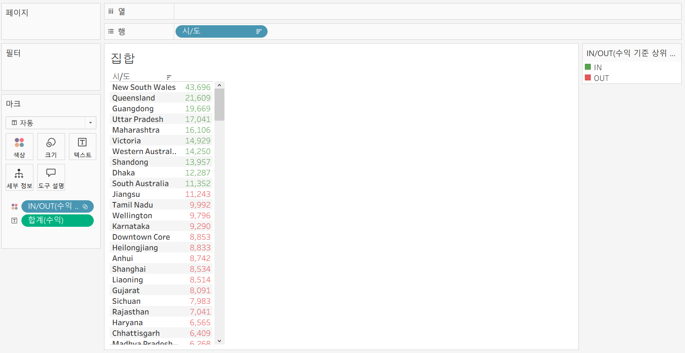

## 32. 결합집합

<!-- 결합집합의 개념 및 사용 사례를 적어주세요. -->
**결합된 집합** : 여러 조건을 설정해 집합 설정

>**매출 5만원 이상, 수익률 10% 이상인 도시 데이터 구분**

`시/도` 필드, 우클릭, `만들기` `집합`   
→ 조건 탭, 이름: 시/도 매출>5만 , 필드 기준: 매출, >= 50000   
→ `시/도` 필드, 행 선반에 올리기   
→ `매출` 필드, 텍스트 마크에 올리기   
→ `시/도 매출>5만`, 색상카드 올리기   
→ 내림차순   
+   
→ `시/도` 필드, 우클릭, `만들기` `집합`   
→ 조건 탭, 이름: 시/도 수익률>10% , 필드 기준: 수익률, >= 0.1   
→ `수익률` 필드, 텍스트 마크에 올리기   
→ `시/도 수익률>10%`, 색상카드 올리기   
→ 내림차순   
+   
→ `시/도 매출>5만`, 우클릭, `결합된 집합만들기`   
→ 두 집합의 공유 멤버 클릭   
→ 색상 카드로 올리기   

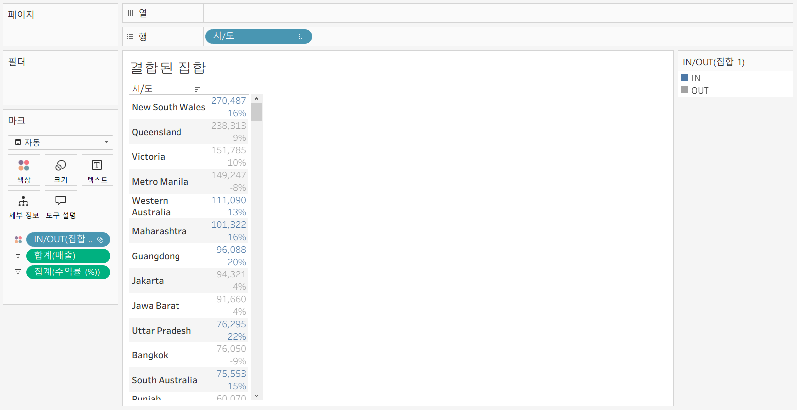

## 33. 계산된 필드

<!-- 계산된 필드를 사용하는 방법과 예시를 적어주세요. -->
**계산된 필드** : 데이터 원본에 있는 필드를 활용하여 새로운 필드를 만드는 기능      
*기존 데이터 이외에 계산해야 할 데이터가 추가로 필요할 경우에 계산된 필드를 만들어 사용*

1. 데이터 패널
2. 분석 탭
3. 사용하고자 하는 필드 우클릭
필드 이름 > 계산식 > 문자값은 따옴표, 주석은 //

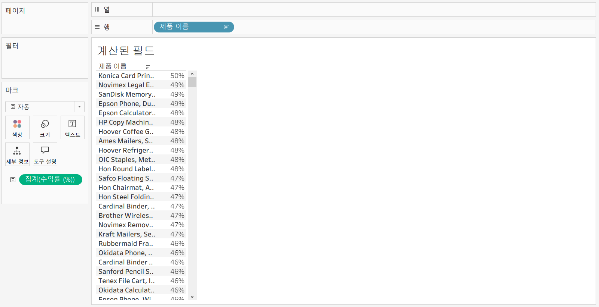

## 34. 행수준계산

<!-- 행수준 계산의 의미와 적용 방법을 적어주세요. -->
**기본 계산** : 데이터 원본에 대한 행 수준 계산 또는 집계 계산    
>행 수준 계산 - 데이터의 각 레코드를 통해 계산하는 방식    
>집계 계산 - 현재 뷰에서 보이는 기준으로 계산하는 방식    

\- **계산식 예시**
> 고객 이름 (분리)     
SPLIT([고객 이름], ' ', 1)    
> 고객 성 (분리)     
SPLIT([고객 이름], ' ', 2)    

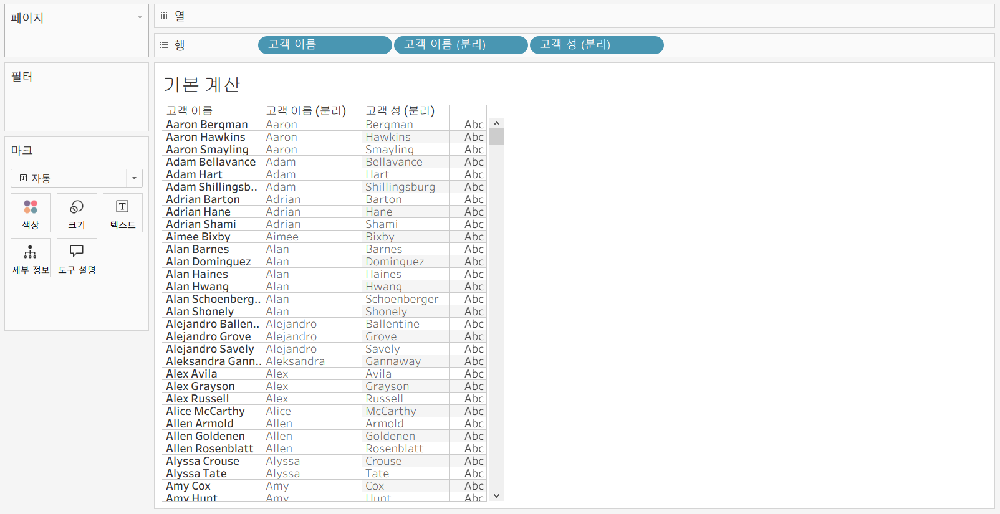

> 수익성    
IF [수익] >0 THEN '수익성 있음'    
ELSEIF [수익]<0 THEN '수익성 없음'    
ELSE '손익 평형'    
END

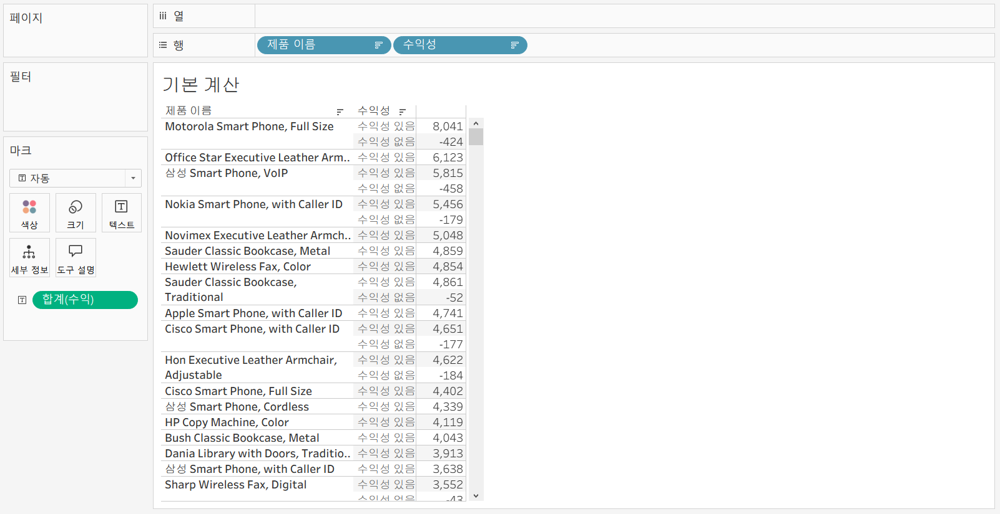

> 주문 처리 일수    
DATEDIFF('day', [주문 날짜], [배송 날짜])     
**차원 패널로 전환해야 함**

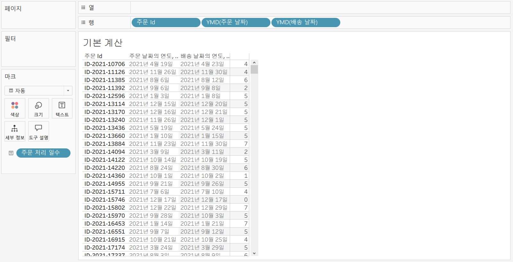

## 35. 집계계산

<!-- 집계계산의 정의 및 활용 사례에 대해 알게 된 점을 적어주세요. -->

**집계 계산** : 현재 뷰에서 보이는 기준으로 계산하는 방식         
직접 계산된 필드 **집계** (계산수단 옵션 없음) `vs` 태블로 자동으로 필드 **합계**

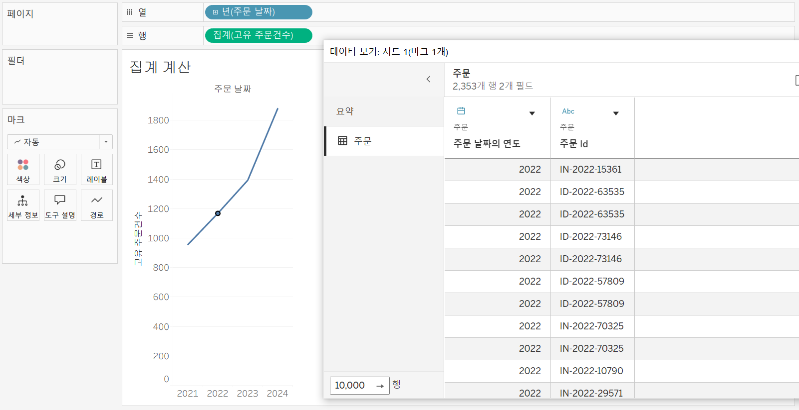

## 36. 테이블계산

<!-- 테이블 계산의 개념 및 사용 방법을 적어주세요. -->
**테이블 계산** : 뷰에 보이는 내용을 바탕으로 데이터 계산    

> 누적 매출     
RUNNING_SUM(SUM([매출]))    

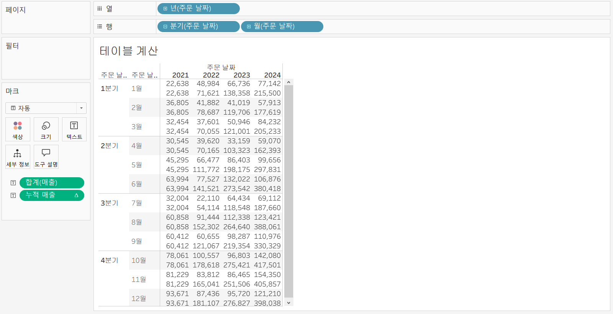

\- 계산 방향(옆으로, 아래로, 주문 날짜의 월 등) 설정 가능       
\- 정렬 순서(사용자 지정 옵션) 설정 가능

> 현재 달과 전월의 매출 차이
SUM([매출]) - LOOKUP(SUM([매출]), -1)

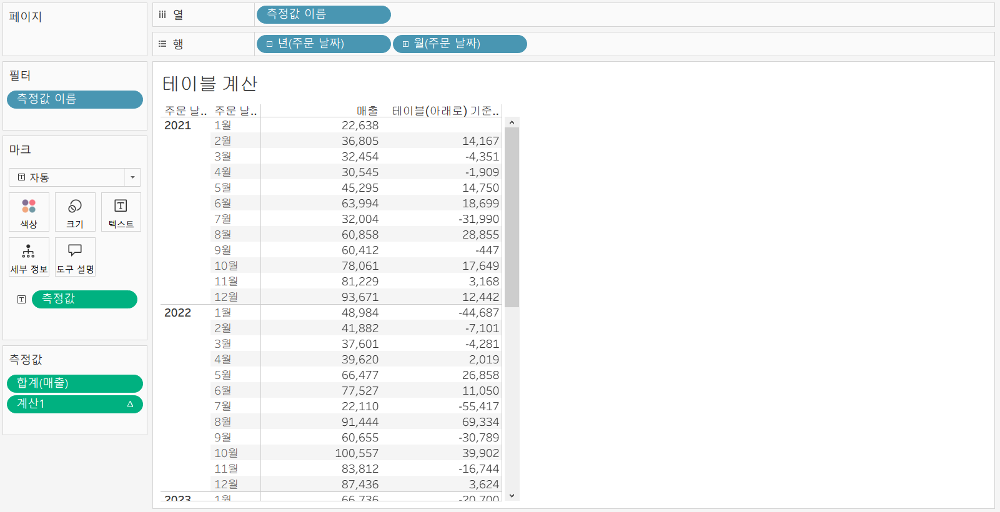

## 37. 퀵테이블계산(1)

<!-- 퀵테이블 계산의 원리 및 예제에 대해 알게 된 점을 적어주세요. -->

**퀵 테이블 계산** : 테이블 계산 유형들을 클릭만으로 가능하도록 만들어 놓은 기능     
\- 필드 우클릭, 퀵 테이블, 목록     
\- 누계(집계한 값을 누적한 값):  한 번 더 집계해줌.    

> 분기별 누적 매출 & 월별 매출 차트

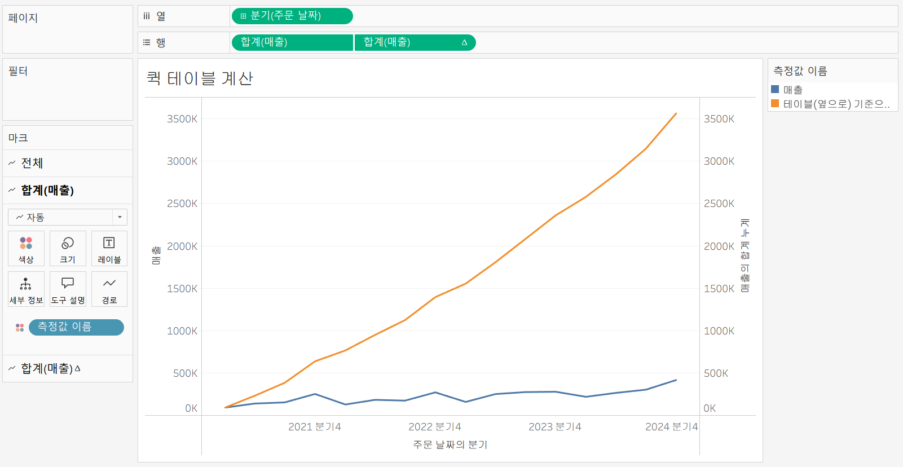

> 제품에 대한 연도별 매출 차이

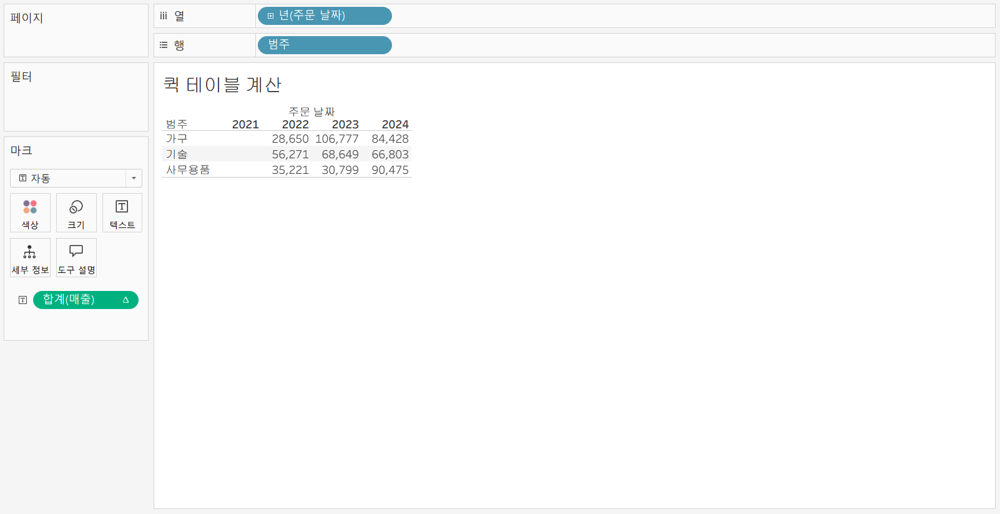

> 월별 수익 차이를 % (퍼센트)로 보려고 한다면,    
**퀵 테이블 계산 > 비율 차이**

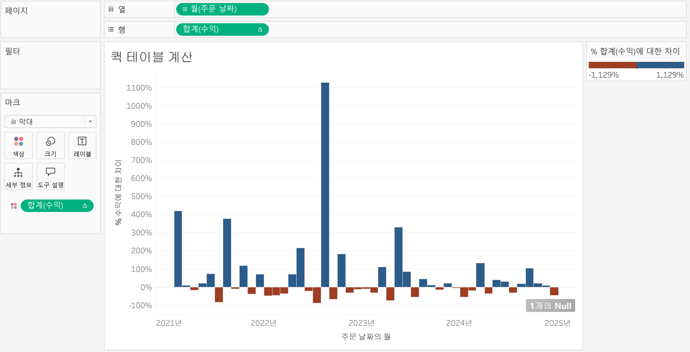

> 지역별 제품 매출 순위와 구성비율    
합계(매출) 퀵 테이블 계산 > 순위 > 계산 대상 : 옆에서 아래로

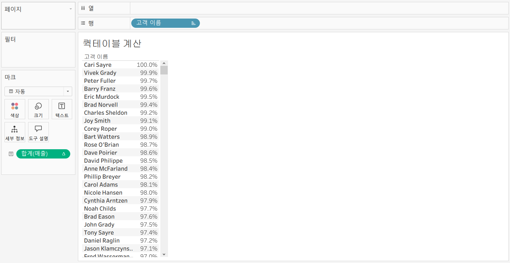

## 38. 퀵테이블계산(2)

<!-- 이동평균, YTD 총계, 전년 대비 성장률, YTD 성장률 등 본 강의에서 알게 된 점을 적어주세요. -->
**이동 평균** : 이전의 값부터 현재까지 값에 대한 평균을 낼 때 사용하며 주식 데이터에서 많이 활용하고 있음    
**YTD(Year to Date) 총계** : 특정 시점을 기준으로 해당 연도부터 그 시점까지 총계를 말함      
(**년보다 하위필드인 분기, 월 필드가 있어야 사용 가능함**) 

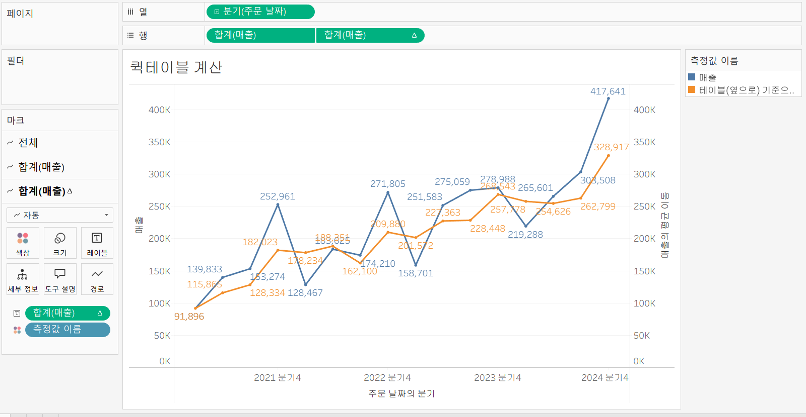
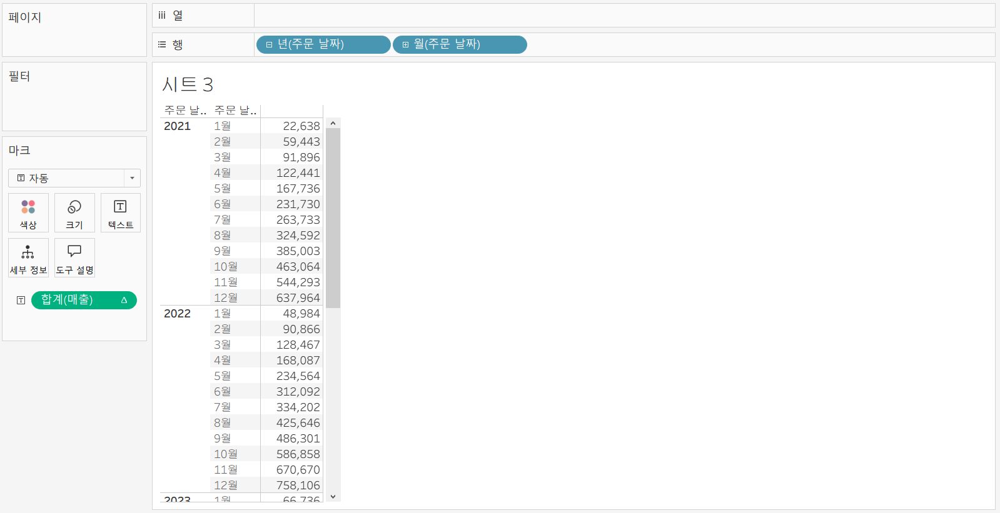

 

# 확인문제

## 문제 1.

푸앙이는 이제껏 매출을 올리는 데에 힘썼었지만, 왠지 모르게 주머니에 들어오는 돈이 없어 속상합니다. 

그래서 매출이 상위 20곳에 속하지만, 수익률(%)이 마이너스인 시/도를 확인하려고 합니다.

> **수익률은 SUM([수익]) / SUM([매출])로 정의합니다.**

어떤 집합을 만들었고, 어떤 결합을 하였는지를 중심으로 기술하고, 결과 자료를 첨부해주세요. (텍스트 표 형태이며, 색상으로 위 집합을 구분할 수 있게 만들어주세요.)

~~~
시/도 매출 20 : 상위 탭을 사용하여 상위 20, 매출 합계 설정함.
시/도 수익률 < 0 : 조건 탭을 사용하여 수익률 < 0 조건을 설정함.
두 집합 공유 부분을 색으로 표시하고자 함.
~~~
<!-- 아래 예시 이미지를 삭제하고, 직접 만든 시트 사진을 올려주세요. 시트의 이름은 본인 이름으로 기입해주세요-->

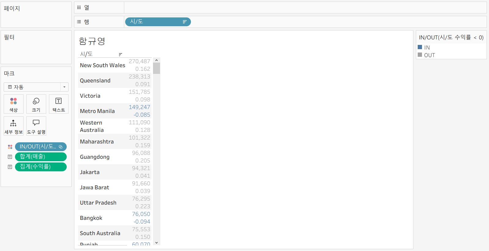

## 문제 2.

> **푸앙이는 주문 Id별로 주문에서 배송까지에 걸리는 날짜 일수가 궁금했습니다. 
> 그래서 주문 ID별로 주문에서 배송까지 걸리는 일자를 '배송까지 걸린 일수'라는 계산된 필드로 만들고, 이를 마크에 올린 후 확인해보았습니다.  이때, 계산된 필드의 식은 'DATEDIFF' 함수를 이용하였습니다.**

**배송까지 걸린 일수 계산을 위한 DATEDIFF 함수 수식을 적어주세요.**

~~~
DATEDIFF('day', [주문 날짜], [배송 날짜])
~~~

>  **그런데 위 그림처럼 '주문 날짜'와 '배송 날짜'를 함께 행에 올려 확인해보니, 주문날짜와 배송날짜의 차이가 '배송까지 걸린 일수'와 다릅니다. ID-2021-11126을 보니, 11월 26일 배송에 11월 30일 배송이면 4일 차이인데, 12일이 걸렸다고 하네요. 왜 이런 문제가 생긴걸까요?**

~~~
DATEDIFF로 만든 계산된 필드가 연속형 필드이기 때문에 합계로 계산이 되었다.
~~~

> **그리고 이를 해결하기 위해서는 어떻게 해야할까요?**

~~~
DATEDIFF로 만든 계산된 필드를 차원형 필드로 바꿔줘야 한다.
~~~

## 문제 3.

다음은 Tableau의 다양한 계산을 사용할 수 있는 경우를 빈칸으로 두고 문제를 작성한 것입니다. 각 빈칸에 적합한 계산 유형을 채워보세요.

> 보기 
>
> **누계, 차이, 비율 차이, 구성 비율, 순위, 백분위수, 이동 평균, YTD 총계, 통합 성장률, 전년 대비 성장률, YTD 성장률**

| 계산 유형       | 설명                                     | 사용 예시                                                    |
| --------------- | ---------------------------------------- | ------------------------------------------------------------ |
| 여기에 적으세요 | 데이터의 누적 합계를 계산                | 한 기업이 월별 매출 데이터를 누적하여 연간 매출 추이를 보고 싶을 때 사용 |
| ____________    | 연속 데이터 포인트 간의 차이를 계산      | 한 기업이 월별 매출 데이터에서 전월 대비 매출 증감량을 분석하고 싶은 경우 |
| ____________    | 연속 데이터 포인트 간의 비율 변화를 계산 | 한 기업이 월별 매출 데이터에서 전월 대비 매출 증감률(%)을 분석하고 싶은 경우 |
| ____________    | 전체에서 각 데이터 포인트의 비율을 계산  | 한 기업이 전체 매출에서 각 제품군이 차지하는 비율을 보고 싶을 때 사용 |
| ____________    | 데이터의 순위를 매깁니다                 | 한 기업이 제품별 매출 데이터를 순위별로 정렬하여 상위 10개 제품을 분석하고 싶은 경우 |
| ____________    | 데이터의 백분위를 계산                   | 한 기업이 고객별 구매 금액 데이터를 백분위수로 나누어 상위 25% 고객을 분석하고 싶은 경우 |
| ____________    | 일정 기간의 평균을 계산                  | 한 기업이 주간 매출 데이터에서 4주 이동 평균을 계산하여 트렌드를 분석하고 싶은 경우 |
| ____________    | 연초부터 현재까지의 총계를 계산          | 한 기업이 월별 매출 데이터를 연초부터 현재까지 누적하여 연간 매출 목표 달성 여부를 분석하고 싶은 경우 |
| ____________    | 일정 기간 동안의 연평균 성장률을 계산    | 한 기업이 5년 간 매출 데이터를 바탕으로 연평균 성장률(CAGR)을 계산하고 싶은 경우 |
| ____________    | 전년 동기간 대비 성장률을 계산           | 한 기업이 월별 매출 데이터에서 전년 동월 대비 매출 성장률을 분석하고 싶은 경우 |
| ____________    | 연초부터 현재까지의 성장률을 계산        | 한 기업이 올해 연초부터 현재까지의 매출이 전년 동기 대비 얼마나 성장했는지 분석하고 싶은 경우 |

> 사용 예시를 참고하여 실제 경우처럼 생각하며 고민해보아요!

 

 

### 🎉 수고하셨습니다.