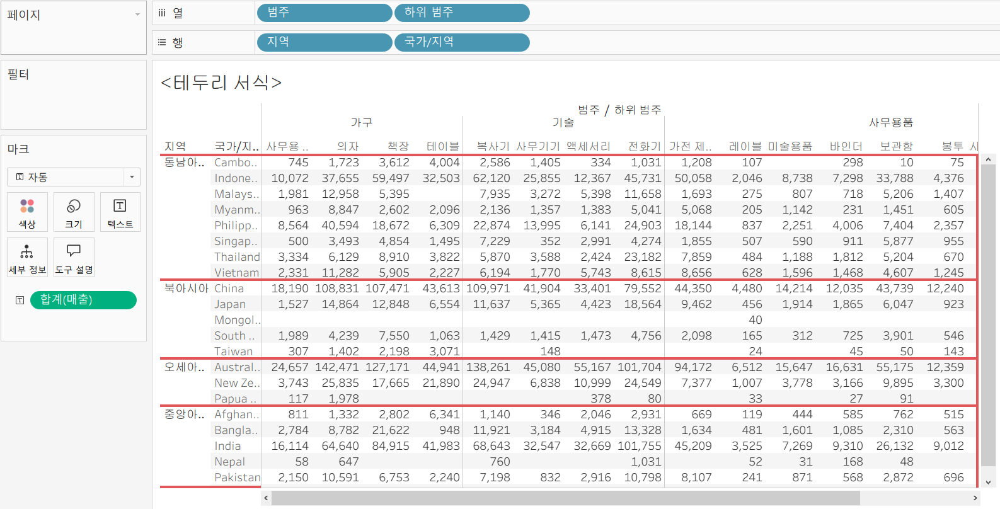
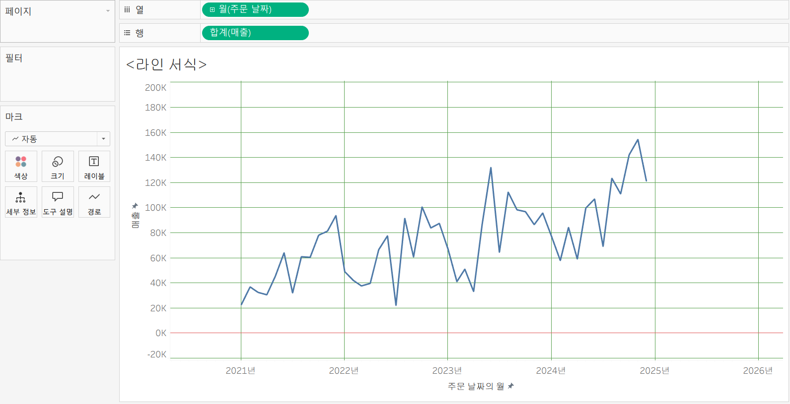

# Tableau 6주차 정규과제

📌Tableau 정규과제는 매주 정해진 **유튜브 강의를 통해 태블로 이론 및 기능을 학습한 후, 실습 문제를 풀어보며 이해도를 높이는 학습 방식**입니다. 

이번주는 아래의 **Tableau_6th_TIL**에 명시된 유튜브 강의를 먼저 수강해주세요. 학습 중에는 주요 개념을 스스로 정리하고, 이해가 어려운 부분은 강의 자료나 추가 자료를 참고해 보완하세요. 과제 작성이 끝난 이후에는 **Github에 TIL과 실습 인증 결과를 업로드 후, 과제 시트에 제출해주세요.**


**👀(수행 인증샷은 필수입니다.)** 

> 태블로를 활용하는 과제인 경우, 따로 캡쳐도구를 사용하여 이미지를 첨가해주세요.


## Tableau_6th_TIL

### 48. 워크시트 서식(2)

### 49. 대시보드 패널

### 50. 대시보드 구성방식

### 51. 대시보드 컨테이너

### 52. 레이아웃 패널

### 53. 필터 동작

### 54. 대시보드 하이라이터 동작

### 55. 대시보드 URL

### 56. 대시보드 시트에 이동 동작

### 57. 매개변수 변경 동작


<br>

## 주차별 학습 (Study Schedule)

| 주차  | 공부 범위          | 완료 여부 |
| ----- | ------------------ | --------- |
| 1주차 | **강의 1 ~ 9강**   | ✅         |
| 2주차 | **강의 10 ~ 19강** | ✅         |
| 3주차 | **강의 20 ~ 29강** | ✅         |
| 4주차 | **강의 30 ~ 38강** | ✅         |
| 5주차 | **강의 39 ~ 47강** | ✅         |
| 6주차 | **강의 48 ~ 57강** | ✅         |
| 7주차 | **강의 58 ~ 67강** | 🍽️         |

> **🧞‍♀️ 오늘은 강의보다 실습과 대시보드 직접 만들기가 더 중요하니, 기록보다는 사고하며 강의를 들어주세요.**

<!-- 여기까진 그대로 둬 주세요-->


---

# 학습 내용 정리

## 48. 워크시트 서식(2)

<!-- 워크시트에 관해 본 강의에서 알게 된 점을 적어주세요 -->

서식 → 테두리 → 테두리 서식 → 행 구분선, 열 구분선 수준 화살표를 움직일 수 있음.     



서식 → 라인 → 서식(라인의 유형, 두꼐, 색상 설정) → 차트에 추세선과 참조선 추가 (각 라인에 서식 별도 설정) → 축 서식도 변경 가능.



## 49강. 대시보드패널

<!-- 대시보드패널 강의에서 알게 된 점을 적어주세요. -->

> [ 샘플 수익성 대시보드 ]       

맵 차트에서 나라를 선택하면 오른쪽 차트들과 연계되어 데이터를 표시하며     
화면 오른쪽 상단 드롭다운 메뉴에 세그먼트를 선택하여 데이터를 표시할 수 있음.      

### [크기] 항목
: 대시보드 크기 설정     
: 드롭다운 메뉴 - 고정된 기본 크기들, 화면을 채우는 자동 크기, 또는 크기 범위를 선택할 수 있음. 

### [시트] 항목
: 목록에 있는 시트를 drag and drop 해서 띄울 수 있음. 

### [개체] 항목
: 제목, 이미지 (링크/파일삽입), 웹 페이지     

해상도 -> 기기 유형, 모델(해상도) 선택하며 대시보드를 해상도 맞게 크기를 변경하고 배치 가능

## 50. 대시보드 구성방식

<!-- 대시보드 구성방식에 대해 알게 된 점을 적어주세요. -->

개체를 추가하는 방식 : **1) 바둑판식 방식**, **2)부동**

> **🧞‍♀️ 부동과 바둑판식 방식을 차이를 중점으로 기술해보세요**

```
1) 바둑판식      
: 격자무늬 구조에 따라 개체들을 추가할 수 있음.  
: 개체를 추가한 후에 다른 개체들의 크기가 변경됨.
: *대시보드 크기를 변경해도 개체들의 전체적인 배치가 유지됨.    
2) 부동
: 대시보드에 개체를 추가하면 개체를 자유롭게 배치할 수 있음.     
: 다른 개체들의 크기나 모양에 영향을 주지 않음.
: 대시보드 크기를 변경하면 개체들의 위치, 크기가 달라지므로 대시보드 크기가 자주 변경되지 않는 경우에 사용하는 것을 추천함.     
: 그래프 내 빈공간이 있으면 텍스트 개체, 이미지 개체, 또는 워크시트를 추가할 수 있음.
```


## 51. 대시보드 컨테이너

<!-- 대시보드 컨테이너에 대해 알게 된 점을 적어주세요. -->
*개체를 대시보드 배치하기 전에 컨테이너를 먼저 배치할 수 있음.*    
**컨테이너**: 대시보드 개체들과 워크시트들을 그룹화하고 구성할 수 있는 공간.      
**가로 컨테이너** : 내부의 개체들을 수평 공간으로 배열할 때 사용.    
**세로 컨테이너** : 내부의 개체들을 수직 공간으로 배열할 떄 사용.  

``` 
▼바둑판식     
  ▼세로      
    ▼가로     
      ▼DKBMC    
      ▼A 수익성 대시보드
    ▼가로
      ▼BAN 01
      ▼BAN 02
      ▼BAN 03
      ▼BAN 04
```

각각을 높이 조절 가능.     

## 52. 레이아웃 패널

<!-- 레이아웃 패널에 대해 알게 된 점을 적어주세요. -->
*대시보드의 디자인을 변경하고자 할 때 인터페이스를 사용함.*    
**레이아웃 탭**: 대시보드의 개체 속성을 변경할 수 있음.    
그래프 중 하나를 클릭하고 "레이아웃" 탭을 클릭하면 해당 개체에 변경할 수 있는 옵션들이 나타남.    

<br>

- 탭 상단, 제목 옵션: 기본적으로 워크시트의 제목으로 설정-> 제목 표시 체크 풀어서 제목 숨기기    
- 부동 개체로 변경 가능 -> 개체 자유롭게 이동 가능 & 픽셀 크기 변경 가능      
- 테두리 옵션 : 개체 테두리 색상 편집 가능     
- 백그라운드 옵션 : 가장 큰 컨테이너 선택 -> 원하는 색상 선택     
- 여백 옵션 : 미처 바뀌지 않은 백그라운드 옵션, 미세한 정렬 등을 조정      
    - 바깥쪽 여백 : 컨테이너의 모서리와 테두리 사이의 공간을 변경할 수 있음.     
    - 안쪽 여백 : 선택된 개체 모서리와 테두리 사이의 공간을 변경할 수 있음.     
    *옵션들은 기본적으로 모든 테두리를 동일하게 변경하도록 설정되어 있지만 각 측면을 개별적으로 변경하기를 원한다면 "모든 변이 동일" 선택 해제 하기.*      
- 항목 계층 : 대시보드에 있는 컨테이너와 개체를 볼 수 있음. 


## 53. 필터 동작

<!-- 필터 동작에 대해 알게 된 점을 적어주세요. -->


## 54. 대시보드 하이라이터 동작

<!-- 하이라이터에 대해 알게 된 점을 적어주세요. -->


## 55. 대시보드 URL

<!-- URL에 대해 알게 된 점을 적어주세요 -->


## 56. 대시보드 시트에 이동 동작

<!-- 대시보드 시트에 이동에 대해 알게 된 점을 적어주세요.-->


## 57. 매개변수 변경 동작

<!-- 매개변수 변경 동작에 대해 알게 된 점을 적어주세요.-->


# 확인 문제

오늘은 별도의 문제가 없습니다. 


여러 대시보드를 참고하시어, superstore 데이터를 사용해 나만의 대시보드를 제작해주세요.

**단, 워크시트 3개 이상의 그래프를 표시해야 하며 각 시트 간 상호작용성 필터 or 하이라이트 동작은 꼭 추가되어야 합니다**

어떤 부분에 가중을 두었는지, 어떤 사용자 편의성을 고려하였는지에 대한 설명이 필요합니다.


<br>

<br>

### 🎉 수고하셨습니다.